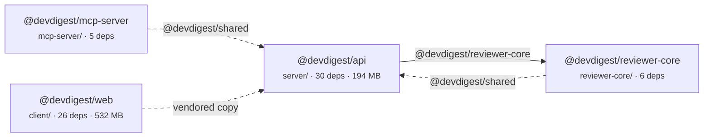
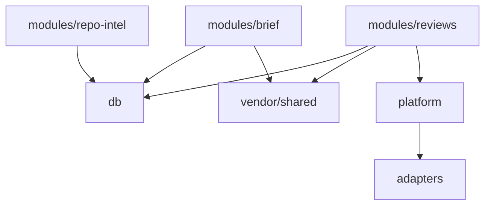

# Diagrams

Two diagrams, both Mermaid, both rendered inline in the report. GitHub renders Mermaid in Markdown,
so no images and no build step. Keep the default theme: hard-coded colours that look right in light
mode are unreadable in dark mode, and the report is read in both.

The rule that matters more than any syntax detail: **a diagram is a claim about structure, not a dump
of edges.** If every node connects to every other node, you have drawn a hairball that proves only
that you had data. Filter until the shape says something, then say what it says in a sentence
underneath.

## 1. Package graph

Source: `internalEdges` from `collect.mjs`, plus the package list.

Every package is a node. Every alias that points outside its own package is an edge, labelled with
the alias so a reader can grep for it. Packages with no internal edges still appear — an isolated
package is a finding, not an omission.

Conventions that carry meaning:

- **Solid edge** — a real code dependency on another package's implementation.
- **Dashed edge** — a shared-contract or vendored-copy relationship. Worth distinguishing: a vendored
  copy is a synchronisation obligation, not an import.
- **Node label** — package name, then directory and the one or two numbers relevant to this report.
  Resist putting every metric in the node; the tables carry those.
- **Cycles** — if two packages point at each other, say so explicitly in the prose beneath. A reader
  will not spot a two-node cycle in a diagram, and it is usually the most consequential structural
  fact on the page.

## 2. Component graph

Source: `components` and `componentEdges` for one package (normally the one with the most source
files).

`componentEdges` is sorted by import count. Take the top edges until you reach ~15 nodes, then stop.
Drop test components unless the finding is about tests — they connect to everything by design and
will dominate the picture.

- Direction: `TD` reads better for layered architectures (callers above, infrastructure below), `LR`
  for pipelines. Pick the one that matches the code, not the one that fits the page.
- Edge thickness or labels for import counts are optional and usually noise. If one edge matters
  because it is unusually heavy, label just that one.
- If the package documents an intended layering (`server/docs/architecture.md`, the
  `onion-architecture` skill), note in the prose whether the drawn graph matches it. A component
  graph that contradicts the documented architecture is a finding worth a section of its own.

## When to add a third diagram

Only when a specific finding needs it, and then keep it tiny:

- **A dependency's blast radius** — the files importing one library you are proposing to remove or
  defer. Three to eight nodes.
- **A cycle**, drawn alone, when the package graph is too busy to show it clearly.

Do not draw a treemap of `node_modules` in Mermaid. Sizes belong in a sorted table, where they can be
read exactly and compared; Mermaid has no honest way to encode area.
