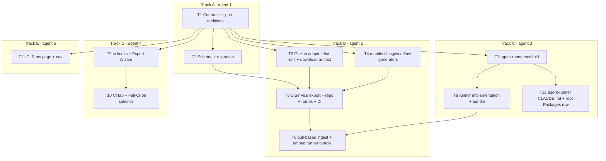

# Implementation Plan: Export to CI (Worktree B)

## Overview
Fill the empty CI skeleton so a tuned agent can be serialized into a portable `AgentManifest`
(+ skills + empty `memory.jsonl` + a self-contained GitHub Actions workflow + a bundled
agent-runner), installed into a target repo via an atomic `devdigest/ci` PR, run in CI on the
same `reviewer-core` engine (grounding gate + `wrapUntrusted`/`INJECTION_GUARD` + deterministic
verdict), and pulled back into the studio's **CI Runs** page and the agent's **CI** tab. This is
a deliberately simple v1 (SPEC-2026-07-08-export-to-ci); the security and reviewer-core
invariants are the only things that must not be simplified.

## Execution mode
multi-agent (parallel) — the spec caps execution at **≤5 implementer agents**. The work is
partitioned into exactly **5 tracks with non-overlapping owned paths** (one per agent). Track A
is a foundation phase that runs alone first; Tracks B–E run in parallel afterward, with two
DAG edges (B's export flow depends on A+the adapter; B's runner-embed + ingest depends on C's
bundle).

## Requirements (verified)
All requirements are taken verbatim from `specs/2026-07-08-export-to-ci.md` (AC-1…AC-36). They
are complete and all decisions (Q1–Q8) are resolved; this plan does not re-open them. Mapping of
each AC to a task is in **AC → Task traceability** below. The two non-negotiable invariant groups
the plan protects explicitly:
- **Security invariants** (AC-15, AC-16, AC-17, AC-18, AC-19, AC-21, AC-27) — least-privilege
  permissions, secret-from-Secrets-only, no fork-PR secret, no comment trigger, self-contained
  bundled runner, `wrapUntrusted`+`INJECTION_GUARD`, no public inbound ingest endpoint.
- **reviewer-core invariants** — mandatory `groundFindings()` gate, `wrapUntrusted()` +
  `INJECTION_GUARD` paired, deterministic verdict from findings + `ci_fail_on` (never the model's
  self-report). reviewer-core is consumed unchanged by both studio and runner.

## Open questions & recommendations
- Q: none — the spec resolved Q1–Q8. No new clarifying questions block planning.
- **Rec (verified): leave `ci_runs` untouched.** The runs-list backing store is `agent_runs`
  (Q1). `ci_runs` is not read or written by this feature. Dropping it is a needless migration
  risk under "simplicity first" and it is a documented stub table (`server/insights/gotchas.md`:
  do not delete/rename stub tables). **Decision baked into T2: leave `ci_runs` in place, dead for
  this feature.** The `CiRun` *DTO* is repurposed as the CI Runs page API response backed by
  `agent_runs` (see Contracts).
- **Rec: idempotency key for ingest** = unique index on `(ci_installation_id, actions_run_id)`
  on `agent_runs` — the plainest natural key satisfying AC-30, no dedup service needed.
- **Rec: ship the runner as one ncc bundle** (`.devdigest/runner/index.js`) rather than raw TS +
  a `package.json`/`tsx` install step in the target repo. ncc inlines reviewer-core + shared into
  a single self-contained file, which is simpler to ship and review and still "consumes
  reviewer-core as raw TypeScript source" at build time (AC-19). Flagged in Risks: the server
  must be able to read the built bundle at export time.
- **Rec (single writer for `agent_runs`): route all CI-run persistence through
  `container.reviewRepo`.** `server/src/modules/reviews/repository.ts` documents itself as the
  ONLY layer that writes `agent_runs`/`run_traces`. Ingest reuses that writer (extended additively
  if a CI-only field needs setting) instead of hand-rolling new Drizzle inserts against
  `agent_runs` in `CiRepository`; the stale "ONLY layer" comment is updated to name the two
  legitimate callers. Baked into T6.

## Affected modules & contracts
- **server `@devdigest/api`** — new `modules/ci/` (export engine, workflow/manifest/slug
  generators, installation repo, pull-based ingest, routes); two new `GitHubClient` capabilities
  implemented in the Octokit adapter + mock; DI + module registry wiring; a narrow additive
  extension of the shared `agent_runs` writer in `modules/reviews/repository.ts` (single-writer
  rule).
- **client `@devdigest/web`** — Export Wizard modal + agent **CI** tab; global **CI Runs** page +
  nav; TanStack Query hooks.
- **agent-runner (NEW top-level package `@devdigest/agent-runner`)** — bundled CI runner that
  reuses `reviewer-core`. New sibling dir, own `package.json`/`tsconfig.json`, ncc build, plus its
  own `agent-runner/CLAUDE.md` and a new row in the root `CLAUDE.md` Packages table.
- **reviewer-core `@devdigest/reviewer-core`** — **unchanged**; consumed by the runner via path
  alias. No edits (invariant).
- **Contracts (`@devdigest/shared`, edit BOTH `server/src/vendor/shared/` and
  `client/src/vendor/shared/`):**
  - `contracts/eval-ci.ts`: **add `AgentManifest` to the client copy** (currently missing — drift);
    add `status` + `workflow_version` to `CiInstallation` (both copies); repurpose the `CiRun` DTO
    as the CI Runs page response (backed by `agent_runs`) and add `repo`, `agent`, `verdict/status`,
    `findings_count`, `blockers`, `score`, `cost_usd`, `duration_s`, `pr_number`, with `pr_id`
    allowed null; keep `CiResultArtifact` as the on-disk artifact shape unchanged.
    **Field-clarity decision: RENAME the existing `CiRun.github_url` → `actions_job_url`** (they
    denote the same concept — the link to the Actions job). Do not keep two fields for one concept;
    apply the rename in both vendored copies and use `actions_job_url` consistently everywhere in
    the plan. (This is a rename of a field on a stub DTO with no current consumers — called out
    explicitly, not silent.)
  - `adapters.ts` (both copies): add `listWorkflowRuns(repo, opts)` and
    `downloadArtifact(repo, artifactRef)` to the `GitHubClient` port + their payload/return types.
  - No **breaking** change to existing shared shapes — additions are additive (new fields nullish
    where a consumer may not set them); the one non-additive change is the deliberate
    `github_url`→`actions_job_url` rename above. Explicit callout: the client `eval-ci.ts` also has
    pre-existing drift (import extensions, missing `Provider`/`CiFailOn` imports, narrower
    `ConformanceInput.provider`); T1 reconciles only what this feature needs (`AgentManifest` +
    CI fields) and must not gratuitously rewrite unrelated shapes.

## Architecture changes
- New Fastify module `server/src/modules/ci/` (onion): `routes.ts` (thin, Zod-validated) →
  `service.ts` (orchestration) → `repository.ts` (Drizzle, `ci_installations` only). Pure
  generators (`manifest.ts`, `workflow.ts`, `slug.ts`) are dependency-free helpers. `ingest.ts`
  orchestrates the pull path and is invoked by `CiService` (never imported by a route).
- `agent_runs` writes stay behind the single existing writer (`reviewRepo`); `CiRepository` owns
  only `ci_installations` queries.
- `GitHubClient` port gains two read capabilities (list workflow runs, download artifact);
  implemented in `server/src/adapters/github/octokit.ts` and `server/src/adapters/mocks.ts`.
- DI: register `CiService` + `CiRepository` in `server/src/platform/container.ts` (lazy getters,
  `ContainerOverrides` support); register the module in `server/src/modules/index.ts`.
- New top-level package `agent-runner/` (RSC/onion N/A) — pure TS CLI, injects `OpenRouterProvider`
  into `reviewPullRequest`. It runs **outside** the server DI graph, so it intentionally reads
  CI-injected env vars directly (`OPENROUTER_API_KEY`, `GITHUB_TOKEN`); the `SecretsProvider`
  process.env chokepoint is scoped to `server/` only (documented in `agent-runner/CLAUDE.md`).
- Client: new App Router route `client/src/app/ci/`; new agent tab under
  `AgentEditor/_components/CiTab/`; hooks under `client/src/lib/hooks/`.

## Track → owned-path partition (≤5 agents, non-overlapping)

| Track | Agent | Owned paths (exclusive) |
|---|---|---|
| **A — Contracts, schema & migration** | 1 | `server/src/vendor/shared/contracts/eval-ci.ts`, `client/src/vendor/shared/contracts/eval-ci.ts`, `server/src/vendor/shared/adapters.ts`, `client/src/vendor/shared/adapters.ts`, `server/src/db/schema/ci.ts`, `server/src/db/schema/runs.ts`, `server/src/db/migrations/**` (new files only) |
| **B — Server `ci/` module + GitHub adapter** | 2 | `server/src/modules/ci/**`, `server/src/adapters/github/octokit.ts`, `server/src/adapters/mocks.ts`, `server/src/platform/container.ts`, `server/src/modules/index.ts`, `server/src/modules/reviews/repository.ts` (narrow additive extension of the `agent_runs` writer + stale-comment update — see T6) |
| **C — agent-runner package** | 3 | `agent-runner/**` (incl. `agent-runner/CLAUDE.md`) and the single `@devdigest/agent-runner` row added to the root `CLAUDE.md` Packages table (no other track touches root `CLAUDE.md`) |
| **D — Client CI tab + Export Wizard** | 4 | `client/src/app/agents/[id]/_components/AgentEditor/_components/CiTab/**`, `client/src/app/agents/[id]/_components/AgentEditor/constants.ts`, `client/src/app/agents/[id]/_components/AgentEditor/AgentEditor.tsx`, `client/src/lib/hooks/ci.ts`, `client/messages/en/ci.json` |
| **E — Client CI Runs page + nav** | 5 | `client/src/app/ci/**`, `client/src/vendor/ui/nav.ts`, `client/src/components/app-shell/helpers.ts`, `client/src/lib/hooks/ci-runs.ts` |

All shared/"do-not-touch" files (`vendor/shared/*`, `platform/container.ts`, `modules/index.ts`,
`adapters/mocks.ts`, `modules/reviews/repository.ts`, `nav.ts`, root `CLAUDE.md`) have exactly one
owning track. reviewer-core is owned by no track (read-only). Track A completes before B–E start,
so its shared-file edits never race the parallel phase. Track B's edit to
`modules/reviews/repository.ts` is a narrow additive extension of the shared `agent_runs` writer —
it does NOT touch the multi-run review service orchestration or the PR feed (Worktree B boundary).

## Dependency DAG

## Phased tasks

### Phase 1 — Foundation (Track A, runs alone)

- **T1**
  - **Action:** Reconcile `@devdigest/shared` in **both** vendored copies. (1) Add `AgentManifest`
    to the client `eval-ci.ts` (byte-parity with the server copy — it is missing today). (2) Add
    `status` (enum e.g. `active | pr_open | error`) and `workflow_version` (string) to
    `CiInstallation` in both copies. (3) Repurpose the `CiRun` DTO as the CI Runs API response
    backed by `agent_runs`: add `repo`, `agent`, `status`/`verdict`, `findings_count`, `blockers`,
    `score`, `cost_usd`, `duration_s`, `pr_number`, and allow `pr_id`/internal linkage null.
    **RENAME `CiRun.github_url` → `actions_job_url`** (same concept — the Actions-job link; do not
    keep both). Keep `CiResultArtifact` unchanged. (4) Add `listWorkflowRuns` and `downloadArtifact`
    (+ payload/return types) to the `GitHubClient` port in both `adapters.ts` copies. Keep other
    additions additive; do not rewrite unrelated drifted shapes.
  - **Module:** shared (server + client vendored copies)
  - **Type:** core
  - **Skills to use:** zod, onion-architecture (domain/contracts placement), typescript-expert
  - **Owned paths:** `server/src/vendor/shared/contracts/eval-ci.ts`,
    `client/src/vendor/shared/contracts/eval-ci.ts`, `server/src/vendor/shared/adapters.ts`,
    `client/src/vendor/shared/adapters.ts`
  - **Depends-on:** none
  - **Risk:** medium (drift between the two copies is the historical trap)
  - **Known gotchas:** `@devdigest/shared` is a path alias, not an npm package — client resolves
    its own copy; the two have drifted (client uses `./x` imports, server uses `./x.js`). Edit both
    or the client silently misses `AgentManifest`. (client/insights/gotchas.md; verified: client
    `eval-ci.ts` currently has no `AgentManifest`.)
  - **Acceptance:** `cd server && pnpm typecheck` and `cd client && pnpm typecheck` both pass; a
    unit assertion imports `AgentManifest` from `@devdigest/shared` in the client build and
    `AgentManifest.safeParse(validObj).success === true`; both `CiInstallation` schemas expose
    `status` + `workflow_version`; the `CiRun` DTO exposes `actions_job_url` (and no longer
    `github_url`) in both copies.

- **T2**
  - **Action:** Add `status` + `workflow_version` to `ci_installations`; add `ci_installation_id`
    (FK), `repo`, `external_pr_number`, `actions_run_id`, `actions_job_url` to `agent_runs`; add a
    UNIQUE index on `(ci_installation_id, actions_run_id)` for ingest idempotency (AC-30). Keep
    `prId` nullable (already is) and `workspace_id` NOT NULL (ingest derives it via the agent — see
    T6). **Leave `ci_runs` untouched** (Rec above). Generate + apply the migration:
    `cd server && pnpm db:generate` then `pnpm db:migrate` (new migration file only — never edit
    existing ones).
  - **Module:** server
  - **Type:** backend
  - **Skills to use:** drizzle-orm-patterns, postgresql-table-design
  - **Owned paths:** `server/src/db/schema/ci.ts`, `server/src/db/schema/runs.ts`,
    `server/src/db/migrations/**`
  - **Depends-on:** T1 (column set mirrors the DTO fields)
  - **Risk:** medium (new NOT NULL columns need safe defaults; unique index must match the natural
    key exactly)
  - **Known gotchas:** migrations never auto-run on boot — the server boots fine and only fails at
    query time if `db:migrate` is skipped. FK columns are not auto-indexed in Postgres; add an
    index on `ci_installation_id`. (server/insights/gotchas.md)
  - **Acceptance:** a new migration file is generated; `pnpm db:migrate` applies clean on a fresh
    DB; `cd server && pnpm exec vitest run .it.test` boots and a select over the new `agent_runs`
    columns succeeds; server `pnpm typecheck` passes.

### Phase 2 — Parallel build (Tracks B, C, D, E)

#### Track B — Server `ci/` module + GitHub adapter (agent 2)

- **T3**
  - **Action:** Implement `listWorkflowRuns` + `downloadArtifact` on `OctokitGitHubClient` (auth
    already token-from-`SecretsProvider`) and on `MockGitHubClient` (fixture returns + capture
    arrays for assertions), matching the T1 port signatures. Wrap real calls in existing
    `withRetry`/`withTimeout`.
  - **Module:** server
  - **Type:** backend
  - **Skills to use:** onion-architecture (infrastructure-layer), fastify-best-practices,
    typescript-expert
  - **Owned paths:** `server/src/adapters/github/octokit.ts`, `server/src/adapters/mocks.ts`
  - **Depends-on:** T1
  - **Risk:** low
  - **Known gotchas:** `MockGitHubClient` exposes public capture arrays (`posted`, `openedPrs`,
    `committed`) — extend the same pattern so ingest tests can assert no extra calls; changing
    mocks.ts affects all unit tests, keep additions additive.
  - **Acceptance:** unit test drives `MockGitHubClient.listWorkflowRuns`/`downloadArtifact`
    returning injected fixtures; `cd server && pnpm exec vitest run --exclude '**/*.it.test.ts'`
    passes; typecheck passes.

- **T4**
  - **Action:** Pure generators. (a) `manifest.ts`: build an `AgentManifest` from an agent DTO +
    linked skills (slugs) and serialize to YAML. (b) `slug.ts`: deterministic filesystem-safe slug
    from a name, `^[a-z0-9][a-z0-9-]*$`, stable across re-exports (derived, not persisted — Q6),
    collision disambiguation `-2`,`-3`,…. (c) `workflow.ts`: GHA workflow generator enforcing the
    security invariants — `permissions:` exactly `contents: read` + `pull-requests: write`
    (AC-15); OpenRouter key only via `secrets.OPENROUTER_API_KEY`, no literal anywhere (AC-16);
    fork PRs never receive the secret — the keyed analysis job is gated so it does not run / runs
    key-less for fork PRs (AC-17); `on:` limited to configured `pull_request` events, never
    `issue_comment`/`pull_request_review_comment` (AC-18); review step invokes the bundled runner
    `node .devdigest/runner/index.js`, no marketplace `uses:` (AC-19); default path
    `.github/workflows/devdigest-review.yml` (AC-4). Non-GHA (circle/jenkins/cli) generators emit a
    downloadable config file only (Non-goal — no PR/ingest wiring).
  - **Module:** server
  - **Type:** backend (+ security)
  - **Skills to use:** security (fork-secret withholding, least privilege, no-comment-trigger),
    zod, typescript-expert
  - **Owned paths:** `server/src/modules/ci/manifest.ts`, `server/src/modules/ci/slug.ts`,
    `server/src/modules/ci/workflow.ts`, `server/src/modules/ci/constants.ts` (+ colocated
    `*.test.ts`)
  - **Depends-on:** T1
  - **Risk:** high (AC-17 fork-secret withholding is the crux security control — must be encoded
    correctly, e.g. gate the keyed job on `github.event.pull_request.head.repo.fork == false` while
    still assembling the diff, and use `pull_request` not `pull_request_target`)
  - **Known gotchas:** none recorded; treat the fork/secret gate as adversarial and add an explicit
    assertion.
  - **Acceptance:** unit tests: emitted YAML manifest `AgentManifest.safeParse` succeeds and fields
    equal the agent DTO (AC-5); slug matches regex, is stable on repeat, and disambiguates
    collisions (AC-6); workflow `permissions` block equals exactly the two entries (AC-15); no
    secret literal + key referenced only via `secrets.*` (AC-16); fork job carries no secret
    (AC-17); `on:` contains only pull_request events, no comment triggers (AC-18); review step
    references the bundled runner and no `uses: devdigest/review-action@v1` (AC-19); GHA path is
    `.github/workflows/devdigest-review.yml` (AC-4).

- **T5**
  - **Action:** `CiService` + `CiRepository` + `routes.ts`, wired via DI. `CiRepository` owns
    `ci_installations` queries **only** (never `agent_runs`). Export flow: assemble the file set
    (manifest, one `.devdigest/skills/<slug>.md` per linked skill, empty `.devdigest/memory.jsonl`,
    workflow, and the runner bundle file — bundle embedding lands in T6). For `action=open_pr` +
    GHA: `findOpenPr('devdigest/ci')` → `commitFiles` (atomic, single commit, creates/fast-forwards
    `devdigest/ci`, never base) → `openPullRequest` into `base`; idempotently update the existing PR
    if present (AC-10, AC-11); record/update the installation row with `status` + `workflow_version`
    (AC-12). For `action=files` or non-GHA: return the `CiFile[]` only, no PR, no installation
    (AC-13; zip is produced client-side). On any GitHub API failure: surface the error and create no
    partial installation row; retry is idempotent (AC-14). Do **not** call the GitHub Secrets API
    (AC-9). Register `CiService`/`CiRepository` in `container.ts` and the module in
    `modules/index.ts`. Routes (thin, validate → one service call → reply): `POST
    /agents/:id/export-ci` (body `CiExportInput` → `CiExport`), `GET /agents/:id/ci-installations`.
    Both routes must be **workspace-scoped and behind the same auth as the existing agent routes**
    (consistent with the workspace-scoped review lookup in commit 04b06c9).
  - **Module:** server
  - **Type:** backend (+ security)
  - **Skills to use:** onion-architecture (all four layers), fastify-best-practices,
    drizzle-orm-patterns, zod, security, engineering-insights
  - **Owned paths:** `server/src/modules/ci/service.ts`, `server/src/modules/ci/repository.ts`,
    `server/src/modules/ci/routes.ts`, `server/src/modules/ci/helpers.ts`,
    `server/src/platform/container.ts`, `server/src/modules/index.ts`
  - **Depends-on:** T2, T3, T4
  - **Risk:** medium
  - **Known gotchas:** services receive the whole `Container` and call `await container.github()`
    (async) + `container.agentsRepo`/`skillsRepo`; never instantiate adapters in the service; never
    read `process.env` (inject `SecretsProvider`). `commitFiles` already creates the branch from
    `base` if missing and fast-forwards otherwise — reuse it, don't add a `createBranch`.
  - **Acceptance:** `*.it.test.ts` (testcontainers + `MockGitHubClient`): export opens a PR from
    `devdigest/ci`→base with all files in one commit and no direct base commit (AC-10); re-export
    returns the same PR URL and no second open PR (AC-11); an installation row appears with
    `status` + `workflow_version` (AC-12); non-GHA/`files` action returns files with no PR/no
    installation (AC-13); a forced GitHub failure leaves no partial installation and a retry
    succeeds (AC-14); the mock records zero Secrets-API calls (AC-9); both new routes reject an
    unauthenticated / cross-workspace caller (same guard as existing agent routes).

- **T6**
  - **Action:** (a) **Embed runner bundle**: read the built `agent-runner/dist/index.js` (Track C)
    and ship it as a `CiFile` (`.devdigest/runner/index.js`) in the export file set, completing
    AC-19 end-to-end. (b) **Pull-based ingest** — implement `ingest.ts` and a `CiService.refresh()`
    method; add a `POST /ci/refresh` route (workspace-scoped, same auth as agent routes) plus the
    CI Runs read route. **The route calls `ciService.refresh()`; the route must NOT import
    `ingest.ts` directly** (`CiService` owns the orchestration — thin-routes/onion rule). For each
    tracked GHA installation, `listWorkflowRuns` → `downloadArtifact` (`devdigest-result.json`) →
    `CiResultArtifact.safeParse`; persist each as an `agent_runs` row **through the existing
    `container.reviewRepo` agent-run writer** (extend it additively if a CI-only field must be set;
    do NOT hand-roll `agent_runs` inserts in `CiRepository`), and update the stale "ONLY layer that
    writes agent_runs" comment in `modules/reviews/repository.ts` to name the two legitimate callers
    (review flow + CI ingest). Persist with `source='ci'`, agent linkage, CI metadata
    (`actions_job_url`, `external_pr_number`, `repo`, `ci_installation_id`), `prId` null-tolerant
    (AC-28), and **derive the NOT-NULL `workspace_id` transitively from the agent
    (`agents.workspace_id`)** since `ci_installations` has no `workspace_id`. Derive verdict/blockers
    with the **same** `countBlockers`/gate computation used for local runs against `ci_fail_on`
    (AC-29); idempotent on `(ci_installation_id, actions_run_id)` (AC-30); skip
    missing/expired/invalid artifacts without failing the whole refresh (AC-31); on GitHub API
    unavailability/rate-limit, report a degraded refresh and preserve existing runs, no partial rows
    (AC-32). No public inbound ingest endpoint exists (AC-27). Expose the CI Runs read route
    returning the `CiRun` DTO list.
  - **Module:** server
  - **Type:** backend (+ security)
  - **Skills to use:** onion-architecture, fastify-best-practices, drizzle-orm-patterns, zod,
    security (treat artifact strictly as data, never commands), engineering-insights
  - **Owned paths:** `server/src/modules/ci/ingest.ts` (plus additive edits to the already B-owned
    `service.ts`/`routes.ts`, and a narrow additive extension of
    `server/src/modules/reviews/repository.ts` — the shared `agent_runs` writer + stale-comment
    update; no change to review orchestration or the PR feed)
  - **Depends-on:** T5, T8 (runner bundle)
  - **Risk:** medium
  - **Known gotchas:** `groundFindings()` dropping everything and returning empty/score-100 is
    valid — an all-dropped CI run ingests as a zero-findings APPROVE run, not an error
    (reviewer-core/insights/gotchas.md). The verdict must reuse the shared computation, not a
    CI-specific rule.
  - **Acceptance:** `*.it.test.ts`: duplicate ingest of the same
    `(installation, pr, actions_run)` yields exactly one row (AC-30); an invalid/missing/expired
    artifact is skipped while other valid artifacts still ingest and no crash (AC-31); simulated
    API failure preserves the existing run list and surfaces a degraded state with no partial rows
    (AC-32); ingested verdict equals the local-run computation for a seeded findings set + threshold
    (AC-29); the ingested row has `source='ci'`, populated CI metadata, `prId` null, and a correct
    **non-null `workspace_id` matching the agent's workspace** (AC-28); the row is written via
    `reviewRepo` (no direct `agent_runs` insert in `CiRepository`); the `POST /ci/refresh` route
    is workspace-scoped and calls `ciService.refresh()` (route does not import `ingest.ts`); route
    listing has no inbound push endpoint (route table assertion, AC-27); export file set includes
    `.devdigest/runner/index.js` (AC-19).

#### Track C — agent-runner package (agent 3)

- **T7**
  - **Action:** Scaffold `agent-runner/` as a standalone package (`@devdigest/agent-runner`):
    `package.json` (deps: `@vercel/ncc` build, `yaml`, `zod`; scripts `typecheck`, `build`, `test`),
    `tsconfig.json` mirroring `server/tsconfig.json`'s aliases —
    `@devdigest/reviewer-core` → `../reviewer-core/src/index.ts` (+ `/*`), `@devdigest/shared` →
    `../server/src/vendor/shared/index.ts` (+ `/*`). `build` = ncc bundle of `src/index.ts` →
    `dist/index.js`.
  - **Module:** agent-runner (new)
  - **Type:** core
  - **Skills to use:** typescript-expert, engineering-insights
  - **Owned paths:** `agent-runner/package.json`, `agent-runner/tsconfig.json`
  - **Depends-on:** T1
  - **Risk:** medium (ncc must resolve the reviewer-core + shared path aliases into the bundle)
  - **Known gotchas:** reviewer-core emits no JS and is consumed as raw TS; the runner must bundle
    it via the alias, not import a built artifact.
  - **Acceptance:** `cd agent-runner && pnpm typecheck` passes; `pnpm build` emits a single
    `dist/index.js` that imports nothing from `node_modules/@devdigest/*` at runtime.

- **T8**
  - **Action:** Implement the runner CLI (`src/index.ts` + helpers). Load the checked-in
    `.devdigest/agents/<slug>.yaml` manifest and `.devdigest/skills/*.md`, validate the manifest
    against `AgentManifest` before use (AC-20); assemble the PR diff + PR body/title from the CI
    context; wrap the diff (`diff`) and PR body (`pr-description`) via the reviewer-core untrusted
    mechanism (`assemblePrompt`/`wrapUntrusted` + `INJECTION_GUARD`) exactly as a local run (AC-21);
    inject `OpenRouterProvider` (key from the CI-injected `OPENROUTER_API_KEY` env var) into
    `reviewPullRequest`; the pipeline's mandatory `groundFindings()` gate runs (AC-22); compute the
    GitHub review event + blocker count deterministically via `countBlockers`/gate against the
    manifest's `ci_fail_on`, never the model self-report (AC-23); post per `post_as` (github_review
    | pr_comment | none) via the CI-injected `GITHUB_TOKEN` (AC-24); exit non-zero iff the gate
    triggered REQUEST_CHANGES (AC-25); write `devdigest-result.json` conforming to
    `CiResultArtifact` (AC-26); hard-fail (non-zero, error status, post nothing) on an LLM/model
    error — no synthetic skeleton (Q5).
  - **Module:** agent-runner (new)
  - **Type:** core (+ security)
  - **Skills to use:** security (untrusted-input handling, no secret leakage), zod,
    typescript-expert, engineering-insights
  - **Owned paths:** `agent-runner/src/**`
  - **Depends-on:** T7
  - **Risk:** high (this is the in-CI half of the lethal-trifecta mitigation and the parity guarantee)
  - **Known gotchas:** `INJECTION_GUARD` is applied internally by `assemblePrompt` (appended after
    the agent prompt) — reuse `assemblePrompt`, do not hand-roll the guard. `groundFindings()`
    dropping all findings is a valid empty APPROVE result, not an error
    (reviewer-core/insights/gotchas.md). The runner runs outside the server DI graph, so reading
    env vars directly here is intentional (documented in `agent-runner/CLAUDE.md`, T12) — this is
    NOT a `SecretsProvider` violation, which is scoped to `server/`.
  - **Acceptance:** hermetic test with a stubbed LLM + fixture diff: manifest validated before use
    (AC-20); assembled prompt contains `<untrusted source="diff">`/`pr-description` fences + the
    guard (AC-21); verdict/blocker count match the deterministic mapping regardless of the model's
    self-reported verdict (AC-23); all-dropped findings → zero-finding success (AC-22); posted
    artifact type matches `post_as` (AC-24); exit code correlates with gate-triggered state (AC-25);
    emitted `devdigest-result.json` `CiResultArtifact.safeParse` succeeds (AC-26); **Q5 hard-fail**:
    a stubbed LLM/model-call failure → non-zero exit, error status, nothing posted to the PR, and no
    synthetic review skeleton produced; **parity**: for a fixed diff + deterministic model output,
    runner findings == a direct `reviewPullRequest` local run after grounding (AC-36).

- **T12**
  - **Action:** Documentation only. Create `agent-runner/CLAUDE.md` mirroring the other packages'
    module map / read-when structure, stating: the package is bundled into the exported PR and runs
    in CI outside the server DI graph; it intentionally reads CI-injected env vars
    (`OPENROUTER_API_KEY`, `GITHUB_TOKEN`) directly because the `SecretsProvider`/`process.env`
    chokepoint is scoped to `server/` only; it consumes `reviewer-core` as raw TS via path alias and
    must preserve the reviewer-core invariants. Add a `@devdigest/agent-runner` row to the root
    `CLAUDE.md` Packages table (path `agent-runner/`, no port).
  - **Module:** agent-runner (new) + root docs
  - **Type:** core (docs)
  - **Skills to use:** (none — documentation)
  - **Owned paths:** `agent-runner/CLAUDE.md`, root `CLAUDE.md` (single Packages-table row only)
  - **Depends-on:** T7
  - **Risk:** low
  - **Known gotchas:** root `CLAUDE.md` is otherwise untouched by any track — add only the one row.
  - **Acceptance:** `agent-runner/CLAUDE.md` exists with the module map + the env-var/secrets note;
    root `CLAUDE.md` Packages table contains a `@devdigest/agent-runner` row; no other root
    `CLAUDE.md` content changed (diff is a single added row).

#### Track D — Client CI tab + Export Wizard (agent 4)

- **T9**
  - **Action:** Add `client/src/lib/hooks/ci.ts` (TanStack Query: `useExportCi` mutation,
    `useCiInstallations(agentId)`; reuse the existing `useUpdateAgent` for `ci_fail_on`). Build the
    **Export Wizard** as a `Modal`-based 4-step flow (`Tabs`/stepper): **Target** (four cards, GHA
    preselected + "recommended" badge — AC-1, AC-2), **Preview** (lists the four artifact
    categories: manifest, per-skill files, empty `memory.jsonl`, workflow; workflow contents
    **editable** and persisted into Install — AC-3, AC-4), **Configure** (trigger toggles
    `opened`/`synchronize` on, `reopened` off; "Post results as" radio github_review default;
    two secret rows with local readiness badges + hint — AC-7, AC-8; readiness reflects the
    studio-local SecretsProvider only, no GitHub call — AC-9), **Install** ("Open a PR" → export
    mutation; "Copy files as a zip" degraded path builds the archive client-side from the returned
    `CiFile[]`, no PR/installation — AC-5 wizard side, AC-13). For a **non-GHA target**, the Install
    step offers file-download only and does **not** render an "Open a PR" action (spec Edge cases /
    Non-goal). Add any missing i18n keys to `messages/en/ci.json` (`exportWizard`, `ciTab`,
    `publishDialog` namespaces already scaffolded).
  - **Module:** client
  - **Type:** ui
  - **Skills to use:** frontend-architecture, react-best-practices, next-best-practices (RSC/`"use
    client"` boundary — the wizard is interactive, mark client), react-testing-library
  - **Owned paths:**
    `client/src/app/agents/[id]/_components/AgentEditor/_components/CiTab/ExportWizard/**`,
    `client/src/lib/hooks/ci.ts`, `client/messages/en/ci.json`
  - **Depends-on:** T1
  - **Risk:** medium
  - **Known gotchas:** the `Modal` primitive
    (`client/src/vendor/ui/kit/Modal.tsx`) already provides `role="dialog"`/`aria-modal` and a close
    button — reuse it. Missing i18n keys render as the key string, not an error — add every new key.
    TanStack cache does not persist across reloads — don't rely on it for above-the-fold state.
  - **Acceptance:** RTL (MSW): wizard renders four labelled steps with step 1 active and GHA
    preselected + recommended badge (AC-1, AC-2); Preview lists all four artifact categories and the
    workflow field is editable and its edits reach the Install request (AC-3, AC-4); Configure shows
    the default toggles/radio and two secret rows with readiness + hint (AC-7, AC-8), and no GitHub
    Secrets request is issued (AC-9); the zip path downloads an archive and issues no export/PR
    mutation (AC-13); selecting a **non-GHA target** shows file-download only with **no "Open a PR"
    action** (Edge case). **Accessibility: reuse the `Modal` primitive so the wizard exposes
    `role="dialog"` + `aria-modal` and is keyboard-navigable (assert the dialog role + Escape/Close
    path); WCAG 2.1 AA beyond what the primitive provides is deferred to manual review** (stated,
    simplest path). `cd client && pnpm test` + `pnpm typecheck` pass.

- **T10**
  - **Action:** Add the **CI** tab: register `"ci"` in `AgentEditor/constants.ts` `TABS` and render
    `{tab === "ci" && <CiTab .../>}` in `AgentEditor.tsx`. `CiTab` shows, per repository, the
    installation status + workflow version and the CI run history for that installation, a
    **Fail CI on** selector (never/critical/warning/any) that persists via `useUpdateAgent` →
    `ci_fail_on` (AC-35), an **Add to CI** button that opens the Export Wizard (AC-1), and an
    **Update CI config** action that re-runs the export against the existing installation (AC-11
    client side).
  - **Module:** client
  - **Type:** ui
  - **Skills to use:** frontend-architecture, react-best-practices, next-best-practices,
    react-testing-library
  - **Owned paths:** `client/src/app/agents/[id]/_components/AgentEditor/_components/CiTab/CiTab.tsx`
    (+ `index.ts`), `client/src/app/agents/[id]/_components/AgentEditor/constants.ts`,
    `client/src/app/agents/[id]/_components/AgentEditor/AgentEditor.tsx`
  - **Depends-on:** T9
  - **Risk:** low
  - **Known gotchas:** tab state lives in the `?tab=` query param; follow the existing
    `ConfigTab`/`SkillsTab` colocated pattern. `UpdateAgentInput` already whitelists `ci_fail_on`.
  - **Acceptance:** RTL: the CI tab renders the installation list (status + workflow version), run
    history, and the Fail-CI-on selector (AC-34); clicking **Add to CI** opens the wizard (AC-1);
    changing Fail CI on issues an agent update carrying `ci_fail_on` (AC-35); clicking **Update CI
    config** triggers a re-export (the export mutation fires for the existing installation — AC-11
    client side). Accessibility follows the `Modal`/wizard note in T9. `cd client && pnpm test` +
    `pnpm typecheck` pass.

#### Track E — Client CI Runs page + nav (agent 5)

- **T11**
  - **Action:** Add the global **CI Runs** page: `client/src/app/ci/page.tsx` (thin) rendering
    `./_components/CiRunsView`, matching the `agents/skills` route convention. Add
    `client/src/lib/hooks/ci-runs.ts` (`useCiRuns` query + a refresh mutation that triggers the
    server pull ingest). The view lists `source='ci'` runs with columns PR, repository, agent,
    verdict/status, findings count, cost, duration, and a link to the Actions job (`actions_job_url`)
    — rendering correctly with `prId` null (AC-33); a refresh surfaces a degraded state when the pull
    path reports one and preserves the existing list (AC-32, client side). Add a "CI Runs" nav entry
    to `client/src/vendor/ui/nav.ts` (+ its gKey shortcut) and active-route detection in
    `client/src/components/app-shell/helpers.ts`.
  - **Module:** client
  - **Type:** ui
  - **Skills to use:** frontend-architecture, react-best-practices, next-best-practices (RSC page +
    client view boundary), react-testing-library
  - **Owned paths:** `client/src/app/ci/**`, `client/src/lib/hooks/ci-runs.ts`,
    `client/src/vendor/ui/nav.ts`, `client/src/components/app-shell/helpers.ts`
  - **Depends-on:** T1 (reads the Track B runs API; mock via MSW in tests to stay independent)
  - **Risk:** low
  - **Known gotchas:** the `runs` namespace in `messages/en/ci.json` is already scaffolded — treat
    that file as read-only from this track (it is owned by Track D); if a key is genuinely missing,
    coordinate rather than editing it here.
  - **Acceptance:** RTL (MSW): the page renders the required columns for `source='ci'` rows
    including a row with `prId` null (AC-33); triggering refresh shows a degraded state and keeps the
    existing rows when the API reports degraded (AC-32); the nav shows the CI Runs entry and it is
    active on `/ci`. Accessibility: the runs table uses semantic table roles and the nav entry is
    keyboard-reachable; deeper WCAG 2.1 AA is deferred to manual review (stated). `cd client && pnpm
    test` + `pnpm typecheck` pass.

## AC → Task traceability
- AC-1 → T9/T10 · AC-2 → T9 · AC-3 → T9 · AC-4 → T4/T9 · AC-5 → T4(+T9) · AC-6 → T4 · AC-7 → T9 ·
  AC-8 → T9 · AC-9 → T5/T9 · AC-10 → T5 · AC-11 → T5(+T10) · AC-12 → T5 · AC-13 → T5/T9 ·
  AC-14 → T5 · AC-15 → T4 · AC-16 → T4 · AC-17 → T4 · AC-18 → T4 · AC-19 → T4/T6/T8 · AC-20 → T8 ·
  AC-21 → T8 · AC-22 → T8 · AC-23 → T8 · AC-24 → T8 · AC-25 → T8 · AC-26 → T8 · AC-27 → T6 ·
  AC-28 → T2/T6 · AC-29 → T6 · AC-30 → T2/T6 · AC-31 → T6 · AC-32 → T6/T11 · AC-33 → T11 ·
  AC-34 → T10 · AC-35 → T10 · AC-36 → T8. Every AC maps to at least one task. (T12 is documentation
  supporting the Track C security posture; it maps to no AC directly.)

## Testing strategy
- **server unit** (`cd server && pnpm exec vitest run --exclude '**/*.it.test.ts'`) — T3, T4
  (generators, slug, workflow security assertions).
- **server integration** (`cd server && pnpm exec vitest run .it.test`) — T2 (migration/boot), T5
  (export/PR/installation via `MockGitHubClient` + testcontainers, route auth/workspace scoping),
  T6 (ingest idempotency, skip/degraded, verdict parity, workspace_id derivation, reviewRepo
  single-writer, no-inbound-route).
- **agent-runner** (`cd agent-runner && pnpm test` + `pnpm typecheck` + `pnpm build`) — T7/T8
  (manifest validation, untrusted wrapping, deterministic verdict, artifact schema, exit code, Q5
  hard-fail, reviewer-core parity AC-36).
- **client** (`cd client && pnpm test` + `pnpm typecheck`) — T9/T10/T11 (RTL + MSW: wizard steps,
  non-GHA install path, CI tab, Update-CI-config re-export, CI Runs page, degraded refresh).
- **reviewer-core** — unchanged; run `cd reviewer-core && npm test` as a regression guard only.

## Risks & mitigations
- **Fork-secret withholding encoded incorrectly (AC-17)** → highest-severity security risk. Mitigation:
  T4 uses `pull_request` (not `pull_request_target`), gates the keyed job on
  `head.repo.fork == false`, and adds an explicit test that the fork job carries no secret; T8
  never echoes the key.
- **Runner bundle availability at export time** → T5/T6 embed `agent-runner/dist/index.js`, which
  must be built before the server can export. Mitigation: T7 provides the `build` script; add
  runner `build` to the server dev/build pipeline (call out to `scripts/dev.sh`); if the bundle is
  absent, export fails loudly rather than shipping a broken workflow.
- **ncc failing to inline reviewer-core/shared via path aliases** → T7 risk. Mitigation: verify the
  bundle imports nothing from `@devdigest/*` at runtime as a T7 acceptance gate.
- **Shared-contract drift between the two vendored copies** → T1 edits both; typecheck of both
  packages is the gate. The `github_url`→`actions_job_url` rename must land in both copies.
- **Two writers for `agent_runs`** → mitigated by routing CI persistence through the existing
  `reviewRepo` writer (T6) and updating its "ONLY layer" comment; `CiRepository` never inserts
  `agent_runs`.
- **`workspace_id` NOT NULL on a CI run with no installation-level workspace** → T6 derives it from
  the agent; covered by a T6 acceptance assertion.
- **Ingest idempotency key mismatch** → the unique index `(ci_installation_id, actions_run_id)`
  (T2) must exactly match the key ingest computes (T6); covered by the duplicate-ingest test.
- **`ci_runs` left dead could confuse future readers** → recorded as an explicit decision here and
  should be captured via `/engineering-insights` at session end.

## Red-flags check
- [x] Every requirement maps to a task (AC-1…AC-36 traceability table above)
- [x] No specification was authored or edited — the spec is the input; this plan restates and
      verifies it
- [x] Execution mode recorded (multi-agent, ≤5 tracks) and the plan is shaped for it
- [x] Dependencies form a DAG (see mermaid; no cycles) — T12 added under Track C, `T7 → T12`
- [x] Concurrent tasks (Tracks B/C/D/E in Phase 2) have non-overlapping Owned paths; every
      shared/do-not-touch file (incl. `modules/reviews/repository.ts` and root `CLAUDE.md`) has a
      single owning track; Track A runs alone first
- [x] Every Acceptance is a concrete command/test/observable
- [x] Shared-contract edits are called out explicitly (both vendored copies; additions additive;
      the one deliberate non-additive change — `github_url`→`actions_job_url` rename on the
      consumer-less `CiRun` stub DTO — is flagged; `ci_runs` left untouched by decision)
