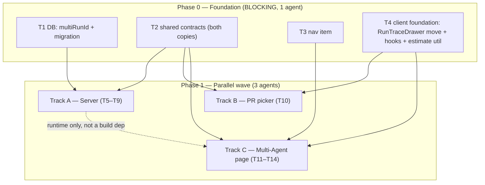

# Implementation Plan: Multi-Agent Review

## Overview
Let a reviewer fan a PR out to a chosen *set* of agents in one parallel pass, group the
fan-out into one persistent multi-agent run, and read it back as a single resource with
per-agent columns, a deterministic "where agents disagree" block, live per-agent status,
and a pre-run time/cost estimate. Source of truth: `specs/2026-07-08-multi-agent-review.md`
(SPEC-2026-07-08-multi-agent-review). All decisions (D-1..D-4, SIMP-1..SIMP-3) are fixed in
the spec; this plan only decides the *how*.

## Execution mode
**multi-agent (parallel)** — the coordinator requires ≤5 concurrent implementers, ideally 3.
Shaped as **1 blocking foundation agent → a wave of 3 parallel agents** (server ∥ PR-picker ∥
Multi-Agent page). Max concurrent implementers = **3** (optional split of the page track pushes
it to 4, still ≤5). Owned paths are strictly non-overlapping within each wave.

## Requirements (verified)
Restated from the spec's EARS acceptance criteria (cited as AC-n):

- R1 (AC-1..AC-3): PR-page picker — a "Pick agents to run" dropdown with a checkbox + per-agent
  time estimate per enabled agent; a "Run multi-agent review (N)" action tracking the checked
  count (disabled at 0); confirming starts a run over exactly the checked set. Replaces
  `RunReviewDropdown`.
- R2 (AC-4..AC-6): A GLOBAL-nav Multi-Agent Review page with a Configure-run step: pick a PR
  (step 2 + run disabled until a PR is chosen), then selectable agent cards (name, teaser,
  time·cost estimate).
- R3 (AC-7..AC-9): Pre-run estimate computed **on the client** — total cost = sum, total time =
  max, over the per-agent estimate fields carried by the agents-list response; agents with no
  history render "—" and are skipped in the summary. No separate estimate endpoint.
- R4 (AC-10..AC-12): One persistent `multi_agent_run` groups the N `agent_runs`; each agent runs
  in isolation (one failure does not abort siblings); the run is exposed as one resource
  (`MultiAgentRun` = columns + conflicts + totals).
- R5 (AC-13..AC-15): Columns view with live per-agent status (running/done/failed) driving the
  trace drawer's `running` prop; "View trace" (Columns footer or Tabs summary) opens the **same
  existing `RunTraceDrawer`** via `?trace=<agent_run id>`; failed agents render a failed column
  with the reason without blocking siblings.
- R6 (AC-16..AC-19): Columns/Tabs toggle over the same run built from **one** shared set of
  building blocks (finding card, per-agent summary, disagree block); expanding a finding shows
  confidence + rationale + suggested fix + action buttons; Accept/Dismiss persist; Learn / Reply /
  Turn-into-eval are visible non-functional placeholders.
- R7 (AC-20..AC-23): "Where agents disagree" block shared by both views; two findings match when
  **same file AND overlapping line ranges** (deterministic, no LLM/embedding); each group lists
  every agent that ran, with its verdict or "did not flag"; "Show only conflicts" hides unanimous
  groups.
- R8 (AC-24): reviewer-core grounding gate + untrusted-input wrapping stay **unchanged**.
- R9 (non-functional): parallel fan-out (`Promise.allSettled`, failure-isolated); agents-list
  p95 < 500 ms (DB aggregate, no LLM, no extra round-trip); i18n via `next-intl` (no hardcoded
  strings); WCAG 2.1 AA keyboard operability; trigger keeps the existing 10 req/min limit.

## Verification of the spec's reuse claims (grounded against code)
All confirmed against the current tree:

- ✅ `POST /pulls/:id/review` exists with body `RunRequest {agentId?, all?}` and `rateLimit
  {max:10, timeWindow:'1 minute'}` — `server/src/modules/reviews/routes.ts:27`.
- ✅ Fan-out is **sequential** today: `run-executor.ts` `executeRuns()` uses
  `for (const {agent, runId} of jobs) { await this.runOneAgent(...) }` —
  `server/src/modules/reviews/run-executor.ts:176`. This is the parallelisation target (D-2).
- ✅ SSE `GET /runs/:id/events` (in-memory `RunBus`, replay-first) — `routes.ts:48`.
- ✅ `GET /pulls/:id/runs/active` + `GET /pulls/:id/runs` — `routes.ts:95,101`.
- ✅ `GET /runs/:id/trace` → `RunTrace` — `routes.ts:121`.
- ✅ Accept/Dismiss finding routes — `routes.ts:150` (`FINDING_ACTIONS = ['accept','dismiss']`).
- ✅ `RunTraceDrawer` colocated at
  `client/src/app/repos/[repoId]/pulls/[number]/_components/RunTraceDrawer`, opened via
  `search.get("trace")` — `.../pulls/[number]/page.tsx:17,61,174` (props `{runId, running,
  findings, agentName, onClose}`). Confirmed a structural move is needed to share it.
- ✅ `multi_agent_runs` is a 4-column stub (`id, workspaceId, prId, ranAt`) with **no** link
  from `agent_runs` — `server/src/db/schema/runs.ts:42`. No `multiRunId` anywhere in code.
- ✅ Contracts `MultiAgentRun / AgentColumn / AgentColumnFinding / Conflict / ConflictTake`
  exist in `vendor/shared/contracts/observability.ts` (both copies).
- ✅ `agents.description` = `text('description').notNull().default('')` —
  `server/src/db/schema/agents.ts:14`; exposed on the `Agent` contract
  (`knowledge.ts:200`).
- ✅ `useRunEvents(runIds: string[])` + reviews hooks — `client/src/lib/hooks/reviews.ts:164`.
- ✅ i18n namespaces auto-load by directory scan (`client/src/i18n/request.ts` `loadMessages`);
  a new `messages/en/<ns>.json` needs **no** central registration — zero cross-track contention.

### Gaps found in the reuse claims
- **GAP-1 (contract edit, not just "add"):** the spec says "extend the agents-list response" with
  `est_duration_ms/est_cost_usd/has_history`. That response is the shared `Agent` contract
  (`vendor/shared/contracts/knowledge.ts`), which is **duplicated** in server *and* client copies
  and consumed widely. Adding the fields is an **edit to an existing shared contract** — additive
  and backward-compatible (three nullable/optional fields), but it must be called out and applied
  to **both** copies in lock-step. See Red-flags.
- **GAP-2 (request shape):** the trigger's request is `{ agentIds: string[] }`, but the existing
  `RunRequest` (`platform.ts`) is `{agentId?, all?}`. The spec's phrasing "the current RunRequest
  gains a subset field" would mean editing a widely-shared contract. **Recommendation:** do **not**
  touch `RunRequest`; add a dedicated `MultiAgentRunRequest` to `observability.ts` (the file A5
  already owns for these contracts) — a pure add, lower blast radius. See Rec below.
- **GAP-3 (read addressing):** the read route is PR-scoped (`GET /pulls/:id/multi-agent`) but the
  spec's edge case says "two multi-agent runs on the same PR … the view shows the one being
  opened", which implies addressing a *specific* multi-run. See Open questions Q1.

## Open questions & recommendations
- **Q1 (read addressing, GAP-3):** How does `GET /pulls/:id/multi-agent` pick which run when a PR
  has several? → **default:** return the **most recent** `multi_agent_run` for the PR, and accept
  an optional `?multiRunId=<id>` to target a specific one (the trigger response already hands the
  client the id). Non-breaking; keeps the spec's route. Confirm or override.
- **Rec-1 (GAP-2):** Add `MultiAgentRunRequest = { agent_ids: string[] }` and
  `MultiAgentRunTriggerResult = { id, pr_id, targets: ReviewRunTarget[] }` to `observability.ts`
  and **reuse the existing `ReviewRunTarget`** (`review-api.ts`, already `{run_id, agent_id,
  agent_name}`) for the per-agent targets — no new target shape, no edit to `RunRequest`.
- **Rec-2 (simplicity):** The trigger and read live naturally on the existing reviews plugin
  (`reviews/routes.ts`) and a new `multi-agent-service.ts`; no new module/DI wiring is required
  (reuse `ReviewRunExecutor`, `container.agentsRepo`). Do not build a parallel module.
- **Rec-3 (matcher):** Keep the conflict matcher a **pure function** in its own file so the "no
  LLM/embedding" guarantee (AC-21) is verifiable by inspection (zero imports from `container.llm`
  / reviewer-core).
- **Rec-4 (estimate DRY):** Put the client summary math (sum cost / max time / skip no-history)
  in one pure util consumed by **both** the picker and Configure run (AC-7), so the two entry
  points cannot drift.

## Affected modules & contracts
- **server / reviews** — parallelise executor; new multi-agent service + conflict matcher + two
  routes; repository methods to create/link/read multi-runs.
- **server / agents** — agents-list gains per-agent estimate fields from a DB aggregate over
  past `done` `agent_runs`.
- **server DB** — add `multiRunId` (nullable FK → `multi_agent_runs.id`, `ON DELETE set null`)
  to `agent_runs`; the `multi_agent_runs` stub table is used as-is.
- **client** — PR-page agent picker (replaces `RunReviewDropdown`); GLOBAL-nav Multi-Agent
  Review page (Configure run + results with Columns/Tabs + disagree block); shared building
  blocks; structural move of `RunTraceDrawer` to a shared location; new hooks + estimate util.
- **contracts (`@devdigest/shared`, BOTH copies):**
  - *Add* to `observability.ts`: `MultiAgentRunRequest`, `MultiAgentRunTriggerResult`
    (reusing `ReviewRunTarget`).
  - *Edit (called out)* `knowledge.ts` `Agent`: add `est_duration_ms: number|null`,
    `est_cost_usd: number|null`, `has_history: boolean` (additive).
  - *Reuse verbatim:* `MultiAgentRun`, `AgentColumn`, `AgentColumnFinding`, `Conflict`,
    `ConflictTake`, `ReviewRunTarget`, `FindingRecord`, `RunTrace`, `RunEvent`.

## Architecture changes
- **Domain/contracts:** `server` + `client` `vendor/shared/contracts/{observability,knowledge}.ts`
  (kept identical; files already in each barrel — no `index.ts` edit).
- **Infrastructure:** `server/src/db/schema/runs.ts` + new migration under
  `server/src/db/migrations/`; new repo methods in `server/src/modules/reviews/repository.ts`
  and an aggregate in `server/src/modules/agents/repository.ts`.
- **Application:** `server/src/modules/reviews/multi-agent-service.ts` (orchestration only, no
  SQL) + pure `multi-agent-conflicts.ts`; estimate assembly in `server/src/modules/agents/service.ts`.
- **Presentation (server):** two routes appended to `server/src/modules/reviews/routes.ts`
  (trigger keeps `rateLimit {max:10, timeWindow:'1 minute'}`).
- **Presentation (client):** RSC-by-default; add `"use client"` only where interactive
  (picker, Configure run, Columns/Tabs, drawer). `RunTraceDrawer` moves to
  `client/src/components/RunTraceDrawer/` (shared). New route `app/multi-agent-review/`.

## Dependency DAG (parallel waves ≤ 3)

Wave 1 = {Track A, Track B, Track C} run concurrently (3 implementers). Track C may optionally
split into C1/C2 (→ 4 concurrent, still ≤5) — see the note under Track C.

## Phased tasks

### Phase 0 — Foundation (BLOCKING · 1 agent · single owner, no internal concurrency)

- **T1 — DB: link agent_runs to a multi-run**
  - **Action:** Add `multiRunId: uuid('multi_run_id').references(() => multiAgentRuns.id, { onDelete: 'set null' })` (nullable) to the `agentRuns` table; keep `multi_agent_runs` as-is. Run `cd server && pnpm db:generate` to emit the migration, then `pnpm db:migrate`. Add an index on `multi_run_id` (FK columns are not auto-indexed in Postgres).
  - **Module:** server · **Type:** backend
  - **Skills to use:** drizzle-orm-patterns, postgresql-table-design, onion-architecture
  - **Owned paths:** `server/src/db/schema/runs.ts`, `server/src/db/migrations/**` (new file only — never edit existing migrations)
  - **Depends-on:** none · **Risk:** medium
  - **Known gotchas:** migrations never auto-run on boot — a missing `db:migrate` fails at query time, not startup (`server/insights/gotchas.md`); order the `multiAgentRuns` declaration before `agentRuns` or use the arrow-fn reference to avoid a TDZ/circular-ref error.
  - **Acceptance:** `cd server && pnpm typecheck` passes; a new migration file exists adding `multi_run_id` + its index; `cd server && pnpm db:migrate` applies cleanly against a fresh DB.

- **T2 — Shared contracts (both copies, identical)**
  - **Action:** In **both** `server/src/vendor/shared/contracts/` and `client/src/vendor/shared/contracts/`: (a) `observability.ts` — add `MultiAgentRunRequest = z.object({ agent_ids: z.array(z.string()).min(1) })` and `MultiAgentRunTriggerResult = z.object({ id, pr_id, targets: z.array(ReviewRunTarget) })` (import `ReviewRunTarget` from `review-api.ts`); (b) `knowledge.ts` — extend `Agent` with `est_duration_ms: z.number().nullable()`, `est_cost_usd: z.number().nullable()`, `has_history: z.boolean().default(false)`. Do **not** touch `RunRequest`. Keep both copies byte-for-byte equivalent.
  - **Module:** server + client · **Type:** core
  - **Skills to use:** zod, typescript-expert
  - **Owned paths:** `server/src/vendor/shared/contracts/observability.ts`, `server/src/vendor/shared/contracts/knowledge.ts`, `client/src/vendor/shared/contracts/observability.ts`, `client/src/vendor/shared/contracts/knowledge.ts`
  - **Depends-on:** none · **Risk:** medium (**edits an existing shared contract — see Red-flags / GAP-1**)
  - **Known gotchas:** client keeps its **own** copy of every contract — both must change in lock-step (`client/insights/INSIGHTS.md`); the files are already in each barrel, so no `index.ts` edit is needed; watch `.js`-extension import conventions per copy.
  - **Acceptance:** `cd server && pnpm typecheck` and `cd client && pnpm typecheck` both pass; a diff shows the two `observability.ts` copies identical and the two `knowledge.ts` copies identical.

- **T3 — GLOBAL nav item**
  - **Action:** Add a `GLOBAL` section to `NAV` (or a single global item) `{ key:'multi-agent-review', label:'Multi-Agent Review', icon:<existing IconName>, href:'/multi-agent-review', gKey:'m' }`, and a matching `SHORTCUTS` entry. Route is not repo-scoped (no `:repoId`).
  - **Module:** client · **Type:** ui
  - **Skills to use:** frontend-architecture
  - **Owned paths:** `client/src/vendor/ui/nav.ts`
  - **Depends-on:** none · **Risk:** low
  - **Known gotchas:** `resolveHref` only substitutes `:repoId`; a global href without the token passes through unchanged.
  - **Acceptance:** `cd client && pnpm typecheck` passes; `NAV` contains the item with `href:'/multi-agent-review'` and `icon` is a valid `IconName`.

- **T4 — Client foundation: shared drawer + hooks + estimate util**
  - **Action:** (1) Move `RunTraceDrawer` from `client/src/app/repos/[repoId]/pulls/[number]/_components/RunTraceDrawer/` to `client/src/components/RunTraceDrawer/` (whole dir; relative imports and the colocated test move with it — **do not rewrite the test**); update the only external importer, `.../pulls/[number]/page.tsx`, to the new path. (2) Add `client/src/lib/hooks/multiAgentReview.ts`: `useTriggerMultiAgentRun()` (POST `/pulls/:id/multi-agent-run`, body `{agent_ids}`, returns `MultiAgentRunTriggerResult`) and `useMultiAgentRun(prId, multiRunId?)` (GET `/pulls/:id/multi-agent`), plus a barrel export in `client/src/lib/hooks/index.ts`. (3) Add pure util `client/src/lib/utils/multiAgentEstimate.ts`: `summariseEstimate(agents)` → `{ total_cost_usd:number, total_time_ms:number }` where cost = sum of non-null `est_cost_usd`, time = max of non-null `est_duration_ms` (skip `has_history:false`).
  - **Module:** client · **Type:** ui + core
  - **Skills to use:** frontend-architecture, react-best-practices, typescript-expert
  - **Owned paths:** `client/src/components/RunTraceDrawer/**` (moved), `client/src/app/repos/[repoId]/pulls/[number]/_components/RunTraceDrawer/**` (removed), `client/src/app/repos/[repoId]/pulls/[number]/page.tsx` (import path only), `client/src/lib/hooks/multiAgentReview.ts`, `client/src/lib/hooks/index.ts`, `client/src/lib/utils/multiAgentEstimate.ts`
  - **Depends-on:** T2 (hooks type against the new contracts) · **Risk:** medium
  - **Known gotchas:** `@devdigest/shared` is a TS-path alias, not an npm package; keep imports via the alias; `useRunEvents` closes on terminal event or unmount — the *page* must keep the subscription mounted for the run's duration (fold into Track C), not this task.
  - **Acceptance:** `cd client && pnpm typecheck` passes; `grep -rn "pulls/\[number\]/_components/RunTraceDrawer" client/src` returns nothing (no dangling import); the existing PR page still imports the drawer (from the new path); `cd client && pnpm test` (existing suite) stays green.

### Phase 1 — Parallel wave (3 concurrent agents)

#### Track A — Server (1 agent: T5 → T9, worked in order by one implementer)

- **T5 — Parallelise the fan-out (D-2)**
  - **Action:** In `run-executor.ts` `executeRuns()`, replace the sequential `for (const {agent, runId} of jobs) { await this.runOneAgent(...) }` (line ~176) with `await Promise.allSettled(jobs.map(({agent, runId}) => this.runOneAgent(...)))`, preserving the existing per-agent try/catch failure isolation and per-run logging. Shared pre-work (diff/intent load) stays before the fan-out. Do not touch `runOneAgent`'s grounding/untrusted path (AC-24).
  - **Module:** server · **Type:** backend
  - **Skills to use:** onion-architecture, fastify-best-practices, typescript-expert
  - **Owned paths:** `server/src/modules/reviews/run-executor.ts`
  - **Depends-on:** none · **Risk:** medium
  - **Known gotchas:** each agent already gets its own `runId`/logger namespace — `Promise.allSettled` must keep per-run log narrowing intact so live logs don't cross-contaminate; a rejected settle must still have persisted the row failure inside `runOneAgent` (it already does).
  - **Acceptance:** `cd server && pnpm typecheck` passes; code shows `Promise.allSettled` over `jobs` with the per-agent catch retained; `cd server && pnpm exec vitest run --exclude '**/*.it.test.ts'` stays green (no new tests added).

- **T6 — Deterministic conflict matcher (D-1, AC-21/22)**
  - **Action:** New pure module `server/src/modules/reviews/multi-agent-conflicts.ts`: given the roster of agents that ran + their persisted findings, group findings that share a file **and** have overlapping `[start_line,end_line]` ranges; emit `Conflict[]` where each `ConflictTake` is the agent's `Severity` or `'ignored'` when it produced no matched finding in that group. No LLM/embedding/reviewer-core import.
  - **Module:** server · **Type:** core
  - **Skills to use:** typescript-expert, zod
  - **Owned paths:** `server/src/modules/reviews/multi-agent-conflicts.ts`
  - **Depends-on:** T2 · **Risk:** low
  - **Known gotchas:** range overlap is inclusive on both ends; "did not flag" is derived from the *roster* (every agent in the multi-run), not only agents with findings — an agent with zero findings still appears as `'ignored'` in every group (AC-22).
  - **Acceptance:** `cd server && pnpm typecheck` passes; `grep -nE "llm|embedding|reviewer-core|openai" server/src/modules/reviews/multi-agent-conflicts.ts` returns nothing (proves AC-21 determinism); output conforms to the `Conflict`/`ConflictTake` contracts.

- **T7 — Multi-agent service (persistence + read assembly, D-3/AC-10/12)**
  - **Action:** New `server/src/modules/reviews/multi-agent-service.ts`: `trigger(workspaceId, prId, agentIds)` resolves the agent set, creates **one** `multi_agent_runs` row, creates N `agent_runs` with `multiRunId` set, fires `ReviewRunExecutor.executeRuns` (fire-and-forget, reusing the existing pattern), and returns `MultiAgentRunTriggerResult`. `read(workspaceId, prId, multiRunId?)` loads the multi-run (latest for the PR, or the given id — see Q1), assembles `AgentColumn[]` from the linked `agent_runs` + their reviews/findings, computes `Conflict[]` via T6, and totals (`agent_count`, `total_duration_ms = max`, `total_cost_usd = sum`). Add the needed queries (create multi-run, set `multiRunId`, list runs+findings by `multiRunId`) to `server/src/modules/reviews/repository.ts` — no SQL in the service (onion rule).
  - **Module:** server · **Type:** backend
  - **Skills to use:** onion-architecture, drizzle-orm-patterns, zod, typescript-expert
  - **Owned paths:** `server/src/modules/reviews/multi-agent-service.ts`, `server/src/modules/reviews/repository.ts`
  - **Depends-on:** T1, T2, T6 · **Risk:** medium
  - **Known gotchas:** services must never `container.db.select()` directly — all queries live in `repository.ts` (`server/insights/INSIGHTS.md`); reuse `container.agentsRepo` for agent lookups rather than importing the agents repo; the executor is fire-and-forget — the trigger returns `runIds` immediately so the client can subscribe to SSE (mirror `ReviewService.runReview`).
  - **Acceptance:** `cd server && pnpm typecheck` passes; the read path returns a value conforming to `MultiAgentRun` (columns + conflicts + totals); triggering links exactly one `multi_agent_runs` row to N `agent_runs` via `multi_run_id`.

- **T8 — Routes (D-3)**
  - **Action:** Append to `server/src/modules/reviews/routes.ts`: `POST /pulls/:id/multi-agent-run` (`body: MultiAgentRunRequest`, `rateLimit {max:10, timeWindow:'1 minute'}`, `response: MultiAgentRunTriggerResult`) and `GET /pulls/:id/multi-agent` (optional `?multiRunId`, `response: MultiAgentRun`), both delegating to `MultiAgentService` and resolving `workspaceId` via `getContext`. Thin handlers only.
  - **Module:** server · **Type:** backend
  - **Skills to use:** fastify-best-practices, onion-architecture, zod
  - **Owned paths:** `server/src/modules/reviews/routes.ts`
  - **Depends-on:** T7 · **Risk:** low
  - **Known gotchas:** declare params/body/response via `fastify-type-provider-zod` (no manual casts); keep the trigger's 10/min limit to match the single-review trigger (AC non-functional).
  - **Acceptance:** `cd server && pnpm typecheck` passes; both routes register under the existing reviews plugin; the trigger route carries `rateLimit {max:10}`; `cd server && pnpm exec vitest run --exclude '**/*.it.test.ts'` stays green.

- **T9 — Per-agent estimate fields (AC-8/9)**
  - **Action:** In `server/src/modules/agents/repository.ts` add an aggregate over `agent_runs` (per `agentId`, `status='done'`) returning avg `durationMs`, avg `costUsd`, and a count; in `server/src/modules/agents/service.ts` `list()`, map each agent to `est_duration_ms`/`est_cost_usd` (null when count = 0) and `has_history` (count > 0). No LLM, single aggregate query.
  - **Module:** server · **Type:** backend
  - **Skills to use:** drizzle-orm-patterns, onion-architecture, postgresql-table-design
  - **Owned paths:** `server/src/modules/agents/service.ts`, `server/src/modules/agents/repository.ts`
  - **Depends-on:** T2 · **Risk:** low
  - **Known gotchas:** aggregate in **one** grouped query (join agents ⟕ agent_runs) to keep the list p95 < 500 ms (AC non-functional) — avoid an N+1 per agent; null estimates must serialise as `null`, not `0`, so the client "—"/"no history" branch fires (AC-9).
  - **Acceptance:** `cd server && pnpm typecheck` passes; `GET /agents` responses include `est_duration_ms`/`est_cost_usd`/`has_history` per agent; an agent with no `done` runs yields nulls + `has_history:false`; existing agents tests stay green.

#### Track B — PR-page agent picker (1 agent: T10)

- **T10 — Replace RunReviewDropdown with the multi-select AgentPicker (AC-1/2/3, AC-7)**
  - **Action:** Build `client/src/app/repos/[repoId]/pulls/[number]/_components/AgentPicker/` (client component): a dropdown listing every **enabled** agent with a checkbox + per-agent time estimate (`est_duration_ms`, "—"/"no history" when null), a summary line from `summariseEstimate(...)` ("≈ Xs · $Y · parallel fan-out"), and a "Run multi-agent review (N)" button (N = checked count, disabled at 0). Default-check all enabled agents (OQ-4). Carry the existing `warnMerged` precondition (OQ-6). On confirm call `useTriggerMultiAgentRun()` then route to the run's live view via `?trace`/navigation. Remove the old `RunReviewDropdown/` dir and update its mount in `PrDetailHeader.tsx` (and the `page.tsx` reference if present). All strings in a new `agentPicker` namespace.
  - **Module:** client · **Type:** ui
  - **Skills to use:** frontend-architecture, react-best-practices, next-best-practices, security
  - **Owned paths:** `client/src/app/repos/[repoId]/pulls/[number]/_components/AgentPicker/**`, `client/src/app/repos/[repoId]/pulls/[number]/_components/RunReviewDropdown/**` (removed), `client/src/app/repos/[repoId]/pulls/[number]/_components/PrDetailHeader/PrDetailHeader.tsx`, `client/src/app/repos/[repoId]/pulls/[number]/page.tsx`, `client/messages/en/agentPicker.json`
  - **Depends-on:** T2, T4 · **Risk:** medium
  - **Known gotchas:** `page.tsx` is also touched by T4 (drawer import) — those are in Phase 0, so by the time T10 runs the move is done (no concurrent writer); teaser/summary strings are untrusted model output — render as data, never as HTML/instructions (security skill); estimates come from `useAgents()` which now carries the fields (T2) — no separate request (AC-7).
  - **Acceptance:** `cd client && pnpm typecheck` passes; the dropdown renders checkboxes + per-agent estimate and the "Run multi-agent review (N)" button (label tracks N, disabled at 0); the old single/all menu no longer renders; `grep -rn "RunReviewDropdown" client/src` returns nothing; `cd client && pnpm test` stays green.

#### Track C — Multi-Agent Review page (1 agent: T11 → T14; optional split C1/C2, see note)

- **T11 — Shared building blocks (AC-16, AC-17, AC-19, AC-20/22/23)**
  - **Action:** Under `client/src/app/multi-agent-review/_components/`, build the single reusable set used by BOTH views: a finding card (reusing/adapting the existing `FindingCard` where practical) showing confidence + rationale + suggested fix + action buttons, with **functional Accept/Dismiss** (via existing `useFindingAction`) and **visible non-functional placeholders** for Learn / Reply / Turn-into-eval (marked/disabled, no persisted action); a per-agent summary/header (status, score, duration, cost, "View trace"); and the `DisagreeBlock` (renders `Conflict[]`, one row per agent with verdict or "did not flag", and a "Show only conflicts" toggle hiding unanimous groups).
  - **Module:** client · **Type:** ui
  - **Skills to use:** frontend-architecture, react-best-practices, security
  - **Owned paths:** `client/src/app/multi-agent-review/_components/**` (finding card, per-agent summary, DisagreeBlock)
  - **Depends-on:** T2 · **Risk:** medium
  - **Known gotchas:** one implementation each — no per-mode duplicates (AC-16); placeholders must be clearly non-functional (disabled/badged) and perform no request (AC-19); "Show only conflicts" filters client-side over the already-computed `conflicts` (no refetch).
  - **Acceptance:** `cd client && pnpm typecheck` passes; the finding card, per-agent summary and DisagreeBlock exist as single components imported by both views (T12); Accept/Dismiss call the finding-action hook; Learn/Reply/Turn-into-eval are rendered disabled; toggling "Show only conflicts" hides unanimous groups.

- **T12 — Columns/Tabs views + toggle (AC-12/13/14/15/16)**
  - **Action:** Build `ColumnsView` and `TabsView` over one `MultiAgentRun`, plus a keyboard-operable segment control. Columns: one column per agent (live status header running/done/failed, score, duration, cost, findings) with a footer "View trace"; failed columns show the error without blocking siblings. Tabs: one tab per agent with a score badge + summary card + "View trace". Both embed the T11 building blocks and the shared `DisagreeBlock`. "View trace" sets `?trace=<agent_run id>` and the live status drives the drawer's `running` prop (running → Live-log). Live status from `useRunEvents` (per-agent) + `usePrActiveRuns`/`usePrRuns` fallback.
  - **Module:** client · **Type:** ui
  - **Skills to use:** frontend-architecture, react-best-practices, next-best-practices
  - **Owned paths:** `client/src/app/multi-agent-review/_components/ColumnsView/**`, `client/src/app/multi-agent-review/_components/TabsView/**`, `client/src/app/multi-agent-review/_components/ViewToggle/**`
  - **Depends-on:** T11, T4 · **Risk:** medium
  - **Known gotchas:** the SSE subscription must stay mounted for the run's duration or live events are lost (`client/insights/gotchas.md`) — subscribe at the page/results level, not inside a column that may unmount on toggle; toggling views must not re-run or refetch (AC-16); reuse the moved shared `RunTraceDrawer` (T4) — do not rebuild it (AC-14a).
  - **Acceptance:** `cd client && pnpm typecheck` passes; a segment control switches Columns↔Tabs over the same run with no refetch; "View trace" sets `?trace=<agent_run id>` and mounts the shared drawer; a failed agent renders a failed column/tab with its error while siblings still render; controls are keyboard operable (WCAG).

- **T13 — Configure run page (AC-4/5/6, AC-7)**
  - **Action:** `client/src/app/multi-agent-review/page.tsx` (Configure run): step 1 select a PR (reuse existing pulls hooks); step 2 (disabled with an empty-state prompt until a PR is chosen) lists selectable agent cards (name, teaser from `agents.description`/OQ-5, per-agent time·cost estimate), a summary from `summariseEstimate(...)`, and a run action (disabled at 0 agents) calling `useTriggerMultiAgentRun()` → navigate to the results route. A "Configure agents…" link points to `/agents` (OQ-7).
  - **Module:** client · **Type:** ui
  - **Skills to use:** frontend-architecture, react-best-practices, next-best-practices, security
  - **Owned paths:** `client/src/app/multi-agent-review/page.tsx`, `client/src/app/multi-agent-review/_components/ConfigureRun/**`
  - **Depends-on:** T2, T4 · **Risk:** medium
  - **Known gotchas:** teaser is untrusted model-adjacent text — render as data (security); estimate is client-only from the agents-list fields (no extra request, AC-7); empty teaser is omitted (OQ-5).
  - **Acceptance:** `cd client && pnpm typecheck` passes; the route renders Configure run; step 2 + run button stay disabled until a PR is selected; agent cards show teaser + estimate; the summary reads "≈ Xs · $Y · parallel fan-out" with time=max, cost=sum, skipping no-history agents.

- **T14 — Results route + data wiring (AC-10..AC-16 integration)**
  - **Action:** `client/src/app/multi-agent-review/[id]/page.tsx` — read the run via `useMultiAgentRun(prId, multiRunId)`, keep the per-agent SSE subscription mounted for the duration, render `ViewToggle` + `ColumnsView`/`TabsView` + `DisagreeBlock`, mount the shared `RunTraceDrawer` via `?trace`. All page strings in a new `multiAgentReview` namespace.
  - **Module:** client · **Type:** ui
  - **Skills to use:** frontend-architecture, react-best-practices, next-best-practices
  - **Owned paths:** `client/src/app/multi-agent-review/[id]/**`, `client/messages/en/multiAgentReview.json`
  - **Depends-on:** T11, T12, T13, T4 · **Risk:** medium
  - **Known gotchas:** subscription-mount lifetime (see T12); the results view reads one run resource and never re-runs on toggle (AC-16); initial load target < 1 s excluding LLM time (non-functional) — render columns from the run resource, stream status over SSE.
  - **Acceptance:** `cd client && pnpm typecheck` passes; navigating from a trigger renders columns + conflicts + totals for the created run; live status transitions running→done in a column header; `cd client && pnpm test` stays green.

  **Optional split (if more throughput is wanted, → 4 concurrent, still ≤5):**
  - **C1** = T11 + T12 + T14, owning `client/src/app/multi-agent-review/_components/**`,
    `client/src/app/multi-agent-review/[id]/**`, `client/messages/en/multiAgentReview.json`.
  - **C2** = T13, owning `client/src/app/multi-agent-review/page.tsx`,
    `.../_components/ConfigureRun/**`, and a **separate** `client/messages/en/configureRun.json`
    namespace (so C1 and C2 never write the same messages file).
  Keep this as an option only — the default is a single Track C agent.

## Testing strategy
Implementers **do not write or extend tests** in this workflow. Self-verification per task is:
- **server:** `cd server && pnpm typecheck`; optionally re-run the existing suites to catch
  regressions — `cd server && pnpm exec vitest run --exclude '**/*.it.test.ts'` (unit) and, where
  the DB link matters, `cd server && pnpm exec vitest run .it.test` (integration). No new tests.
- **client:** `cd client && pnpm typecheck`; optionally `cd client && pnpm test` (existing vitest
  + jsdom) to confirm nothing broke. No new tests.
- **reviewer-core:** not modified; confirm it is untouched (see AC-24 acceptance below).
- Acceptance for every task above is measurable via typecheck output, existing-suite green,
  grep/inspection, or observable UI behaviour — never "add a test".

## Risks & mitigations
- **Editing the shared `Agent` contract (GAP-1)** ripples to client + reviewer-core → keep the
  change additive (nullable/optional) and apply both copies in T2 in lock-step; verify with a copy
  diff.
- **Parallel fan-out changing behaviour (T5)** → keep `runOneAgent` and its grounding/untrusted
  path byte-identical; only swap the loop for `Promise.allSettled`; per-agent failure isolation is
  already inside `runOneAgent`.
- **AC-24 (grounding/untrusted untouched)** → no task edits reviewer-core; **acceptance:** `git
  diff --stat -- reviewer-core/` is empty and `cd reviewer-core && npm test` stays green.
- **SSE lost on unmount** → subscribe at the results page level (T12/T14), degrade to polling
  (`usePrActiveRuns`) per the spec's accepted fallback.
- **agents-list latency (AC-8)** → single grouped aggregate (T9), no N+1.
- **Read-run addressing (GAP-3/Q1)** → confirm the "latest + optional `?multiRunId`" default
  before Track A/C finalise the read contract usage.

## Red-flags check
- [x] Every requirement maps to a task (R1→T10; R2→T13; R3→T2/T9/T4/T10/T13; R4→T1/T5/T7/T8;
      R5→T4/T12; R6→T11/T12; R7→T6/T11; R8→no-op + AC-24 acceptance; R9→T5/T9/T12/T13 + i18n/a11y).
- [x] No specification was authored or edited — the spec is input; this plan restates + verifies it.
- [x] Execution mode recorded (multi-agent) and the plan is shaped for it (foundation → 3-agent wave).
- [x] Dependencies form a DAG (no cycles) — see the mermaid graph; Track A↔C is runtime-only, not a build dep.
- [x] Concurrent tasks have non-overlapping Owned paths — Track A (server only) ∥ Track B (PR
      `_components` + `PrDetailHeader` + `page.tsx` + `agentPicker.json`) ∥ Track C (new
      `multi-agent-review/**` + `multiAgentReview.json`); `page.tsx` is written only in Phase 0 (T4)
      and Phase 1 Track B (T10), never concurrently; message namespaces are distinct per track.
- [x] Every Acceptance is measurable (typecheck, existing-suite green, grep/inspection, observable UI).
- [x] Edits to existing shared contracts are called out — GAP-1 (`Agent` in `knowledge.ts`,
      both copies); `RunRequest` deliberately **not** edited (Rec-1). No implementer writes tests.
