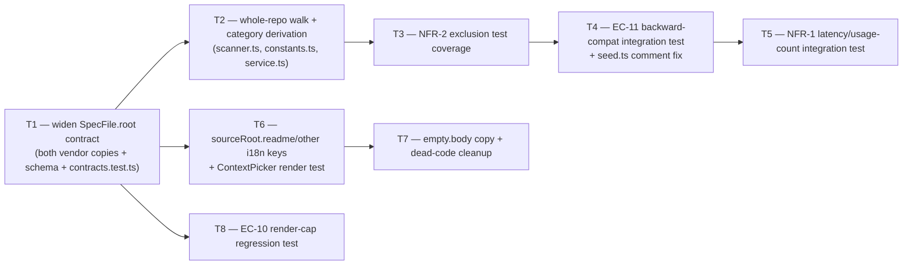

# Implementation Plan: Project Context — widen scan scope to the whole repository clone

## Overview
SPEC-01 (Project Context) was amended on 2026-08-28: the scanner no longer walks only
`specs/`, `docs/`, and `insights/` subtrees — it walks the entire repository clone (minus an
excluded build/dependency set plus every dot-directory), and `SpecFile.root` becomes a
path-derived category that also covers `readme` and a residual value. The feature itself
already shipped on this branch; this plan covers only the amendment — the walker, the
category-derivation rule, the widened contract, and the UI/copy surfaces that read `root` —
not a re-build of Project Context.

## Execution mode
- Mode: single-agent (sequential)
- Rationale: confirmed by the user — one module's tightly-coupled work (contract → scanner →
  UI label), well under the threshold where parallel width pays.

## Requirements (as given)
Traced verbatim to SPEC-01's `AC-n`/`EC-n`/`NFR-n` ids, restricted to the criteria the
amendment actually changed (per the dispatch brief and confirmed by reading the amended spec
text end to end). No renumbering.

- AC-1 (US-1): whole-clone `.md` discovery; `root` becomes a path-derived category covering at
  least `docs`, `specs`, `insights`, `readme`, plus a residual value (exact residual value is an
  implementation decision, delegated explicitly by the spec) — status: clear
- NFR-2 (AC-1): exclusion set widens to the existing build/dependency directories **plus every
  directory whose name begins with a dot** — status: clear
- EC-2 (AC-1): the "no markdown documents found" empty state must no longer name a fixed set of
  scanned directories — status: clear
- EC-10 (AC-1): render-cap/filter behavior must hold under a much larger discovered set — status:
  clear (regression of unchanged mechanism, re-affirmed under new conditions)
- NFR-1 (AC-3, global): the 5s p95 bound (≤5,000 matching files, including usage-count
  computation) is now the primary defence since the walk is unbounded by subtree — status: clear,
  scoped down for automated verification (see Testing strategy)
- EC-11 (AC-1, AC-5): documents attached before this change (discovered under the old
  fixed-root scan) must remain attached and resolvable — status: clear
- NFR-9 (AC-1, global): `SpecFile.root` widening is a breaking change to a contract vendored in
  two copies; both must widen together; no DB migration required (`root` is a plain `text`
  column, no CHECK constraint — confirmed by direct query) — status: clear

Out of scope for this plan (explicitly, per the amended spec's Non-goals): user-configurable
scan roots/exclusions: not offered. Editing/uploading documents: still non-goals, unaffected by
this amendment.

## Recommendations (not requirements)
- Fix the now-inaccurate doc comment in `server/src/db/seed.ts:152-161` ("README.md ... are
  negative fixtures the context scanner must exclude") while touching the same fixture for the
  EC-11 regression test — README.md flips from a negative fixture to a positive `readme`-category
  fixture under the widened scan. — one-comment-block correctness fix, no functional change —
  recommended, folded into T4.
- Do **not** touch `context.notCloned.body` ("Clone this repo locally to scan specs/, docs/, and
  insights/ for project context.") even though it is now imprecise — `e2e/specs/08-project-
  context.flow.json` asserts this exact string verbatim. Changing it without also updating the
  e2e flow (out of scope here) would break the e2e gate for no requirement gain — declined by
  user's framing (no EC/AC calls for this string; only `empty.body` is required by EC-2).
- Remove the dead `CONTEXT_ROOTS` constant and its now-stale "three scanned roots" comment in
  `client/.../ProjectContextView/constants.ts`, and the unused `context.roots` ("Scanned roots")
  message key — both are unreferenced dead code that becomes actively misleading after this
  change. — recommended, folded into T7.
- Scale NFR-1's automated latency check down from the spec's literal "~5,000 files" to a smaller
  representative synthetic fixture (a few hundred files across many directories, including a
  large excluded subtree) rather than materializing 5,000 real files inside a Testcontainers
  test — the existing `MAX_INDEXED_FILES = 5000` bound is unchanged by this amendment; the
  amendment's actual risk is "does the walk stay fast when it can no longer stop at 3 subtrees,"
  which the scaled fixture exercises. The literal 5,000-file p95 claim remains a manual leg (spec
  already splits it that way: "e2e for the progress affordance"). — recommended, adopted.

## Open questions
None — the dispatch brief pre-answered every ambiguity Step 0 would otherwise have raised
(execution mode, exact facts about the `root` column/CHECK constraint, which vendored files
change, the outermost-wins nesting precedent). One implementation decision this plan makes
explicit because the spec deliberately delegates it: the residual category's literal enum value
is `'other'`.

## Affected modules & contracts
- `server` — scanner walk + category derivation, DB schema TS-narrowing, service-layer
  message/fallback cleanup, new unit + integration test coverage.
- `client` — category label i18n keys, empty-state copy, dead-code cleanup, new unit test
  coverage.
- Contracts: `SpecFile.root` widened in both vendored copies of `@devdigest/shared` (breaking
  change, called out per NFR-9 — **not** a new contract file, an edit to an existing one).

## Architecture changes
- `server/src/vendor/shared/contracts/platform.ts` and
  `client/src/vendor/shared/contracts/platform.ts` — `SpecFile.root`:
  `z.enum(['specs','docs','insights'])` → `z.enum(['specs','docs','insights','readme','other'])`.
  Domain layer (shared contract), both packages in one change (NFR-9).
- `server/src/modules/context/constants.ts` — `ContextRoot` widens to the 5-value union above;
  gains a new pure function `deriveCategory(relPath: string): ContextRoot` that is the **single**
  place the category-derivation rule lives (replacing the duplicate ad hoc fallback that used to
  live in `service.ts`'s `deriveRoot`). Precedence, made explicit per the dispatch brief's request:
  1. Walk the path's directory segments **from the repo root down** (outermost first); the first
     segment matching `CONTEXT_ROOT_DIRS` (`specs`/`docs`/`insights`) wins — this is the existing
     "outermost wins" rule from `scanner.ts:190-198`, now applied to a full path since there is no
     more `activeRoot` walk-state to carry it implicitly.
  2. Else, if the filename (case-insensitive) is `readme.md` → `'readme'`.
  3. Else → `'other'`.
  Domain-ish pure logic (application layer helper), no I/O.
- `server/src/modules/context/scanner.ts` — `walkDir` drops the `activeRoot` gating parameter
  entirely: every non-excluded, non-symlinked `.md` file is now a candidate (previously only
  files nested under a context-root directory were). Exclusion predicate becomes
  `EXCLUDED_SET.has(name) || name.startsWith('.')` (NFR-2). Category is computed once per
  candidate via `deriveCategory`. Infrastructure/application boundary — still no DB, no Fastify.
- `server/src/modules/context/service.ts` — `deriveRoot()`'s duplicate fallback logic is replaced
  by a call to `constants.ts`'s `deriveCategory()`; `buildScanMessage()` stops claiming the scan
  covers three named roots (`"Scanned specs, docs, insights — found N documents"` → repo-wide
  phrasing). Application layer, orchestration only.
- `server/src/db/schema/project-context.ts:41` — `root: text('root', { enum: [...] })` TS-only
  narrowing widens to match; **no migration** (plain `text` column, no CHECK constraint —
  verified by direct query, NFR-9).
- `client/src/components/context-picker/ContextPicker.tsx:246` — unchanged code, but now renders
  `tContext('sourceRoot.readme'|'sourceRoot.other')` for previously-impossible values; the keys
  must exist before this ships or next-intl falls back visibly.
- `client/messages/en/context.json` — new `sourceRoot.readme` / `sourceRoot.other` keys;
  `empty.body` rewritten to stop naming `specs/`, `docs/`, `insights/` (EC-2); dead `roots` key
  removed.
- `client/.../ProjectContextView/constants.ts` — dead `CONTEXT_ROOTS` constant + stale comment
  removed (never imported anywhere else — confirmed by search).



## Phased tasks

### Phase 1 — Contract barrier
- **T1**
  - **Action:** Widen `SpecFile.root` from `z.enum(['specs','docs','insights'])` to
    `z.enum(['specs','docs','insights','readme','other'])` in **both** vendored copies. Widen the
    matching TS-only enum narrowing on `root: text('root', { enum: [...] })` in
    `server/src/db/schema/project-context.ts:41` to the same 5 values (no migration — the column
    is plain `text`, no CHECK constraint). Add a `SpecFile` import + parse assertions to
    `server/test/contracts.test.ts` covering all 5 category values (including the pre-existing
    3, to prove backward parse compatibility) — the file does not import `SpecFile` today.
  - **Module:** server
  - **Type:** backend
  - **Skills to use:** zod (schema-use-enums, type-use-z-infer), postgresql-table-design (confirm
    no migration needed — TS-only narrowing, not a DB constraint)
  - **Owned paths:** `server/src/vendor/shared/contracts/platform.ts`,
    `client/src/vendor/shared/contracts/platform.ts`,
    `server/src/db/schema/project-context.ts`, `server/test/contracts.test.ts`
  - **Depends-on:** none
  - **Parallel-safe with:** none (barrier — every other task needs the widened type to compile)
  - **Traces to:** NFR-9
  - **Test:** `server/test/contracts.test.ts`
  - **Risk:** low
  - **Known gotchas:** `./scripts/arch-check.sh`'s `contracts-in-sync` rule diffs the two vendored
    copies byte-for-byte after import-path normalization — edit both identically or the arch-check
    gate goes from 3 to 4 violations. Do **not** add a migration file — the column already accepts
    any text value; only the Drizzle/Zod TypeScript narrowing changes.
  - **Acceptance:** `cd server && pnpm exec vitest run test/contracts.test.ts` passes with new
    assertions for `'readme'` and `'other'`; `cd server && pnpm typecheck` still shows exactly 9
    pre-existing errors (all in `run.repo.severity.test.ts`); `cd client && pnpm typecheck` still
    shows 0; `./scripts/arch-check.sh` still shows exactly 3 violations (not 4).

### Phase 2 — Scanner core rewrite
- **T2**
  - **Action:** Rewrite `walkDir` in `server/src/modules/context/scanner.ts` to drop the
    `activeRoot: ContextRoot | null` parameter and the "only collect files nested under a
    context-root directory" gate — every non-excluded, non-symlinked `.md` file anywhere in the
    clone is now a candidate. Add `deriveCategory(relPath: string): ContextRoot` to
    `server/src/modules/context/constants.ts`, implementing the explicit 3-step precedence from
    Architecture changes above (outermost directory-segment match → readme-by-filename →
    `'other'`), and widen the `ContextRoot` type / `CONTEXT_ROOT_DIRS`-adjacent exports there.
    Rewrite the module header comments in both files — they currently describe the old
    "specs/docs/insights at any depth" glob-equivalent scope, which is no longer true. Update
    `server/src/modules/context/service.ts`'s `deriveRoot()` to delegate to the new
    `deriveCategory()` (deleting its duplicate logic) and `buildScanMessage()` to stop naming
    three fixed roots. Do **not** touch `server/src/modules/context/repository.ts` — it only
    imports the `ContextRoot` type, no logic there needs to change. Do **not** touch
    `server/src/modules/repo-intel/constants.ts` — `EXCLUDED_DIRS`/`MAX_FILE_SIZE`/
    `MAX_INDEXED_FILES` stay imported, never redefined.
  - **Module:** server
  - **Type:** backend
  - **Skills to use:** onion (application vs infrastructure boundary — `deriveCategory` is pure,
    stays out of the walk's I/O), ts (exhaustive union widening), postgresql-table-design (n/a
    here beyond what T1 already covered)
  - **Owned paths:** `server/src/modules/context/scanner.ts`,
    `server/src/modules/context/constants.ts`, `server/src/modules/context/service.ts`,
    `server/test/context-scanner.test.ts` (new)
  - **Depends-on:** T1
  - **Parallel-safe with:** none (single-agent)
  - **Traces to:** AC-1
  - **Test:** `server/test/context-scanner.test.ts`
  - **Known gotchas:** the "outermost wins" rule already exists as an informal comment at
    `scanner.ts:190-198` for the old `activeRoot`-propagation version — the rewrite must preserve
    the same semantics (first directory segment from the root, not the deepest) now that it runs
    over the full path instead of walk-state. Never-follow-symlinks (EC-3) must survive the
    rewrite unchanged — it is a one-line `entry.isSymbolicLink()` guard, easy to drop by accident
    when restructuring the loop. `scanClone` has zero DB dependency — it is filesystem + tokenizer
    only, so its own test does not need Postgres, unlike T4/T5.
  - **Risk:** medium (central walk rewrite; broad candidate-set change)
  - **Acceptance:** new fixture in `context-scanner.test.ts` with `.md` files at
    `docs/x.md`, `specs/y.md`, `insights/z.md`, `README.md` (repo root, no directory segment),
    `notes/plain.md` (no special ancestor anywhere in its path), and `docs/specs/nested.md`
    (two category-like segments) — asserts categories `docs`, `specs`, `insights`, `readme`,
    `other`, and `docs` (outermost wins) respectively. `cd server && pnpm exec vitest run
    test/context-scanner.test.ts` passes; `cd server && pnpm typecheck` still exactly 9 errors.

- **T3**
  - **Action:** Append NFR-2-specific assertions to `server/test/context-scanner.test.ts`: a
    fixture tree containing `node_modules/README.md`, `dist/notes.md`, `.claude/NOTES.md`, and
    `.github/CONTRIBUTING.md`, asserting `scanClone` returns none of them and that the walk does
    not descend into those directories at all (e.g. assert no candidate path contains any of those
    segments, not merely that they're filtered post-hoc). No production code change — T2 already
    implements the exclusion predicate; this task is dedicated coverage for NFR-2's own Verify
    text, which is narrower and more specific than AC-1's.
  - **Module:** server
  - **Type:** backend
  - **Skills to use:** ts, security (defense-in-depth reasoning for why dot-dirs matter — agent-
    tooling directories dominate once the scan is unrestricted)
  - **Owned paths:** `server/test/context-scanner.test.ts` (append only)
  - **Depends-on:** T2
  - **Parallel-safe with:** none (single-agent)
  - **Traces to:** NFR-2
  - **Test:** `server/test/context-scanner.test.ts`
  - **Known gotchas:** the rationale in the spec: on the repository used to validate this change,
    125 of 169 markdown files live under `.claude/` alone — without the dot-directory exclusion
    the list would be dominated by agent-tooling docs. Also fold in EC-2's integration leg here
    (a fixture whose only `.md` files live entirely under excluded/dot directories) — assert
    `scanClone` returns an empty `documents` array, not an error.
  - **Risk:** low
  - **Acceptance:** `cd server && pnpm exec vitest run test/context-scanner.test.ts` passes,
    including the empty-result case; test count in this file increases, overall suite stays green.

### Phase 3 — Backward-compatibility and latency regression
- **T4**
  - **Action:** Add `server/test/context-scan-scope.it.test.ts` (Testcontainers, follows the
    `startPg()`/`dockerAvailable()` skip pattern from `server/test/skills.it.test.ts`). Reuse the
    existing `seed()` fixture rather than constructing a new one: `server/src/db/seed.ts` already
    writes a fixture git repo for `acme/payments-api` with `specs/security-baseline.md` and
    `specs/public-api.md` on disk, both already attached to a seeded agent
    (`seed.ts:706-708`) — that is exactly the EC-11 scenario (attached before this change, under
    the old fixed-root scan). Seed, run the widened `scanClone`/`ContextService.list` +
    `getAgentContext` against it, and assert both documents are still present, still categorized
    correctly (`specs`), and still resolve at read time. In the same task, fix the now-inaccurate
    doc comment at `server/src/db/seed.ts:152-161` — it currently calls `README.md` a "negative
    fixture the context scanner must exclude," which becomes false under the widened scan
    (`README.md` is now a **positive** `readme`-category fixture); update the comment only, the
    fixture file writes are unchanged.
  - **Module:** server
  - **Type:** backend
  - **Skills to use:** postgresql-table-design (n/a beyond existing schema), fastify (n/a — no
    route change), ts
  - **Owned paths:** `server/test/context-scan-scope.it.test.ts` (new),
    `server/src/db/seed.ts` (comment only, lines ~152-161)
  - **Depends-on:** T2, T3
  - **Parallel-safe with:** none (single-agent)
  - **Traces to:** EC-11
  - **Test:** `server/test/context-scan-scope.it.test.ts`
  - **Known gotchas:** requires Docker (Testcontainers `pgvector/pgvector:pg16`); follows the
    existing `dockerAvailable()` skip-cleanly pattern — do not fail the suite when Docker is
    unavailable in a sandboxed run. `specs/deleted-doc.md` is also attached in the seed fixture
    but deliberately never written to disk (EC-7's "missing in repo" fixture) — do not "fix" that;
    it is intentional and unrelated to this task.
  - **Risk:** low
  - **Acceptance:** `cd server && pnpm exec vitest run .it.test` (Docker available) shows the new
    file passing, including an assertion that `specs/security-baseline.md` and
    `specs/public-api.md` remain in the agent's effective document set with `missing: false`
    after re-scanning under the widened scanner + contract.

- **T5**
  - **Action:** Append an NFR-1 latency case to `server/test/context-scan-scope.it.test.ts`: build
    a synthetic fixture directory tree (a few hundred `.md` files spread across many nested
    directories, plus a large excluded subtree such as a big `node_modules/` or `.claude/` tree to
    prove exclusion keeps the walk cheap) and time
    `ContextService.rescan` + `ContextService.list` (the latter includes `usedByAgentCounts`, the
    DB-backed piece NFR-1's Verify text calls out explicitly). Assert completion well under a
    generous bound scaled to the fixture size. Document in the test file's comment that the
    literal ~5,000-file p95 claim from the spec is intentionally not reconstructed here (see
    Recommendations) and remains a manual/CI-scale concern bounded by the pre-existing
    `MAX_INDEXED_FILES = 5000` cap, which this amendment does not change.
  - **Module:** server
  - **Type:** backend
  - **Skills to use:** ts, postgresql-table-design (usedByAgentCounts is the DB-backed leg)
  - **Owned paths:** `server/test/context-scan-scope.it.test.ts` (append only)
  - **Depends-on:** T4
  - **Parallel-safe with:** none (single-agent)
  - **Traces to:** NFR-1
  - **Test:** `server/test/context-scan-scope.it.test.ts`
  - **Known gotchas:** this leg needs Postgres (via `usedByAgentCounts`), unlike T2/T3's pure-fs
    `scanClone` tests — that's why it lives in the `.it.test.ts` file, not
    `context-scanner.test.ts`.
  - **Risk:** low
  - **Acceptance:** `cd server && pnpm exec vitest run .it.test` (Docker available) shows the
    latency case passing under the documented scaled bound.

### Phase 4 — UI category display and copy
- **T6**
  - **Action:** Add `sourceRoot.readme` and `sourceRoot.other` keys to
    `client/messages/en/context.json`, following the existing lowercase style
    (`"specs": "specs/"`, `"docs": "docs/"`, `"insights": "insights/"` — `readme`/`other` have no
    directory to name, so no trailing slash). Add `client/src/components/context-picker/
    ContextPicker.test.tsx` (new — no test currently exists for this component) rendering the
    component with stub `SpecFile[]` documents whose `root` is `'readme'` and `'other'`
    respectively, asserting the correct localized label renders for each and that next-intl does
    not fall back to a raw key.
  - **Module:** client
  - **Type:** ui
  - **Skills to use:** next-intl usage per frontend-architecture, react (render test, no
    unnecessary memoization), ts
  - **Owned paths:** `client/messages/en/context.json` (add `sourceRoot.readme`,
    `sourceRoot.other` only), `client/src/components/context-picker/ContextPicker.test.tsx` (new)
  - **Depends-on:** T1
  - **Parallel-safe with:** none (single-agent)
  - **Traces to:** AC-1
  - **Test:** `client/src/components/context-picker/ContextPicker.test.tsx`
  - **Known gotchas:** `ContextPicker.tsx:246` already reads `tContext(\`sourceRoot.${doc.root}\`)`
    — no code change needed there, only the missing keys. `fetch` is globally mocked in vitest
    (`src/test/setup.ts`) — `useContextDocument`'s fetch must be accounted for in the render
    harness (mock or keep the row's preview closed) or the test will hang on an unresolved
    promise. Follow an existing colocated test's render-harness pattern (e.g.
    `client/src/app/agents/_components/AgentCard/AgentCard.test.tsx`) for `NextIntlClientProvider`
    setup rather than inventing a new one.
  - **Risk:** low
  - **Acceptance:** `cd client && pnpm exec vitest run src/components/context-picker/
    ContextPicker.test.tsx` passes; `cd client && pnpm typecheck` stays at 0.

- **T7**
  - **Action:** Rewrite `context.empty.body` in `client/messages/en/context.json` so it no longer
    names `specs/`, `docs/`, or `insights/` as the scanned set (EC-2) — describe discovery as
    repository-wide, outside excluded/dot directories. Do **not** touch `context.notCloned.body`
    — `e2e/specs/08-project-context.flow.json` asserts it verbatim (see Recommendations). Remove
    the unused `context.roots` ("Scanned roots") message key and the dead `CONTEXT_ROOTS` constant
    + its stale "three scanned roots" comment in
    `client/src/app/repos/[repoId]/context/_components/ProjectContextView/constants.ts` (confirmed
    unreferenced anywhere else in the client). Add
    `client/src/app/repos/[repoId]/context/_components/ProjectContextView/copy.test.ts` (new) — a
    lightweight test importing the `en/context.json` messages and asserting `empty.body` does not
    match `/specs\/|docs\/|insights\//`, so the EC-2 requirement is enforced by an automated check
    rather than a manual read.
  - **Module:** client
  - **Type:** ui
  - **Skills to use:** frontend-architecture (dead-code removal is a "where does this go / should
    this exist" call), next-intl usage, ts
  - **Owned paths:** `client/messages/en/context.json` (edit `empty.body`, remove `roots`),
    `client/src/app/repos/[repoId]/context/_components/ProjectContextView/constants.ts`,
    `client/src/app/repos/[repoId]/context/_components/ProjectContextView/copy.test.ts` (new)
  - **Depends-on:** T6 (both edit `client/messages/en/context.json` — serialize to avoid a merge
    conflict, even though the keys touched don't overlap)
  - **Parallel-safe with:** none (single-agent)
  - **Traces to:** EC-2
  - **Test:** `client/src/app/repos/[repoId]/context/_components/ProjectContextView/copy.test.ts`
  - **Known gotchas:** `ProjectContextView`'s own `DocumentRow` does **not** render a root/category
    chip today (removed in a prior design pass — confirmed by reading the file; only
    `ContextPicker.tsx` renders `sourceRoot.*`) — do not add one here, it is out of scope for this
    amendment. Double-check `CONTEXT_ROOTS` really is dead (grep confirms it is exported but never
    imported anywhere) before deleting.
  - **Risk:** low
  - **Acceptance:** `cd client && pnpm exec vitest run src/app/repos/\[repoId\]/context/
    _components/ProjectContextView/copy.test.ts` passes; `cd client && pnpm test` still 37+ (net
    new tests, none removed); `cd client && pnpm typecheck` stays at 0; e2e flow 08's asserted
    `notCloned.body` string is byte-identical to before (grep-diff `context.json` against git
    HEAD for that one key).

- **T8**
  - **Action:** Add `client/src/app/repos/[repoId]/context/_components/ProjectContextView/
    helpers.test.ts` (new — no test file exists for this folder today) covering `capForDisplay`
    with a stub of ≥2,000 `SpecFile`-shaped objects spanning all 5 category values (`specs`,
    `docs`, `insights`, `readme`, `other`), asserting `rows.length === LIST_RENDER_CAP`,
    `truncated === true`, and `total` equals the full input length — re-affirming EC-10's existing
    render-cap mechanism holds now that the discovered set can be much larger and more varied by
    category than it was under the fixed-root scan.
  - **Module:** client
  - **Type:** ui
  - **Skills to use:** react (pure-function test, no rendering needed), ts
  - **Owned paths:** `client/src/app/repos/[repoId]/context/_components/ProjectContextView/
    helpers.test.ts` (new)
  - **Depends-on:** T1
  - **Parallel-safe with:** none (single-agent)
  - **Traces to:** EC-10
  - **Test:** `client/src/app/repos/[repoId]/context/_components/ProjectContextView/
    helpers.test.ts`
  - **Known gotchas:** `capForDisplay` is a pure function already exported from `helpers.ts` —
    this task needs no component rendering, no `NextIntlClientProvider`, no fetch mocking; keep it
    that way rather than reaching for a full `ProjectContextView` render test, which would be a
    much heavier and unnecessary test for what EC-10 actually asks.
  - **Risk:** low
  - **Acceptance:** `cd client && pnpm exec vitest run src/app/repos/\[repoId\]/context/
    _components/ProjectContextView/helpers.test.ts` passes; `cd client && pnpm typecheck` stays
    at 0.

## Per-task briefs (what the orchestrator actually dispatches)

```dispatch T1 → implementer-backend
Action: Widen SpecFile.root from z.enum(['specs','docs','insights']) to
z.enum(['specs','docs','insights','readme','other']) in BOTH vendored copies
(server/src/vendor/shared/contracts/platform.ts AND
client/src/vendor/shared/contracts/platform.ts — edit identically, arch-check.sh's
contracts-in-sync rule diffs them byte-for-byte after .js-import normalization). Widen the
matching TS-only enum narrowing on server/src/db/schema/project-context.ts:41
(root: text('root', { enum: [...] })) to the same 5 values. NO MIGRATION — the column is plain
text with no CHECK constraint (confirmed by direct DB query). Add a SpecFile import + parse
assertions to server/test/contracts.test.ts covering all 5 values including the pre-existing 3
(backward-compat proof).
Module: server   Type: backend
Skills to emphasise: zod (schema-use-enums), postgresql-table-design (confirm no migration)
Owned paths: `server/src/vendor/shared/contracts/platform.ts`,
`client/src/vendor/shared/contracts/platform.ts`, `server/src/db/schema/project-context.ts`,
`server/test/contracts.test.ts`
Do NOT touch (other tasks own these): everything else — this is the barrier task, nothing else
has landed yet.
Depends-on: none
Known gotchas: contracts-in-sync arch-check rule requires byte-identical vendored files; do not
add a migration file.
Test: `server/test/contracts.test.ts`
Traces to: NFR-9 — "widening SpecFile.root ... is a breaking change to a shared contract
vendored in two copies ... both copies shall be widened together"
Acceptance: `cd server && pnpm exec vitest run test/contracts.test.ts` passes; `cd server &&
pnpm typecheck` exactly 9 pre-existing errors (unchanged); `cd client && pnpm typecheck` 0;
`./scripts/arch-check.sh` exactly 3 violations (unchanged).
Plan file (read only if blocked): docs/plans/project-context-scan-scope.md § Phase 1
```

```dispatch T2 → implementer-backend
Action: Rewrite walkDir in server/src/modules/context/scanner.ts to drop the
`activeRoot: ContextRoot | null` gating parameter — every non-excluded, non-symlinked .md file
anywhere in the clone is now a candidate (previously only files nested under a context-root
directory were collected). Add `deriveCategory(relPath: string): ContextRoot` to
server/src/modules/context/constants.ts implementing this precedence explicitly: (1) walk the
path's directory segments from the repo root down (outermost first); first segment matching
CONTEXT_ROOT_DIRS ('specs'/'docs'/'insights') wins — this is the pre-existing "outermost wins"
rule from scanner.ts:190-198, now applied over the full path since there is no more activeRoot
walk-state; (2) else if filename (case-insensitive) is 'readme.md' → 'readme'; (3) else →
'other'. Widen ContextRoot's union to the 5 values. Rewrite both files' module header comments
— they currently describe the old "specs/docs/insights at any depth" scope, no longer true.
Update server/src/modules/context/service.ts: deriveRoot() delegates to the new
deriveCategory() (delete its duplicate logic); buildScanMessage() stops naming three fixed
roots. Do NOT touch repository.ts (type-only usage, no logic change) or
repo-intel/constants.ts (EXCLUDED_DIRS/MAX_FILE_SIZE/MAX_INDEXED_FILES stay imported, never
redefined).
Module: server   Type: backend
Skills to emphasise: onion (pure deriveCategory stays out of I/O), ts (union widening)
Owned paths: `server/src/modules/context/scanner.ts`, `server/src/modules/context/constants.ts`,
`server/src/modules/context/service.ts`, `server/test/context-scanner.test.ts` (new)
Do NOT touch (other tasks own these): `server/src/modules/context/repository.ts` (no change
needed), `server/src/modules/repo-intel/constants.ts` (never redefine), `server/test/
context-scan-scope.it.test.ts` (T4/T5), client files (T6/T7/T8)
Depends-on: T1
Known gotchas: preserve the never-follow-symlinks guard (entry.isSymbolicLink()) through the
rewrite — EC-3, easy to drop by accident. scanClone has zero DB dependency (fs + tokenizer
only) — its test needs no Postgres.
Test: `server/test/context-scanner.test.ts`
Traces to: AC-1 — "the system shall list every .md file found anywhere in the repository clone
except beneath an excluded directory ... showing ... a category derived from its path,
distinguishing at least docs, specs, insights, and readme, with every other document falling
into a residual category"
Acceptance: fixture with docs/x.md, specs/y.md, insights/z.md, README.md (root, no dir
segment), notes/plain.md (no special ancestor), docs/specs/nested.md (two category-like
segments) → categories docs/specs/insights/readme/other/docs respectively.
`cd server && pnpm exec vitest run test/context-scanner.test.ts` passes; `cd server && pnpm
typecheck` exactly 9 errors (unchanged).
Plan file (read only if blocked): docs/plans/project-context-scan-scope.md § Phase 2
```

```dispatch T3 → implementer-backend
Action: Append NFR-2-specific assertions to server/test/context-scanner.test.ts: a fixture tree
with node_modules/README.md, dist/notes.md, .claude/NOTES.md, .github/CONTRIBUTING.md — assert
scanClone returns none of them AND that the walk never descends into those directories (not
merely filtered post-hoc). No production code change (T2 already implements the exclusion
predicate) — this task is dedicated NFR-2 coverage. Also add EC-2's integration leg here: a
fixture whose only .md files live entirely under excluded/dot directories → assert scanClone
returns an empty documents array (not an error).
Module: server   Type: backend
Skills to emphasise: ts, security (why dot-dir exclusion matters — agent-tooling dominance once
scan is unrestricted)
Owned paths: `server/test/context-scanner.test.ts` (append only — T2 already created this file)
Do NOT touch: any production file — this task is test-only.
Depends-on: T2
Known gotchas: on the repo used to validate this change, 125 of 169 markdown files live under
.claude/ alone (NFR-2's own rationale) — the fixture should be big enough to make the
"dominance" risk visible, not just a token single-file check.
Test: `server/test/context-scanner.test.ts`
Traces to: NFR-2 — "the walk shall exclude the existing dependency/build directory set ... and,
in addition, every directory whose name begins with a dot"
Acceptance: `cd server && pnpm exec vitest run test/context-scanner.test.ts` passes, including
the empty-result case; overall suite stays green.
Plan file (read only if blocked): docs/plans/project-context-scan-scope.md § Phase 2
```

```dispatch T4 → implementer-backend
Action: Add server/test/context-scan-scope.it.test.ts (Testcontainers — follow the
startPg()/dockerAvailable() skip-cleanly pattern from server/test/skills.it.test.ts). Reuse the
existing seed() fixture instead of building a new one: server/src/db/seed.ts already writes a
fixture git repo for acme/payments-api with specs/security-baseline.md and specs/public-api.md
on disk, both already attached to a seeded agent (seed.ts:706-708) — that IS the EC-11
scenario (attached before this change, under the old fixed-root scan). Seed, run the widened
scanClone/ContextService.list + getAgentContext against it, assert both documents remain
present, correctly categorized ('specs'), and still resolve at read time. Also: fix the
now-inaccurate doc comment at server/src/db/seed.ts:152-161 — it currently calls README.md a
"negative fixture the context scanner must exclude," which is false under the widened scan
(README.md is now a POSITIVE 'readme'-category fixture) — comment-only edit, do not change the
fixture file writes.
Module: server   Type: backend
Skills to emphasise: ts, postgresql-table-design (reused schema, no new tables)
Owned paths: `server/test/context-scan-scope.it.test.ts` (new), `server/src/db/seed.ts`
(comment only, ~lines 152-161)
Do NOT touch: seed.ts's actual fixture file writes/attachment seeding logic — only the doc
comment changes. `server/test/context-scanner.test.ts` (T2/T3 own it).
Depends-on: T2, T3
Known gotchas: requires Docker; skip cleanly (not fail) when unavailable, matching existing
pattern. specs/deleted-doc.md is deliberately attached-but-never-written in the seed fixture
(EC-7's "missing in repo" fixture) — leave that alone, unrelated to this task.
Test: `server/test/context-scan-scope.it.test.ts`
Traces to: EC-11 — "A document attached to an agent or skill before this change (discovered
under the old fixed-root scan) → remains attached and resolvable afterward"
Acceptance: `cd server && pnpm exec vitest run .it.test` (Docker available) — new file passes,
asserting specs/security-baseline.md and specs/public-api.md remain in the agent's effective
set with missing:false after re-scanning under the widened scanner + contract.
Plan file (read only if blocked): docs/plans/project-context-scan-scope.md § Phase 3
```

```dispatch T5 → implementer-backend
Action: Append an NFR-1 latency case to server/test/context-scan-scope.it.test.ts: build a
synthetic fixture (a few hundred .md files across many nested directories, plus a large
excluded subtree e.g. a big node_modules/ or .claude/ tree) and time
ContextService.rescan + ContextService.list (the latter includes usedByAgentCounts — the
DB-backed piece NFR-1's Verify text calls out) — assert completion well under a generous bound
scaled to the fixture size. Comment in the test explaining the literal ~5,000-file p95 claim is
intentionally not reconstructed here (expensive, and MAX_INDEXED_FILES=5000 is a pre-existing,
unchanged bound) — remains a manual/CI-scale concern.
Module: server   Type: backend
Skills to emphasise: ts, postgresql-table-design (usedByAgentCounts is the DB-backed leg)
Owned paths: `server/test/context-scan-scope.it.test.ts` (append only — T4 already created this
file)
Do NOT touch: any production file — test-only.
Depends-on: T4
Known gotchas: needs Postgres (usedByAgentCounts), unlike T2/T3's pure-fs scanClone tests —
that's why this lives in the .it.test.ts file.
Test: `server/test/context-scan-scope.it.test.ts`
Traces to: NFR-1 — "the document list ... shall be returned within 5 s at p95, including each
document's per-agent usage count ... this bound is the primary defense against an unbounded
scan"
Acceptance: `cd server && pnpm exec vitest run .it.test` (Docker available) — latency case
passes under the documented scaled bound.
Plan file (read only if blocked): docs/plans/project-context-scan-scope.md § Phase 3
```

```dispatch T6 → implementer-ui
Action: Add sourceRoot.readme and sourceRoot.other keys to client/messages/en/context.json,
following the existing lowercase style ("specs": "specs/", "docs": "docs/", "insights":
"insights/" — readme/other have no directory to name, no trailing slash). Add
client/src/components/context-picker/ContextPicker.test.tsx (new — none exists today):
render with stub SpecFile[] documents whose root is 'readme' and 'other', assert the correct
localized label renders for each and next-intl does not fall back to a raw key.
Module: client   Type: ui
Skills to emphasise: next-best-practices/frontend-architecture (i18n placement), react
(render test)
Owned paths: `client/messages/en/context.json` (add sourceRoot.readme, sourceRoot.other only —
do not touch empty.body or roots, T7 owns those), `client/src/components/context-picker/
ContextPicker.test.tsx` (new)
Do NOT touch: ContextPicker.tsx itself — it already reads
tContext(`sourceRoot.${doc.root}`), no code change needed there.
Depends-on: T1
Known gotchas: fetch is globally mocked in vitest (src/test/setup.ts) — useContextDocument's
fetch must be accounted for (mock it or keep preview closed) or the test hangs. Follow an
existing colocated test's render harness (e.g. client/src/app/agents/_components/AgentCard/
AgentCard.test.tsx) for NextIntlClientProvider setup.
Test: `client/src/components/context-picker/ContextPicker.test.tsx`
Traces to: AC-1 — "...showing each document's repository-relative path and a category derived
from its path, distinguishing at least docs, specs, insights, and readme..."
Acceptance: `cd client && pnpm exec vitest run src/components/context-picker/
ContextPicker.test.tsx` passes; `cd client && pnpm typecheck` stays 0.
Plan file (read only if blocked): docs/plans/project-context-scan-scope.md § Phase 4
```

```dispatch T7 → implementer-ui
Action: Rewrite context.empty.body in client/messages/en/context.json so it no longer names
specs/, docs/, or insights/ as the scanned set (EC-2) — describe discovery as repository-wide,
outside excluded/dot directories. Do NOT touch context.notCloned.body —
e2e/specs/08-project-context.flow.json asserts it verbatim. Remove the unused context.roots
("Scanned roots") key and the dead CONTEXT_ROOTS constant + its stale "three scanned roots"
comment in client/src/app/repos/[repoId]/context/_components/ProjectContextView/constants.ts
(confirmed unreferenced anywhere else). Add
client/src/app/repos/[repoId]/context/_components/ProjectContextView/copy.test.ts (new): import
en/context.json, assert empty.body does not match /specs\/|docs\/|insights\//.
Module: client   Type: ui
Skills to emphasise: frontend-architecture (dead-code call), next-intl usage
Owned paths: `client/messages/en/context.json` (edit empty.body, remove roots — T6 already
landed sourceRoot.* keys), `client/src/app/repos/[repoId]/context/_components/
ProjectContextView/constants.ts`, `client/src/app/repos/[repoId]/context/_components/
ProjectContextView/copy.test.ts` (new)
Do NOT touch: context.notCloned.body (asserted verbatim by e2e flow 08); ProjectContextView's
DocumentRow — it does not render a root/category chip today (removed in a prior design pass),
do not add one, out of scope.
Depends-on: T6
Known gotchas: grep-confirm CONTEXT_ROOTS truly has zero other importers before deleting.
Test: `client/src/app/repos/[repoId]/context/_components/ProjectContextView/copy.test.ts`
Traces to: EC-2 — "the page shows an empty state saying no markdown documents were found in
the repository; there is no longer a fixed set of scanned directories to name"
Acceptance: `cd client && pnpm exec vitest run src/app/repos/\[repoId\]/context/_components/
ProjectContextView/copy.test.ts` passes; `cd client && pnpm test` net-new (37+); `cd client &&
pnpm typecheck` 0; notCloned.body byte-identical to git HEAD (grep-diff check).
Plan file (read only if blocked): docs/plans/project-context-scan-scope.md § Phase 4
```

```dispatch T8 → implementer-ui
Action: Add client/src/app/repos/[repoId]/context/_components/ProjectContextView/
helpers.test.ts (new — no test exists for this folder today) covering capForDisplay with a
stub of ≥2,000 SpecFile-shaped objects spanning all 5 category values (specs, docs, insights,
readme, other): assert rows.length === LIST_RENDER_CAP, truncated === true, total equals the
full input length.
Module: client   Type: ui
Skills to emphasise: react (pure-function test, no rendering)
Owned paths: `client/src/app/repos/[repoId]/context/_components/ProjectContextView/
helpers.test.ts` (new)
Do NOT touch: helpers.ts itself (capForDisplay is unchanged, pre-existing) or constants.ts
(T7 owns it).
Depends-on: T1
Known gotchas: capForDisplay is already pure and exported — no component rendering,
NextIntlClientProvider, or fetch mocking needed; do not reach for a full ProjectContextView
render test, unnecessarily heavy for what EC-10 asks.
Test: `client/src/app/repos/[repoId]/context/_components/ProjectContextView/helpers.test.ts`
Traces to: EC-10 — "the list remains usable through the existing render cap and filter input;
no more than the capped number of rows renders at once"
Acceptance: `cd client && pnpm exec vitest run src/app/repos/\[repoId\]/context/_components/
ProjectContextView/helpers.test.ts` passes; `cd client && pnpm typecheck` stays 0.
Plan file (read only if blocked): docs/plans/project-context-scan-scope.md § Phase 4
```

## Traceability matrix

**Test-writer is switched off for this run.** Every `Test` file named below is the correct,
project-convention file for its criterion, but none will be created automatically by a
dedicated test-writer pass this run — each implementer task's Action explicitly includes writing
its own test file (since no later pass will). If an implementer skips the test file for time
reasons, the row below is the debt record: it stays open until someone writes that exact file.

| Criterion | Task | Test | Commit |
|---|---|---|---|
| NFR-9 (contract, unit leg) | T1 | `server/test/contracts.test.ts` | |
| AC-1 (server: whole-clone walk + category derivation) | T2 | `server/test/context-scanner.test.ts` | |
| NFR-2 (exclusion set incl. dot-directories) | T3 | `server/test/context-scanner.test.ts` | |
| EC-2 (integration leg — all-excluded clone → empty result) | T3 | `server/test/context-scanner.test.ts` | |
| EC-11 (pre-existing attachments keep resolving) | T4 | `server/test/context-scan-scope.it.test.ts` | |
| NFR-9 (contract, integration leg — old rows re-serve) | T4 | `server/test/context-scan-scope.it.test.ts` | |
| NFR-1 (latency bound incl. usage-count computation) | T5 | `server/test/context-scan-scope.it.test.ts` | |
| AC-1 (client: readme/other category label renders) | T6 | `client/src/components/context-picker/ContextPicker.test.tsx` | |
| EC-2 (UI copy leg — empty.body no longer names fixed roots) | T7 | `client/.../ProjectContextView/copy.test.ts` | |
| EC-10 (render-cap regression under a larger, varied set) | T8 | `client/.../ProjectContextView/helpers.test.ts` | |

As a checklist:

```
- [ ] T1 widen SpecFile.root (both vendor copies + schema)     → NFR-9        → contracts.test.ts
- [ ] T2 whole-repo walk + deriveCategory                       → AC-1         → context-scanner.test.ts
- [ ] T3 NFR-2 exclusion coverage + EC-2 integration leg         → NFR-2, EC-2  → context-scanner.test.ts
- [ ] T4 EC-11 backward-compat + seed.ts comment fix             → EC-11, NFR-9 → context-scan-scope.it.test.ts
- [ ] T5 NFR-1 latency + usage-count regression                 → NFR-1        → context-scan-scope.it.test.ts
- [ ] T6 sourceRoot.readme/other + ContextPicker render test     → AC-1         → ContextPicker.test.tsx
- [ ] T7 empty.body copy + dead-code cleanup                     → EC-2         → copy.test.ts
- [ ] T8 EC-10 render-cap regression                             → EC-10        → helpers.test.ts
```

## Testing strategy
- Server unit (hermetic, no Docker): `cd server && pnpm exec vitest run --exclude
  '**/*.it.test.ts'` — baseline 110 passing today; T2/T3 add `context-scanner.test.ts` on top,
  net increase, no regressions.
- Server integration (Docker required): `cd server && pnpm exec vitest run .it.test` — T4/T5 add
  `context-scan-scope.it.test.ts`; skips cleanly (not fails) if Docker is unreachable, matching
  the existing `dockerAvailable()` pattern used by every other `.it.test.ts` in the repo.
- Server typecheck: `cd server && pnpm typecheck` — must stay at exactly 9 pre-existing errors,
  all in `src/modules/reviews/repository/run.repo.severity.test.ts`. Any new error anywhere else
  is this plan's regression, not the pre-existing baseline.
- Client tests: `cd client && pnpm test` — baseline 37 passing; T6/T7/T8 add 3 new test files, net
  increase.
- Client typecheck: `cd client && pnpm typecheck` — must stay at 0.
- Architecture gate: `./scripts/arch-check.sh` — must stay at exactly 3 pre-existing violations
  (documented in the script's own header comment as real, unrelated drift). T1 is the only task
  that touches the `contracts-in-sync` rule's inputs; if it goes from 3 to 4, T1 did not edit both
  vendored copies identically.
- e2e (not modified by this plan, run as a regression gate only):
  `./scripts/e2e.sh` — specifically `08-project-context.flow.json`. Analytically verified to stay
  green: it asserts `empty.title` ("No spec files yet" — untouched), `notCloned.title`/
  `notCloned.body` (untouched, explicitly protected — see T7), and text search for
  `specs/public-api.md` plus its rendered H1 (still discovered and unchanged under the widened
  scan). It does not assert a specific document count or any category/root chip, so the seeded
  repo's discovered-document count moving from 4 to 5 (README.md newly included as the `readme`
  category — see T4) does not break any existing assertion. No task in this plan edits the flow
  file; re-running it after Phase 2/3 land is a recommended manual regression check, not a task,
  since Docker/full-stack e2e orchestration may not be available in every implementer's sandbox.

## Risks & mitigations
- **Central walk rewrite (T2) touches the one function every other AC in the shipped feature
  depends on.** → Scoped tightly to `walkDir`/category derivation only; `repository.ts`,
  `routes.ts`, and the attachment/ordering/path-guard modules are explicitly untouched (verified
  by grep — only `constants.ts`, `scanner.ts`, `service.ts` reference `ContextRoot` beyond the
  type-only import in `repository.ts`).
  Mitigation: T2's acceptance requires the full existing unit suite (110 tests) stays green, not
  just the new file.
- **Discovered-document count on the seeded fixture changes (4 → 5, README.md newly included).**
  → Analytically confirmed not to break `e2e/specs/08-project-context.flow.json` (no hardcoded
  count or chip assertion). Documented as a recommended manual re-run, not a required code
  change (see Testing strategy).
- **Test-writer is off this run** → every `Test:` field names the correct file per project
  convention, but nothing guarantees it gets written without a human/agent actually executing the
  task's Action, which includes the test file explicitly. Flagged in the Traceability matrix
  header as an honest debt marker rather than silently dropped.
- **`repo_context_documents.root` has no CHECK constraint today, so a stale server process running
  old code could still write a pre-widened value after this ships (no in-place risk, but worth
  naming): not a migration risk, just means the TS narrowing is advisory, matching the existing
  pattern for every other `text({ enum: [...] })` column in this schema file.** → No mitigation
  needed beyond normal deploy ordering (server code is single-process here; no rolling deploy
  split to worry about in this repo's actual deployment model).

## Red-flags check
- [x] The spec's `Status` is `approved` — confirmed by reading `specs/SPEC-01-project-context/
      SPEC-01.md:3` directly.
- [x] Every requirement traces to the user's dispatch brief, itself grounded in the amended spec
      text (AC-1, NFR-2, EC-2, EC-10, NFR-1, EC-11, NFR-9 — read verbatim from SPEC-01.md).
- [x] Every requirement maps to a task (see Traceability matrix — no orphan criterion).
- [x] Every task names exactly one `Traces to:` criterion and one `Test:` file (NFR-9 and EC-2
      each get a second row in the matrix for their second Verify leg, pointing at a different
      task, but each individual task still declares exactly one).
- [x] Every task has exactly one `Type`, matching the module it edits (T1/T2/T3/T4/T5 = backend/
      server; T6/T7/T8 = ui/client).
- [x] Every task has a `dispatch` brief naming the right `implementer-<type>`.
- [x] The traceability matrix covers every criterion — no orphan AC, no orphan task.
- [x] Spec ids used verbatim (`AC-1`, `EC-2`, `EC-10`, `EC-11`, `NFR-1`, `NFR-2`, `NFR-9`) — never
      renumbered into a parallel R-list.
- [x] Dependencies form a DAG: T1 → {T2→T3→T4→T5, T6→T7, T8}. No cycles.
- [x] No two tasks that could run concurrently share an Owned path (single-agent mode has no true
      concurrency, but T7's dependency on T6 is recorded anyway per the hard rule's own
      instruction to hold the discipline even in single-agent mode, since both touch
      `context.json`).
- [x] Every Acceptance names a concrete command/result (vitest file, typecheck count, arch-check
      violation count) — no "fast"/"clean"/"user-friendly".
- [x] No spec/requirements file was written or modified by this plan.
- [x] Existing shared contract (`SpecFile.root` in `@devdigest/shared`) is edited, not silently —
      explicitly called out under Architecture changes and NFR-9, with the breaking-change
      rationale and the "both copies together" requirement stated in T1.
