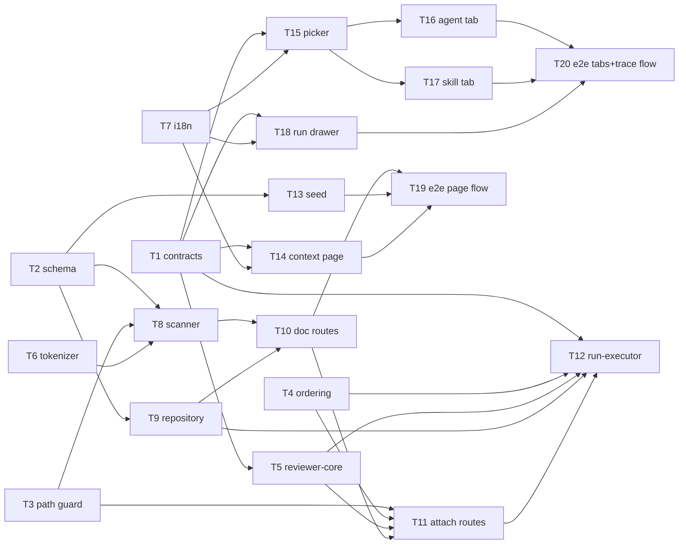

# Implementation Plan: Project Context (SPEC-01)

## Overview

Fill the `## Project context` prompt slot that `reviewer-core` already emits but nothing ever feeds.
The configurator browses every markdown document in the repository clone, attaches an ordered subset
to an agent and to a skill, sees the token cost live, and the run executor reads those documents at
run time and injects their full text as individually delimited untrusted data — recording path,
token size and read/missing status per document in the run trace.

Source spec: `specs/SPEC-01-project-context/SPEC-01.md` (`Status: approved`).

## Execution mode

- Mode: **multi-agent** (up to 6 parallel implementers per phase, 20 tasks total)
- Rationale: the user chose it, and the work really does split into ≥5 independent path groups —
  shared contracts, server scan/attach/run-executor, client page + two Context tabs + run drawer,
  reviewer-core prompt assembly, and e2e flows. Contracts land first as a barrier because both
  vendored copies must move together (`scripts/arch-check.sh` rule `contracts-in-sync`).

## Spec review gate (six questions, fresh eyes)

| # | Question | Verdict |
|---|---|---|
| 1 | Does each AC describe exactly one checkable thing? | Yes. AC-14 bundles four reactions but they are one failure path. |
| 2 | Are condition and expected reaction unambiguous? | Two soft ambiguities were raised (root depth, per-file size limit); **both closed by the user on 2026-08-28** — see Decisions Q-A and Q-B. Nothing in this plan runs on an unconfirmed reading. |
| 3 | Contradictions? | The design's `## Project specifications` / bare-path panel (Screen 3) contradicts Screens 2 and 4 — the spec surfaced it and **resolved it in AC-9** in favour of `## Project context` + delimited text. No unresolved contradiction. One code-level mismatch found (ordinal labels instead of paths), closed by the user as Q-C / R-A. |
| 4 | Behaviour, not incidental implementation detail? | Yes. AC-11/AC-18 name existing files only as "already done" notes. |
| 5 | Non-goals explicit? | Yes — seven, each with a reason. |
| 6 | Every `[NEEDS CLARIFICATION]` closed? | Yes — zero markers in the spec. Q-4/Q-5 are recorded assumptions with rationale, not open blockers. |

**No blocking finding. The spec is plannable and is not handed back.**

### Claims verified against the codebase

| Spec claim | Verdict |
|---|---|
| `## Project context` slot exists in `reviewer-core/src/prompt.ts` | **Already done** — `prompt.ts:101-104` builds `specsBlock`, `:121` pushes `## Project context`. |
| The heading is omitted when the set is empty (EC-8) | **Already done** — gated on `parts.specs.length > 0` and `if (specsBlock)`. Caveat: gated on *length only*, so `specs: ['']` would emit an empty block; the server must never pass blank text. |
| `wrapUntrusted` escapes the closing delimiter (EC-6) | **Already done** — `prompt.ts:32` `content.replaceAll('</untrusted>', '<\\/untrusted>')`. But the *test* lives in `server/test/prompt-structured.test.ts:9`, and EC-6's `Verify:` asks for a **reviewer-core** test, which does not exist. T5 adds it. |
| `SpecFile` / `IndexStatus` contracts exist | **Already done, dead code** — `platform.ts:246-261`, referenced nowhere but the barrel comment. |
| `useContextFiles` / `useReindexContext` exist | **Already done, dead code** — `client/src/lib/hooks/context-files.ts:8,16`, key `["context", repoId]`, zero component imports. |
| The `context` message catalogue exists | **Already done, unused** — `client/messages/en/context.json`. It contains `editor.save`/`mode.edit` keys that this slice must **not** use (editing is a non-goal) and an `empty.body` naming `.devdigest/specs/`, which EC-2 requires be replaced by the three scanned roots. |
| The run drawer renders the `specs` prompt block and `specs_read` | **Already done** — `TraceBody.tsx:38-50` and `:84-86`. Current label `trace.prompt.specs` = "Project context (dynamic)"; AC-18 requires "Project context — attached specs (untrusted)". |
| `run-executor.ts:415` writes `specs_read: []` | **Confirmed**, and a second site at `:600`. `specs` is never passed into `reviewPullRequest` (`run-executor.ts:310-340`), and `trace-builder.ts:61` hardcodes `specs: null`. |

Two further facts that shape the plan and were **not** in the spec:

- The shared contracts are **vendored twice** — `server/src/vendor/shared/contracts/` and
  `client/src/vendor/shared/contracts/` — and `scripts/arch-check.sh` rule `contracts-in-sync`
  diffs them modulo the `.js` import transform. `trace.ts` already carries comment-only drift, so
  the contracts task must reconcile it or the gate stays red. `mcp-server` and `reviewer-core` both
  alias the **server** copy, so their typecheck is also in the NFR-8 blast radius.
- `Tokenizer.count()` (`server/src/adapters/tokenizer/index.ts`) already degrades silently to
  `approxTokens` and **never reports that it did**. EC-5 requires the estimate be *labelled*
  approximate, so the port needs a `countDetailed()` that returns the flag. Nobody would infer this
  from the spec.

## Requirements (as given)

Spec ids are used verbatim. `AC-n`, `EC-n`, `NFR-n` — no parallel R-series, no renumbering.

**Acceptance criteria**

- AC-1: list every markdown document beneath the fixed root set, with path and source root — clear; root depth closed by the user 2026-08-28 as **any depth** (Q-A)
- AC-2: render a selected document read-only, no modifying control — clear
- AC-3: re-scan reflects added/removed files — clear
- AC-4: display, per document, the number of agents using it (direct + skill inheritance) — clear
- AC-5: persist path and position on attach/detach; never persist text — clear
- AC-6: persist and return a changed position — clear
- AC-7: attach on a skill persists independently of any agent — clear
- AC-8: a linked skill's documents appear in the agent's effective set — clear
- AC-9: skill Context tab previews the run-time serialisation (heading + delimited text, not bare paths) — clear; resolves the Screen-3 design contradiction
- AC-10: per-document and total token counts update without a page reload — clear
- AC-11: run reads each document and injects full text into one `## Project context` section, each delimited — clear; heading and delimiting **already exist**
- AC-12: agent-attached first in stored order, then skill-inherited by skill order then document order — clear
- AC-13: a duplicate path appears exactly once at its first occurrence — clear
- AC-14: unreadable document → omit, record missing, warn in the log, complete the run — clear
- AC-15: **zero language-model requests** to discover, attach, count, read or inject — clear; hard user constraint
- AC-16: a path resolving outside the clone root is refused on attach and on read — clear
- AC-17: the trace lists every document with path, token size, and read/missing status — clear
- AC-18: the trace presents a segment labelled "Project context — attached specs (untrusted)" that expands to the full injected text — clear

**Edge cases**

- EC-1: no local clone → explanatory state, no documents, no attachment — clear
- EC-2: no markdown under any root → empty state naming the scanned roots — clear
- EC-3: a symlinked `.md` inside a root is not listed and not attachable — clear
- EC-4: a document above the reader's per-file limit is excluded and the exclusion is reported — clear; the limit closed by the user 2026-08-28 as repo-intel's `MAX_FILE_SIZE` = 400 KB (Q-B)
- EC-5: token encoder unavailable → character estimate, labelled approximate, no error — clear; requires a port change
- EC-6: a document containing the closing delimiter cannot break out — **already satisfied** by `wrapUntrusted`; only the reviewer-core test is missing
- EC-7: an attached document renamed/moved → treated as missing, Context tab shows "missing in repo" — clear
- EC-8: empty effective set → no `## Project context` section, empty trace list, no error — **already satisfied** by `prompt.ts:102,121`
- EC-9: the same document inherited from two skills appears once, at the earlier skill — clear
- EC-10: several thousand documents → list stays usable via filtering, not rendered eagerly — clear

**Non-functional requirements**

- NFR-1: re-scan >300 ms shows progress; ≤5,000 candidate files returned within 5 s p95 — clear (see Risk R-3)
- NFR-2: discovery excludes dependency/build directories rather than walking them — clear
- NFR-3: unreadable document, unavailable encoder, absent clone each degrade; none fails a run — clear
- NFR-4: attach, detach and reorder are keyboard-operable and the new order is announced to AT — clear
- NFR-5: every user-visible string is a `next-intl` message key — clear
- NFR-6: the trace records the clone's commit sha — clear
- NFR-7: document text never persisted outside the clone; every stored path validated on attach and on read — clear
- NFR-8: widening `RunTrace.specs_read` from bare paths to path+size+status is a **breaking shared-contract change**; the run drawer and the server contract test are updated in the same change — clear

## Recommendations — all decided

Every recommendation below was raised by the planner, not by the spec. Five were accepted by the
user across two rounds on 2026-08-28; the sixth stays optional and outside the implementers' scope.

- **R-A — label each injected document by its repository-relative path.** `prompt.ts:103` currently
  wraps each entry as `wrapUntrusted('spec-' + i, s)`, so the model sees `spec-0`, `spec-1` and can
  never name the document it is citing. US-5 ("cite my project's actual rules") and the design brief's
  own verification step ("check that the reviewer cites that specific document") both want the path.
  Widening `PromptParts.specs` / `ReviewInput.specs` from `string[]` to `{ path, text }[]` makes the
  label `spec:specs/public-api.md`. It also makes AC-9's preview literally true, since preview and
  run time then share one function. — **accepted by user**; built into T5.
- **R-B — expose serialisation from `reviewer-core`, do not re-implement it in the client.** AC-9
  says the preview shows "the serialisation actually used at run time". Export
  `buildProjectContextSection(specs)` from `reviewer-core` and have the server preview endpoint call
  it, so drift is impossible. — **accepted by user**; built into T5 + T11.
- **R-C — persist the scan result rather than re-walking on every list request.** AC-3 ("since the
  previous scan"), AC-4's per-document agent count and NFR-1's 5 s budget all imply a stored scan.
  Two tables (`repo_context_documents`, `repo_context_scans`) hold path, root, byte size, token count
  and threat level — **never text**, so NFR-7 holds. — **accepted by user**; built into T2.
- **R-D — harden the shared `Markdown` primitive rather than forking it.**
  `client/src/vendor/ui/primitives/Markdown.tsx:30` passes `href` straight through, so a repository
  document containing `[x](javascript:…)` renders an active hostile link. The spec's
  `## Untrusted inputs` requires non-HTTP(S) schemes be inert. Fixing the shared primitive protects
  `FindingCard` and `CommentCard` too. — **accepted by user**; built into T14. Blast radius: three
  existing consumers, covered by the client suite.
- **R-E — reorder with buttons, not only drag.** The only existing reorder pattern
  (`SkillsTab.tsx:57-71`) is HTML5 drag-and-drop, which is not keyboard-operable; NFR-4 requires
  keyboard-only attach/detach/reorder plus an AT announcement. Ship move-up / move-down buttons with
  `aria-label`s and an `aria-live="polite"` region; drag is optional on top. — **accepted by user**;
  built into T15/T16.
- **R-F — docs are out of scope for the implementers.** `server/docs/api-contracts.md`,
  `client/specs/pages.md` and `e2e/specs/coverage.md` all need new entries, and
  `reviewer-core/docs/pipeline.md` + `e2e/docs/flows.md` are already materially stale. Per
  `specs/README.md` the pipeline runs `doc-writer` after implementation — **optional**, and
  deliberately not assigned to any implementer here; list these five files when `doc-writer` runs.

### R-A — why this is not a second copy of the document text

Recorded because a future reader will ask the same question the user did. R-A **does not duplicate a
document body**: `prompt.ts:103` already passes the full text as `s`, and R-A only replaces the
ordinal label `spec-0` with the document's path. The one genuine copy of document text is
**pre-existing and unchanged by this plan** — `prompt.ts:143` puts the rendered block into
`PromptAssembly.specs`, and `run-executor.ts:406` persists that into the single-jsonb
`run_traces.trace` column (`server/src/db/schema/runs.ts:35-39`).

Dropping that copy and re-resolving paths on read was considered and **rejected by the user**: the
clone is hard-reset to the upstream branch on every sync
(`server/src/adapters/git/simple-git.ts:79`), so a later re-read would return different bytes or
nothing at all, while AC-18 requires "the exact injected text". The trace is the audit record and
must be self-contained.

This is orthogonal to NFR-7, which the plan still honours in full: **attachments** (T2's four tables)
and **`specs_read`** (T1's `SpecRead`) remain text-free — path, position, token count and status only.

## Decisions (questions closed by the user)

Nothing below is an assumption. Each was raised by the planner, answered by the user on 2026-08-28,
and is recorded here so the implementers and `plan-verifier` read a decision rather than a guess.

- **Q-A — root depth. Closed (user, 2026-08-28): any depth.** AC-1's "beneath the fixed root set"
  and the design brief's glob `**/{specs,docs,insights}/**/*.md` read differently — top-level roots
  only, versus any directory named `specs`/`docs`/`insights` anywhere in the tree. The user confirmed
  the **glob reading**: a directory with one of those three names at any depth is a root, which is
  also the only way `.devdigest/specs/` is reachable. Implemented as one exported predicate in
  `server/src/modules/context/constants.ts` (T8); `root` is the matched directory's name.
- **Q-B — which "existing per-file limit". Closed (user, 2026-08-28): `MAX_FILE_SIZE` = 400 KB,
  imported from repo-intel, never redefined.** Use
  `server/src/modules/repo-intel/constants.ts:43` (`400 * 1024`), which is consumed by
  `pipeline/walk.ts:112` — and that call site already increments `stats.skippedTooLarge` separately
  rather than dropping the file silently, which is exactly the "reported rather than silent"
  behaviour EC-4 asks for. The other two candidates were rejected with reasons:
  `2_000_000` in `adapters/codeindex/ripgrep.ts:142` is a search-candidate collection guard, not a
  reader limit; `DEFAULT_BUDGET_BYTES = 12_000` in `modules/intent/references.ts:53` is a **total**
  budget across all resolved references, not a per-file limit. Sizing check run in-repo: the largest
  markdown file outside `node_modules` is 134 KB and SPEC-01 itself is 26 KB, so 400 KB excludes
  nothing today, whereas 12 KB would have excluded the spec and most plans.
- **Q-C / R-A — path labels. Closed (user, 2026-08-28): accepted.** Keep the
  `PromptParts.specs` / `ReviewInput.specs` widening to `{ path, text }[]` and the path-labelled
  `wrapUntrusted` block in T5. The clarification round behind this decision is recorded above under
  "R-A — why this is not a second copy of the document text".
- **Q-4 and Q-5 (from the spec itself)** — no configuration version snapshot when attachments change;
  documents are read from the default-branch clone rather than the pull request's head — are carried
  into the plan unchanged, as the spec's own accepted assumptions.

## Open questions

**None.** Q-A, Q-B and Q-C were the only planner-raised questions and all three were closed by the
user on 2026-08-28 — see **Decisions** above. Nothing in the phased tasks below is qualified by an
"assumption"; every constant, predicate and prompt label named in a task is a decided value.

## Affected modules & contracts

- **`server/`** — new module `src/modules/context/` (scanner, path guard, ordering, repository,
  service, routes); new tables + migration `0011`; `Tokenizer` port widened; `Container` gains
  `contextRepo`; `run-executor.ts` + `trace-builder.ts` feed and record the slot; `seed.ts` gains a
  fixture clone.
- **`client/`** — new page `/repos/[repoId]/context`; new Context tab on the agent editor and on the
  skill editor; shared context-picker component; run-drawer trace segment relabelled and widened;
  `Markdown` primitive hardened; five message namespaces extended.
- **`reviewer-core/`** — `specs` widened to `{ path, text }[]`, `buildProjectContextSection` exported,
  three prompt tests added. **No filesystem access** — `scripts/arch-check.sh` rule
  `reviewer-core-zero-io` forbids it; the server resolves text and passes it in.
- **`e2e/`** — one new assertion primitive (`stdoutExcludes`) and two new flow specs.
- **`mcp-server/`** — no code change; it aliases the server contract copy, so it is a typecheck-only
  consumer of the NFR-8 change.

### Contracts — explicit callout (hard rule)

This plan **edits two existing `@devdigest/shared` files**, in both vendored copies. That is a
deliberate, spec-mandated breaking change, not a casual edit:

| File | Change | Why it is safe |
|---|---|---|
| `contracts/trace.ts` | `specs_read: z.array(z.string())` → `z.array(SpecRead)` where `SpecRead = { path, tokens, tokens_approximate, status }`; new `specs_commit_sha: z.string().nullish()` | **NFR-8 requires it.** Every persisted row today is `[]` (`run-executor.ts:415,600` hardcode it), and `[]` parses under both shapes, so no historical trace breaks. Consumers updated in the same change: `server/test/contracts.test.ts:165`, `client/.../TraceBody.tsx:38-50`, `client/.../RunTraceDrawer.test.tsx:15`. `mcp-server/src/http/client.ts:107` is type-only. |
| `contracts/platform.ts` | `SpecFile` gains `root`, `tokens`, `tokens_approximate`, `threat_level`, `used_by_agents`, `excluded_reason`; new `ContextAttachment`, `SetContextBody`, `EffectiveContextDoc`, `ContextListResponse`, `ContextPreview` | `SpecFile` has **zero consumers** today outside the dead client hook, which T14 owns. `IndexStatus` is **not changed** — per spec Q-1 it is reused in reduced form (`idle`/`parsing`/`done`/`error`), leaving its embedding states unused. |

Both copies must end byte-identical modulo the `from './x.js'` → `from './x'` transform, or
`scripts/arch-check.sh` fails. `trace.ts` already carries comment-only drift between the copies —
reconcile it in the same task.

`PromptAssembly` is **not** changed: it already has a `specs: z.string().nullish()` slot
(`trace.ts:43`), which is exactly what `reviewer-core` fills.

## Architecture changes

- `server/src/modules/context/` — new feature module, onion-layered:
  `routes.ts` (presentation, Zod via `fastify-type-provider-zod`, `getContext(container, req)` first),
  `service.ts` (application — orchestration only, no SQL),
  `repository.ts` (infrastructure — all Drizzle),
  `scanner.ts` / `path-guard.ts` / `ordering.ts` / `constants.ts` (module-local, pure or fs-only,
  mirroring the precedent of `modules/skills/scanner.ts` and `modules/repo-intel/pipeline/walk.ts`).
- `server/src/db/schema/project-context.ts` — four new tables, registered in the `src/db/schema.ts`
  barrel **twice** (the `export *` line and the `schema` object).
- `server/src/platform/container.ts` — one new lazy getter `contextRepo`, following the documented
  cross-module rule (a service never imports another module's `repository.ts`).
- `server/src/adapters/tokenizer/index.ts` — `Tokenizer` port gains `countDetailed()`; `count()` kept
  so existing repo-intel callers are untouched.
- `client/src/app/repos/[repoId]/context/page.tsx` — new App Router entry, `"use client"` (matches
  every existing page except `settings/[section]`), delegating to
  `_components/ProjectContextView/`.
- Agent and skill Context tabs follow **Pattern A** (`AgentEditor/constants.ts` `TABS` table +
  `?tab=` state owned by the page), not the hardcoded-label Pattern B used by `SkillEditor`.
- `reviewer-core/src/prompt.ts` — `buildProjectContextSection()` extracted and exported; re-exported
  through `server/src/platform/prompt.ts`, which is the mandated server-side import shim.

### Task dependency DAG



## Note on `Traces to:`

Every task names **one primary criterion**, and a criterion is primary for at most one task. Where a
criterion is genuinely satisfied by two tasks — a server behaviour plus its UI, or an integration
test plus its e2e flow — the extra tasks list it under `Also covers:` and the traceability matrix
names every contributing task, owner first. No criterion is left without an owner.

## Phased tasks

### Phase 1 — Contracts barrier (single task, everything else waits)

- **T1**
  - **Action:** Widen `RunTrace.specs_read` to a `SpecRead` object array and add `specs_commit_sha`; extend `SpecFile` and add the new Project Context request/response shapes. Apply every edit **identically to both vendored copies**, and reconcile the pre-existing comment drift in `trace.ts` so `scripts/arch-check.sh` rule `contracts-in-sync` passes. Update the server contract test to parse the new shape. Concretely: `SpecRead = z.object({ path: z.string(), tokens: z.number().int(), tokens_approximate: z.boolean().default(false), status: z.enum(['read','missing','rejected','duplicate']) })`; `specs_read: z.array(SpecRead)`; `specs_commit_sha: z.string().nullish()` on `RunTrace`. On `SpecFile` add `root: z.enum(['specs','docs','insights'])`, `tokens: z.number().int().nullish()`, `tokens_approximate: z.boolean().nullish()`, `threat_level: z.enum(['unknown','safe','suspicious','dangerous']).nullish()`, `used_by_agents: z.number().int().nullish()`, `excluded_reason: z.string().nullish()`. Add `ContextAttachment { path, position }`, `SetContextBody { paths: z.array(z.string()) }`, `EffectiveContextDoc { path, position, source: z.enum(['agent','skill']), skill_id: z.string().nullish(), tokens, tokens_approximate, missing: z.boolean() }`, `ContextListResponse { documents: z.array(SpecFile), index: IndexStatus, commit_sha: z.string().nullish(), scanned_at: z.string().nullish() }`, `ContextPreview { text: z.string() }`. Do **not** change `IndexStatus` and do **not** touch `PromptAssembly`.
  - **Module:** server (both vendored copies)
  - **Type:** backend → routes to `implementer-backend`
  - **Skills to use:** zod, ts, security
  - **Owned paths:** `server/src/vendor/shared/contracts/trace.ts`, `client/src/vendor/shared/contracts/trace.ts`, `server/src/vendor/shared/contracts/platform.ts`, `client/src/vendor/shared/contracts/platform.ts`, `server/test/contracts.test.ts`
  - **Depends-on:** none
  - **Parallel-safe with:** none (barrier)
  - **Traces to:** NFR-8
  - **Test:** `server/test/contracts.test.ts` — `'RunTrace (data2.jsx TRACE single-document)'`
  - **Risk:** high (breaking shared contract, four files must stay in lockstep)
  - **Known gotchas:** editing `platform.ts` with a tool that autocorrects punctuation has produced TS1127 "Invalid character" cascades before (`server/insights/INSIGHTS.md:20`, `reviewer-core/insights/INSIGHTS.md:26`) — inspect raw bytes after editing, no smart quotes. `nullish()` (not `optional()`/`nullable()`) is the convention for optional DTO fields. `SpecFile`/`RunTrace` are both a Zod value and a type — do not `import type` them where used as values. The client copy imports `'./x'`, the server copy `'./x.js'` — that difference is expected and normalised by the gate.
  - **Acceptance:** `./scripts/arch-check.sh` exits 0 on the `contracts-in-sync` rule for `trace.ts` and `platform.ts`; `cd server && pnpm exec vitest run test/contracts.test.ts` passes with `specs_read: [{ path: 'specs/security-baseline.md', tokens: 412, tokens_approximate: false, status: 'read' }]`; `cd server && pnpm typecheck`, `cd client && pnpm typecheck`, `cd mcp-server && pnpm typecheck`, `cd reviewer-core && npm run typecheck` all pass.

### Phase 2 — Foundations (T2–T7 all parallel-safe with each other)

- **T2**
  - **Action:** Add the Project Context tables and generate migration `0011`. `repo_context_documents` — `repoId uuid FK repos cascade`, `path text`, `root text {enum specs,docs,insights}`, `sizeBytes integer`, `tokens integer`, `tokensApproximate boolean default false`, `threatLevel text {enum unknown,safe,suspicious,dangerous} default 'unknown'`, `excludedReason text` (nullable), `scannedAt timestamptz`, PK `(repoId, path)`. `repo_context_scans` — `repoId uuid PK FK repos cascade`, `status text {enum idle,parsing,done,error}`, `fileCount integer default 0`, `commitSha text` nullable, `durationMs integer` nullable, `message text` nullable, `scannedAt timestamptz`. `agent_context_documents` — `agentId uuid FK agents cascade`, `path text`, `position integer default 0`, PK `(agentId, path)`. `skill_context_documents` — `skillId uuid FK skills cascade`, `path text`, `position integer default 0`, PK `(skillId, path)`. Index the FK columns explicitly. **No column anywhere stores document text** — that is the point of this task. Register the file in the `src/db/schema.ts` barrel in **both** places (the `export *` line and the `schema` object).
  - **Module:** server
  - **Type:** backend → `implementer-backend`
  - **Skills to use:** drizzle, postgresql, onion
  - **Owned paths:** `server/src/db/schema/project-context.ts`, `server/src/db/schema.ts`, `server/src/db/migrations/0011_*.sql`, `server/src/db/migrations/meta/_journal.json`, `server/src/db/migrations/meta/0011_snapshot.json`
  - **Depends-on:** none
  - **Parallel-safe with:** T1, T3, T4, T5, T6, T7
  - **Traces to:** NFR-7
  - **Test:** `server/test/context-repo.it.test.ts` (written by T9; T2 is proved by the migration applying cleanly)
  - **Risk:** medium
  - **Known gotchas:** migrations never auto-run on boot — forgetting `pnpm db:migrate` produces query-time errors, not startup errors (`server/insights/gotchas.md`). Never edit an existing migration file; the next number is `0011`. Do not touch `schema/context.ts` (that is repo-intel's `code_chunks`/`symbols`) — use a new file. Postgres does not auto-index FK columns.
  - **Acceptance:** `cd server && pnpm db:generate` produces exactly one new `0011_*` migration; `cd server && pnpm db:migrate` applies it against a fresh DB; `cd server && pnpm typecheck` passes; `grep -c "text('.*text'" server/src/db/schema/project-context.ts` shows no column named for document content.

- **T3**
  - **Action:** Write the path-containment guard. Export `isSafeContextPath(relPath: string): boolean` — rejects absolute paths, any `..` segment, backslashes, NUL bytes, and anything not ending `.md`. Export `async resolveContained(cloneRoot: string, relPath: string): Promise<string | null>` — joins, `realpath`s both sides, and returns `null` unless the resolved file path is still inside the resolved clone root (this is what catches a symlink escape). Pure module, no Drizzle, no Fastify. Mirror the intent behind `isSafeDocPath` in `server/src/modules/intent/references.ts:60-81` but do **not** import across the module boundary.
  - **Module:** server
  - **Type:** backend → `implementer-backend`
  - **Skills to use:** security, ts, onion
  - **Owned paths:** `server/src/modules/context/path-guard.ts`, `server/test/context-path-guard.test.ts`
  - **Depends-on:** none
  - **Parallel-safe with:** T1, T2, T4, T5, T6, T7
  - **Traces to:** AC-16
  - **Also covers:** NFR-7 (containment half)
  - **Test:** `server/test/context-path-guard.test.ts`
  - **Risk:** medium (security-critical)
  - **Known gotchas:** `SimpleGitClient.readFile` (`adapters/git/simple-git.ts:129`) has **no traversal guard of its own** — every caller must validate first. A prefix check on the un-`realpath`ed string is not enough for the symlink case, which is exactly what AC-16 names.
  - **Acceptance:** `cd server && pnpm exec vitest run test/context-path-guard.test.ts` passes with cases for `/etc/passwd`, `../../etc/passwd`, `specs/../../etc/passwd`, `specs\\..\\x.md`, a `.txt` path, and a fixture tmpdir where `specs/link.md` symlinks outside the root — all rejected; and `specs/nested/ok.md` accepted.

- **T4**
  - **Action:** Write the pure effective-set builder. `buildEffectiveSet(input: { agentDocs: {path,position}[]; skillDocs: {skillId,skillOrder,path,position}[] }): EffectiveContextDoc[]` — agent-attached documents first in `position` order, then skill-inherited sorted by `skillOrder` then `position`; dedupe by `path` keeping the **first** occurrence and its position. No I/O, no DB.
  - **Module:** server
  - **Type:** backend → `implementer-backend`
  - **Skills to use:** ts, onion
  - **Owned paths:** `server/src/modules/context/ordering.ts`, `server/test/context-ordering.test.ts`
  - **Depends-on:** none
  - **Parallel-safe with:** T1, T2, T3, T5, T6, T7
  - **Traces to:** AC-12
  - **Also covers:** AC-13, EC-9
  - **Test:** `server/test/context-ordering.test.ts`
  - **Risk:** low
  - **Known gotchas:** the skill order is `agent_skills.order` (`server/src/db/schema/agents.ts:51-63`), which already exists — do not invent a second ordering source.
  - **Acceptance:** `cd server && pnpm exec vitest run test/context-ordering.test.ts` passes three cases: (a) agent-level before skill-level in stored order; (b) a path attached directly **and** via a skill appears once at the agent-level position (AC-13); (c) a path inherited from two skills appears once at the earlier skill's position (EC-9).

- **T5**
  - **Action:** Widen the prompt's project-context slot and give it tests. In `reviewer-core/src/prompt.ts`: change `PromptParts.specs` from `string[]` to `Array<{ path: string; text: string }>`; extract `export function buildProjectContextSection(specs?: Array<{path:string;text:string}>): string | undefined` which filters entries whose `text.trim()` is empty, wraps each as `wrapUntrusted('spec:' + path, text)`, joins with `\n\n`, and returns `undefined` for an empty result; have `assemblePrompt` use it so `## Project context` is still emitted only when the section is non-empty. Mirror the type on `ReviewInput.specs` in `reviewer-core/src/review/run.ts`. Export `buildProjectContextSection` from `reviewer-core/src/index.ts` and re-export it from `server/src/platform/prompt.ts` (the mandated server import shim). Add three tests to `reviewer-core/test/prompt.test.ts`: heading + delimited body present for a two-document set with the path in the `source=` attribute; **no** `## Project context` heading when `specs` is absent, empty, or all-blank (EC-8); and a document body containing `</untrusted>` is neutralised so the block cannot terminate early (EC-6). Update `server/test/prompt-structured.test.ts` for the new `specs` type. Do **not** touch `INJECTION_GUARD` and do **not** add a field to `PromptAssembly`.
  - **Module:** reviewer-core
  - **Type:** core → `implementer-core`
  - **Skills to use:** ts, security, zod
  - **Owned paths:** `reviewer-core/src/prompt.ts`, `reviewer-core/src/review/run.ts`, `reviewer-core/src/index.ts`, `reviewer-core/test/prompt.test.ts`, `server/src/platform/prompt.ts`, `server/test/prompt-structured.test.ts`
  - **Depends-on:** T1
  - **Parallel-safe with:** T2, T3, T4, T6, T7
  - **Traces to:** EC-6
  - **Also covers:** AC-11 (assembly half), EC-8
  - **Test:** `reviewer-core/test/prompt.test.ts`
  - **Risk:** medium (touches every review path)
  - **Known gotchas:** `scripts/arch-check.sh` rule `reviewer-core-zero-io` forbids importing `fs`/`node:fs` anywhere under `reviewer-core/src` — this task resolves nothing from disk. `PromptAssembly` is a fixed named-slot contract; new sections render into `assembly.user` and need no new field (`reviewer-core/insights/INSIGHTS.md:10`). `INJECTION_GUARD` already covers delimited content generically — do not bloat it (`INSIGHTS.md:20`). `prompt.ts:27` contains a smart apostrophe inside a single-quoted string; leave it byte-identical. `reviewer-core` uses **npm**, not pnpm. In map-reduce strategy `assemblePrompt` runs per chunk (`run.ts:178`), so the whole section is re-rendered per call — correct, but note the token cost.
  - **Acceptance:** `cd reviewer-core && npm test` passes including the three new tests; `cd reviewer-core && npm run typecheck` and `cd server && pnpm typecheck` pass; `./scripts/arch-check.sh --no-contracts` exits 0.

- **T6**
  - **Action:** Make token approximation observable. Add `countDetailed(text: string): { tokens: number; approximate: boolean }` to the `Tokenizer` interface and implement it on `TiktokenTokenizer` — `approximate: true` exactly when the sticky `broken` fallback to `approxTokens` is in effect. Keep `count()` unchanged so existing repo-intel callers are untouched. Add a `MockTokenizer` to `server/src/adapters/mocks.ts` with a constructor flag that forces the fallback path, and confirm `MockGitClient` exposes `currentHead` and `readFile` (extend it if not) since T12 needs both.
  - **Module:** server
  - **Type:** backend → `implementer-backend`
  - **Skills to use:** ts, onion
  - **Owned paths:** `server/src/adapters/tokenizer/index.ts`, `server/src/adapters/mocks.ts`, `server/test/tokenizer.test.ts`
  - **Depends-on:** none
  - **Parallel-safe with:** T1, T2, T3, T4, T5, T7
  - **Traces to:** EC-5
  - **Test:** `server/test/tokenizer.test.ts`
  - **Risk:** low
  - **Known gotchas:** `ContainerOverrides.tokenizer` already exists (`container.ts:56`) — this task needs **no** change to `container.ts` (T9 owns that file). `ContainerOverrides` is the correct test-double injection point; never `vi.mock()` an adapter module (`server/insights/INSIGHTS.md:10`). Rule `adapters-built-only-in-container` fires on any `new Xxx(Adapter|Provider|Client)(` outside `container.ts` — `mocks.ts` is exempt.
  - **Acceptance:** `cd server && pnpm exec vitest run test/tokenizer.test.ts` passes: a working encoder returns `approximate: false`; a stub whose encoder throws returns a `Math.ceil(len/4)` count with `approximate: true` and never throws. `cd server && pnpm typecheck` passes.

- **T7**
  - **Action:** Land every `next-intl` message key the feature needs, up front, so no UI task has to edit a message file. In `context.json`: replace `empty.body` so it names the three scanned roots instead of `.devdigest/specs/` (EC-2); add `roots`, `notCloned.title`, `notCloned.body` (EC-1), `sourceRoot.specs|docs|insights`, `usedByAgents`, `tokens`, `tokensApprox`, `threat.safe|suspicious|dangerous|unknown`, `excluded`, `filter.placeholder`, `filter.showing`, `readOnlyNotice`, `scan.indexed`, `scan.lastRun`. Leave the existing `editor.*` and `mode.edit` keys in place but note in a comment key that this slice does not use them (editing is a non-goal). In `agents.json` and `skills.json`: add `editor.tabs.context`, `context.heading`, `context.attachedCount`, `context.helper`, `context.filterPlaceholder`, `context.tokensTotal`, `context.injectedNote`, `context.missingInRepo`, `context.moveUp`, `context.moveDown`, `context.attach`, `context.detach`, `context.orderAnnouncement`, and for skills additionally `context.serializesAs` and `context.inheritNote`. In `runs.json`: change `trace.prompt.specs` to `Project context — attached specs (untrusted)` (AC-18) and add `trace.config.specsStatus.read|missing|rejected|duplicate` plus `trace.config.specsTokens`. In `shell.json`: nothing to add — `nav.context` already exists.
  - **Module:** client
  - **Type:** ui → `implementer-ui`
  - **Skills to use:** next, frontend-architecture
  - **Owned paths:** `client/messages/en/context.json`, `client/messages/en/agents.json`, `client/messages/en/skills.json`, `client/messages/en/runs.json`
  - **Depends-on:** none
  - **Parallel-safe with:** T1, T2, T3, T4, T5, T6
  - **Traces to:** NFR-5
  - **Test:** `client/src/app/repos/[repoId]/context/_components/ProjectContextView/helpers.test.ts` (written by T14; T7 is proved by every UI test resolving its labels through the catalogue rather than rendering the key string)
  - **Risk:** low, but it is a hard barrier — a missing key renders as the literal key string, not an error (`client/insights/gotchas.md:19-21`)
  - **Known gotchas:** messages are **one file per namespace** under `client/messages/en/`; there is no single `en.json`. `en` is the only locale (`client/src/i18n/request.ts:14`). Tests mount a namespace as `messages={{ agents: messages }}` — key names must match exactly what the components will call.
  - **Acceptance:** `cd client && pnpm test` passes (no regression); every key listed above exists and `node -e "JSON.parse(require('fs').readFileSync('client/messages/en/context.json'))"` succeeds for all four files; `grep -c "devdigest/specs" client/messages/en/context.json` returns 0.

### Phase 3 — Server feature (T8+T9 parallel; T13 parallel with all of Phase 3)

- **T8**
  - **Action:** Write the clone scanner. `scanClone(cloneRoot: string, tokenizer: Tokenizer): Promise<ScanOutcome>` walks the clone and returns one record per candidate document plus stats. Rules: only `.md` files; only files under a directory named `specs`, `docs` or `insights` **at any depth** (Q-A, closed by the user — express the depth predicate as one exported function in `constants.ts`); `root` is the matched directory name; never descend into `EXCLUDED_DIRS` (reuse `server/src/modules/repo-intel/constants.ts` — `node_modules`, `dist`, `build`, `coverage`, `.next`, `out`, `vendor`, `.git`), matched on basename; `if (entry.isSymbolicLink()) continue` so a symlinked `.md` is never listed (EC-3); skip and **report** any file larger than `MAX_FILE_SIZE` — **`import { MAX_FILE_SIZE, MAX_INDEXED_FILES, EXCLUDED_DIRS } from '../repo-intel/constants.js'`; do not redefine the value** (Q-B, closed by the user) — by emitting the record with `excludedReason` set rather than dropping it silently, mirroring how `pipeline/walk.ts:112` counts `stats.skippedTooLarge` instead of discarding silently (EC-4); cap the list at the imported `MAX_INDEXED_FILES` (5000), reporting the overflow count the way `walk.ts:65-67` sets `stats.bounded`. For each kept file read the text once and derive `tokens`/`tokensApproximate` from `tokenizer.countDetailed()` and `threatLevel` from `regexScan()` (`server/src/modules/skills/scanner.ts:58` — a pure exported function, no LLM). **Return the text to no caller and store it nowhere.** Model the walk on `server/src/modules/repo-intel/pipeline/walk.ts`.
  - **Module:** server
  - **Type:** backend → `implementer-backend`
  - **Skills to use:** onion, ts, security
  - **Owned paths:** `server/src/modules/context/scanner.ts`, `server/src/modules/context/constants.ts`, `server/test/context-scanner.test.ts`
  - **Depends-on:** T2, T3, T6
  - **Parallel-safe with:** T9, T13
  - **Traces to:** NFR-2
  - **Also covers:** EC-3, EC-4, and the threat-badge input from the spec's `## Inputs and provenance`
  - **Test:** `server/test/context-scanner.test.ts`
  - **Risk:** medium
  - **Known gotchas:** `walk.ts` deliberately does not honour `.gitignore` and matches excluded dirs on basename only — keep both behaviours. Unreadable directories are swallowed, not thrown. Importing `regexScan` from `../skills/scanner.js` is a cross-module import of a **pure function**, which is allowed; importing another module's `repository.ts` is not (`server/insights/INSIGHTS.md:38`). `AC-15` — nothing here may call `llmScan` or any provider.
  - **Acceptance:** `cd server && pnpm exec vitest run test/context-scanner.test.ts` passes over a `mkdtemp` fixture tree asserting: `node_modules/docs/x.md` and `dist/specs/y.md` are **not descended into** (NFR-2); `specs/link.md` as a symlink is absent (EC-3); a 500 KB `docs/big.md` appears with `excludedReason` and no tokens (EC-4); `README.md` at the repo root is absent; `src/specs/nested/a.md` is present with `root: 'specs'` (Q-A, closed: any depth); every returned record has a `tokens` number and a `threatLevel`.

- **T9**
  - **Action:** Write the repository and expose it on the container. `ContextRepository` methods: `replaceDocuments(repoId, records)` (transactional delete-then-insert for the scan), `listDocuments(repoId)`, `getScan(repoId)` / `upsertScan(repoId, status)`, `agentAttachments(agentId)`, `setAgentAttachments(agentId, paths)` (positions assigned from array index, transactional), `skillAttachments(skillId)`, `setSkillAttachments(skillId, paths)`, `skillAttachmentsForAgent(agentId)` (joins `agent_skills` so each row carries `skillOrder`), and `usedByAgentCounts(workspaceId)` returning `Map<path, number>` — a **distinct** count of agents reaching a path either directly or through a linked skill. All Drizzle lives here; `toDomain`/`toDb` mappers keep `$inferSelect` types inside the file. Add `private _contextRepo?` + `get contextRepo()` to `server/src/platform/container.ts`, mirroring the `agentsRepo` getter.
  - **Module:** server
  - **Type:** backend → `implementer-backend`
  - **Skills to use:** drizzle, onion, postgresql
  - **Owned paths:** `server/src/modules/context/repository.ts`, `server/src/platform/container.ts`, `server/test/context-repo.it.test.ts`
  - **Depends-on:** T2
  - **Parallel-safe with:** T8, T13
  - **Traces to:** AC-4
  - **Test:** `server/test/context-repo.it.test.ts`
  - **Risk:** medium
  - **Known gotchas:** the `.it.test.ts` suffix is load-bearing for the CI unit/integration split — do not rename. Integration tests need Docker; use the `const d = hasDocker ? describe : describe.skip` guard and `startPg()` from `server/test/helpers/pg.ts`. Drizzle `$inferSelect` types must not leak out of this file. Agents are workspace-scoped, not repo-scoped, so the count matches on path within the workspace — see Risk R-5.
  - **Acceptance:** `cd server && pnpm exec vitest run test/context-repo.it.test.ts` passes AC-4's exact fixture — one document attached directly to agent A **and** attached to a skill linked to agents B and C; `usedByAgentCounts` reports **3** for that path; a second fixture where the skill is linked to A as well still reports 3 (distinct, not summed). `cd server && pnpm typecheck` passes.

- **T10**
  - **Action:** Write the document-discovery service and routes, and register the module. `ContextService`: `list(repoId)` → persisted documents joined with `usedByAgentCounts`, plus the scan record; returns the "not cloned" state when `repos.clonePath` is null (EC-1); `rescan(repoId)` → resolves the clone path, records `status: 'parsing'`, calls `scanClone`, persists via `replaceDocuments`, records `status: 'done'` with `fileCount`, `durationMs` and `commitSha` from `container.git.currentHead()`; `readDocument(repoId, path)` → validates with `resolveContained` then reads the file, 404 on missing, 400 on rejected. Routes on a new Fastify plugin: `GET /repos/:id/context` → `ContextListResponse`, `POST /repos/:id/context/reindex` → `IndexStatus`, `GET /repos/:id/context/document?path=` → `SpecFile` with `content`. Every handler: `getContext(container, req)` first, Zod params/query/response schemas, one service call, reply. Register the plugin in `server/src/modules/index.ts` (one import, one key).
  - **Module:** server
  - **Type:** backend → `implementer-backend`
  - **Skills to use:** fastify, onion, zod, security
  - **Owned paths:** `server/src/modules/context/service.ts`, `server/src/modules/context/routes.ts`, `server/src/modules/context/index.ts`, `server/src/modules/index.ts`, `server/test/context-api.it.test.ts`
  - **Depends-on:** T8, T9
  - **Parallel-safe with:** T13
  - **Traces to:** AC-1
  - **Also covers:** AC-3, EC-1, EC-2 (server halves), NFR-1 (timed scan)
  - **Test:** `server/test/context-api.it.test.ts`
  - **Risk:** medium
  - **Known gotchas:** `getContext(container, req)` is the mandatory first call in every handler — never read `workspaceId` from headers. A service must not run `container.db.select()` directly; all SQL is in T9's repository. Register specific paths before `/:id`-style ones. A body-less POST must not declare `content-type: application/json` (the client helper already handles this) or Fastify rejects it. `repos.clonePath` is nullable and every clone-dependent path in the codebase early-returns on null — do the same, do not throw.
  - **Acceptance:** `cd server && pnpm exec vitest run test/context-api.it.test.ts` passes against a fixture clone: `GET /repos/:id/context` returns **only** in-root markdown and omits markdown at the repo root and inside `node_modules` (AC-1), each document carrying `path` and `root`; adding and deleting a `.md` then `POST …/reindex` changes the list accordingly (AC-3); a repo with `clonePath: null` returns an empty list with a `not_cloned` marker and no error (EC-1); a clone with markdown only at the root returns an empty list and the three scanned root names (EC-2); a timed scan over a 5,000-file fixture completes under 5 s (NFR-1).

- **T11**
  - **Action:** Add the attachment surface. Service: `getAgentContext(agentId)` → `{ attached, effective, tokens_total }` where `effective` comes from `buildEffectiveSet` (T4) over the agent's own rows plus `skillAttachmentsForAgent`, each entry marked `missing: true` when its path is absent from the persisted document list (EC-7); `setAgentContext(agentId, paths)` — **every path validated by `isSafeContextPath` + `resolveContained` before persisting; reject the whole request with 400 if any fails** (AC-16, NFR-7); same pair for skills; `previewSkillContext(skillId)` → reads each attached document and returns `buildProjectContextSection()`'s output verbatim (AC-9, R-B). Routes: `GET|PUT /agents/:id/context`, `GET|PUT /skills/:id/context`, `GET /skills/:id/context/preview`, body `SetContextBody { paths }`. Attachment changes must **not** bump the agent version — do not touch `ConfigChangePatch` in `modules/agents/helpers.ts` (spec Q-4).
  - **Module:** server
  - **Type:** backend → `implementer-backend`
  - **Skills to use:** fastify, onion, zod, security
  - **Owned paths:** `server/src/modules/context/service.ts`, `server/src/modules/context/routes.ts`, `server/test/context-attach.it.test.ts`
  - **Depends-on:** T3, T4, T5, T10
  - **Parallel-safe with:** T13
  - **Traces to:** AC-5
  - **Also covers:** AC-6, AC-7, AC-8, AC-9 (server half), AC-16 (attach half), NFR-7, EC-7 (missing marker)
  - **Test:** `server/test/context-attach.it.test.ts`
  - **Risk:** high (security-critical write path)
  - **Known gotchas:** this task **shares `service.ts` and `routes.ts` with T10** — that is why it depends on T10 rather than running beside it; extend those files, never rewrite them. Import `buildProjectContextSection` from `server/src/platform/prompt.ts`, **not** directly from `@devdigest/reviewer-core` (`server/insights/INSIGHTS.md:66`). Positions come from array index on write — do not accept client-supplied positions.
  - **Acceptance:** `cd server && pnpm exec vitest run test/context-attach.it.test.ts` passes: attaching two documents persists paths and positions and the persisted rows contain **no document body** (AC-5, NFR-7 — asserted by inspecting the row columns); reordering three documents and re-fetching returns the new order (AC-6); attaching to a skill with no linked agents round-trips (AC-7); a skill with one document linked to an agent with none yields an agent effective set containing that document (AC-8); `PUT` with `../../etc/passwd`, an absolute path, or a symlink-escaping path returns 400 and persists nothing (AC-16); `GET /skills/:id/context/preview` returns text containing `## Project context` and `<untrusted source="spec:` (AC-9).

- **T12**
  - **Action:** Feed the slot and record the audit. In `run-executor.ts` `runOneAgent`, before calling `reviewPullRequest`: build the effective set via `container.contextRepo` + `buildEffectiveSet`; for each entry re-validate containment (`resolveContained`) — a failure marks `status: 'rejected'` and the document is skipped; read the file from `repo.clonePath` — a failure marks `status: 'missing'`, skips the document, and emits a warning line into the run log; a success marks `status: 'read'` and counts tokens via `container.tokenizer.countDetailed()`. Pass the surviving `{ path, text }` array as `specs` into `reviewPullRequest` (omit the key entirely when empty, so EC-8's no-heading path is exercised). Write `specs_read` at **both** trace sites (`:415` success and `:600` failure) with every attached document including dropped/rejected/missing ones, and set `specs_commit_sha` from `container.git.currentHead()`. Mirror the `specs_read` field in `server/src/platform/trace-builder.ts:52`. **No LLM call is added anywhere on this path.**
  - **Module:** server
  - **Type:** backend → `implementer-backend`
  - **Skills to use:** onion, ts, security, zod
  - **Owned paths:** `server/src/modules/reviews/run-executor.ts`, `server/src/platform/trace-builder.ts`, `server/test/context-run.it.test.ts`
  - **Depends-on:** T1, T4, T5, T9, T11
  - **Parallel-safe with:** none in Phase 3 (last server task)
  - **Traces to:** AC-11
  - **Also covers:** AC-14, AC-15, AC-17, EC-8, NFR-3, NFR-6
  - **Test:** `server/test/context-run.it.test.ts`
  - **Risk:** high (touches the live review path)
  - **Known gotchas:** `RunLogger` has **no `warn` method** — only `info`, `tool`, `result`, `error` (`server/insights/INSIGHTS.md:56`), and `RunEventKind` is `info|tool|result|error`. Emit AC-14's warning as `runLog.info('WARN — project context document missing: …')` so the run still completes normally; do **not** use `error`, which would misrepresent the run. `RunLogger.info(msg, data?)` takes the message **first**, not pino-style. There are **two** `specs_read: []` sites; missing the second leaves the failure path on the old shape. Reading is fire-and-forget relative to the HTTP response — integration tests must use `waitForPrRuns` from `server/test/helpers/runs.ts`. `container.tokenizer`'s documented scope is repo-intel; widening it here is intentional and free.
  - **Acceptance:** `cd server && pnpm exec vitest run test/context-run.it.test.ts` passes with a stubbed LLM provider: the assembled prompt contains `## Project context` and each attached document's full body inside `<untrusted source="spec:…">` (AC-11); with an attached path whose file was deleted, the run completes, the persisted trace marks that document `status: 'missing'`, and the log contains the warning line (AC-14, NFR-3); the trace's document list matches the attached set with per-document `tokens` and `status`, and `specs_commit_sha` is a non-empty sha (AC-17, NFR-6); with no attachments the assembled prompt contains no `## Project context` heading and the trace's list is `[]` (EC-8); the stub's call counter equals the review's own calls and no more (AC-15).

- **T13**
  - **Action:** Give the demo seed a real clone so every e2e flow has something to render. In `server/src/db/seed.ts`, create a fixture directory under the configured clone dir at `<cloneDir>/acme/payments-api`, write deterministic markdown into it — `specs/public-api.md` (containing the H1 `Public API — PRD` and the rate-limiting requirement from the design brief), `specs/security-baseline.md`, `docs/architecture.md`, `insights/perf-budget.md`, plus `README.md` at the root and `node_modules/docs/ignored.md` as negative fixtures — `git init` + one commit so `currentHead()` resolves, and set `repos.clonePath` to that absolute path (replacing `clonePath: null` at `seed.ts:86`). Seed attachments: `Security Reviewer` gets `specs/security-baseline.md` (position 0) and `specs/public-api.md` (position 1); a seeded skill gets `specs/public-api.md`; and **one attachment pointing at `specs/deleted-doc.md`, which is deliberately not written to disk**, so the "missing in repo" badge has something to render (EC-7). Keep the whole thing idempotent — re-running `pnpm db:seed` must not duplicate rows or fail on an existing directory. Add a second repo row with `clonePath: null` so EC-1's not-cloned state is reachable in e2e.
  - **Module:** server
  - **Type:** backend → `implementer-backend`
  - **Skills to use:** drizzle, ts
  - **Owned paths:** `server/src/db/seed.ts`
  - **Depends-on:** T2
  - **Parallel-safe with:** T8, T9, T10, T11
  - **Traces to:** EC-7 (badge half; the run-path half is T12)
  - **Test:** `server/test/context-api.it.test.ts` (T10's suite runs against the seed in the integration bootstrap)
  - **Risk:** medium — the seed is shared by every e2e flow and by the integration bootstrap
  - **Known gotchas:** `seed.ts` is one of exactly five files allowlisted to read `process.env` by `scripts/arch-check.sh`; keep the read to `DATABASE_URL` and derive the clone dir the same way `platform/config.ts:77-79` does, or accept it as a parameter. The seed today imports no `fs` and no git — adding directory creation is new, so guard it behind existence checks. `./scripts/e2e.sh` runs `pnpm db:seed` against an **isolated** DB and asserts `acme/payments-api` is the *first* repo (flows 01/02/04/05 follow the home redirect) — the second, uncloned repo must sort **after** it. `server/clones/` in the working tree is stale local runtime data, not a fixture source.
  - **Acceptance:** `cd server && pnpm db:seed` run twice in a row succeeds both times; afterwards `repos.clone_path` for `acme/payments-api` points at an existing directory containing the four markdown files; `GET /repos/:id/context` returns exactly those four documents with the right `root` values and excludes `README.md` and `node_modules/docs/ignored.md`; the second seeded repo has `clone_path: null`.

### Phase 4 — UI (T14, T15, T18 parallel; T16 and T17 parallel after T15)

- **T14**
  - **Action:** Build the Project Context page (design Screen 1, minus the removed controls). Route `client/src/app/repos/[repoId]/context/page.tsx` (`"use client"`, matching every existing page), delegating to `_components/ProjectContextView/`. Two columns: a document list (mono filename, source-root chip coloured by `specs`/`docs`/`insights`, `Used by N agents`, token count with an `≈` prefix and the `tokensApprox` label when `tokens_approximate`, threat badge, excluded marker) and a read-only viewer rendering the selected document through `Markdown` from `@devdigest/ui`. **No new-document, new-folder, upload, edit, save or delete control anywhere, and no `Preview | Edit` segmented control** — editing is a non-goal, so the header shows a read-only notice instead. A `Filter documents…` input filters the list and the list renders at most `LIST_RENDER_CAP` (200) rows, showing `filter.showing` when truncated (EC-10; there is no virtualization library in the project and adding one is out of scope). A re-scan button drives `useReindexContext` and shows the pending state plus the `Indexed: N files · last …` status line (AC-3, NFR-1). Empty state names the three scanned roots (EC-2); a repo with no clone renders the not-cloned explanation and offers no attachment (EC-1). Extend `client/src/lib/hooks/context-files.ts` with `useContextDocument(repoId, path)` and retype the existing two hooks against the widened contracts. Add the sidebar entry to `client/src/vendor/ui/nav.ts` — `{ key: "context", label: "Project Context", icon: "Folder", href: "/repos/:repoId/context", gKey: "c" }` in the `WORKSPACE` group (`shell.json`'s `nav.context` and `helpers.ts:30`'s `/context` mapping already exist). Harden `client/src/vendor/ui/primitives/Markdown.tsx` (R-D): in the `a` override, allow only `http:`/`https:`/relative hrefs and render anything else as inert text; add `target="_blank" rel="noopener noreferrer"` to external links. `react-markdown` v9 already does not render raw HTML — do not add `rehype-raw`.
  - **Module:** client
  - **Type:** ui → `implementer-ui`
  - **Skills to use:** frontend-architecture, next, react, ts, security
  - **Owned paths:** `client/src/app/repos/[repoId]/context/page.tsx`, `client/src/app/repos/[repoId]/context/_components/ProjectContextView/ProjectContextView.tsx`, `client/src/app/repos/[repoId]/context/_components/ProjectContextView/helpers.ts`, `client/src/app/repos/[repoId]/context/_components/ProjectContextView/helpers.test.ts`, `client/src/app/repos/[repoId]/context/_components/ProjectContextView/styles.ts`, `client/src/app/repos/[repoId]/context/_components/ProjectContextView/constants.ts`, `client/src/app/repos/[repoId]/context/_components/ProjectContextView/index.ts`, `client/src/lib/hooks/context-files.ts`, `client/src/vendor/ui/nav.ts`, `client/src/vendor/ui/primitives/Markdown.tsx`
  - **Depends-on:** T1, T7
  - **Parallel-safe with:** T15, T18
  - **Traces to:** EC-10
  - **Also covers:** AC-2 (UI half), AC-4 (display), AC-3 (client half), EC-1, EC-2 (UI halves), NFR-1 (progress affordance), and the untrusted-markdown-preview requirement from the spec's `## Untrusted inputs`
  - **Test:** `client/src/app/repos/[repoId]/context/_components/ProjectContextView/helpers.test.ts`
  - **Risk:** medium — `Markdown.tsx` is a shared vendor primitive with three other consumers
  - **Known gotchas:** every string must come from `useTranslations("context")`; a missing key renders as the key string rather than erroring (`client/insights/gotchas.md:19-21`). Do **not** use the pre-existing `editor.*` / `mode.edit` keys. `{count && <X/>}` renders a literal `0` — use `count > 0 &&` (`client/insights/INSIGHTS.md:28`). Never guess icon names; `Folder`, `FileText`, `Eye`, `Filter`, `RefreshCw`, `Shield`, `AlertTriangle` all exist in `client/src/vendor/ui/icons.tsx`. Styling is inline-style objects plus CSS custom properties (`var(--accent)`, `var(--ok)` — **not** `var(--success)`), not Tailwind classes. Non-trivial derivations belong in `helpers.ts`, not the component body (`INSIGHTS.md:42`). No test in the repo instantiates a `QueryClient` — mock the hook module instead. In zsh, `git add` on a `[repoId]` path must be quoted.
  - **Acceptance:** `cd client && pnpm test` and `cd client && pnpm typecheck` pass. `helpers.test.ts` asserts: the filter narrows a 2,000-document fixture and the render list is capped at 200 with the "showing X of Y" message (EC-10); the source-root chip and `used_by_agents` count derive correctly; a `javascript:` href in a document body is rendered inert. A grep of the view for `onSave|upload|delete|Edit` returns no interactive control (AC-2).

- **T15**
  - **Action:** Build the shared context picker used by both Context tabs (design Screens 2 and 3). `ContextPicker` props: `documents: SpecFile[]`, `attachedPaths: string[]`, `onChange(paths: string[])`, `missingPaths: string[]`, `busy: boolean`. Renders the filter input, the `N of M attached` badge, and one row per document with a checkbox, mono filename, dim path prefix, source-root chip, token count (`≈` + approximate label when `tokens_approximate`, EC-5), threat badge, a `missing in repo` badge when the path is in `missingPaths` (EC-7), and a preview affordance. Attached rows sort first, in their attached order. Footer shows the live total `≈ N tokens` and the "injected as an untrusted block" note. **Ordering is keyboard-operable (R-E, NFR-4):** each attached row gets move-up / move-down buttons with `aria-label`s from the catalogue and the checkbox is a real focusable control; after any reorder, write the new position into an `aria-live="polite"` region using the `context.orderAnnouncement` message. HTML5 drag may be added on top, following `SkillsTab.tsx:57-71`, but must not be the only path. Add `client/src/lib/hooks/context-attachments.ts` with `useAgentContext`, `useSetAgentContext`, `useSkillContext`, `useSetSkillContext`, `useSkillContextPreview` (keys `["agent-context", id]`, `["skill-context", id]`, `["skill-context-preview", id]`, mutations invalidating their own key), and export it from `client/src/lib/hooks/index.ts`.
  - **Module:** client
  - **Type:** ui → `implementer-ui`
  - **Skills to use:** react, frontend-architecture, ts, next
  - **Owned paths:** `client/src/components/context-picker/ContextPicker.tsx`, `client/src/components/context-picker/helpers.ts`, `client/src/components/context-picker/helpers.test.ts`, `client/src/components/context-picker/ContextPicker.test.tsx`, `client/src/components/context-picker/styles.ts`, `client/src/components/context-picker/index.ts`, `client/src/lib/hooks/context-attachments.ts`, `client/src/lib/hooks/index.ts`
  - **Depends-on:** T1, T7
  - **Parallel-safe with:** T14, T18
  - **Traces to:** AC-10
  - **Also covers:** EC-5, NFR-4 (implementation), NFR-5, AC-6 (client half), EC-7 (badge)
  - **Test:** `client/src/components/context-picker/ContextPicker.test.tsx`
  - **Risk:** medium
  - **Known gotchas:** derived values are computed during render, never stored in `useState` + `useEffect` — the token total is a sum, not state. Do not use array index as a React `key` when the list reorders; key on `path`. Mount tests as `<NextIntlClientProvider locale="en" messages={{ agents: messages }}>` with the raw namespace JSON imported by relative path, and declare `vi.mock` **before** importing the component. Icon-only buttons need `aria-label`. `client/src/test/setup.ts` does **not** mock `fetch` despite what `gotchas.md` claims — mock the hook module.
  - **Acceptance:** `cd client && pnpm test` passes `ContextPicker.test.tsx`, which asserts: toggling a document updates that row's count display and the footer total without a remount (AC-10); a document whose `tokens_approximate` is true renders the approximate label (EC-5); move-up/move-down are reachable by keyboard and change the emitted `onChange` order, and the `aria-live` region text updates (NFR-4); every rendered label resolves through the message catalogue rather than appearing as a bare key (NFR-5); a path in `missingPaths` renders the missing badge (EC-7).

- **T16**
  - **Action:** Add the Context tab to the agent editor (design Screen 2). Append `{ key: "context", labelKey: "editor.tabs.context", icon: "Folder" }` to `TABS` in `AgentEditor/constants.ts`, add `"context"` to `VALID_TABS` in `agents/[id]/page.tsx`, render `{tab === "context" && <ContextTab agentId={agent.id} />}` in `AgentEditor.tsx`. `ContextTab` composes `ContextPicker` with `useContextFiles(repoId)` + `useAgentContext(agentId)` + `useSetAgentContext()`, shows the `Order matters — earlier docs appear earlier in the assembled ## Project context block` helper line, and owns the `aria-live` announcement region. Follow **Pattern A** (i18n'd `labelKey` table + `?tab=` state owned by the page) — do not copy `SkillEditor`'s hardcoded-label pattern.
  - **Module:** client
  - **Type:** ui → `implementer-ui`
  - **Skills to use:** react, next, frontend-architecture, ts
  - **Owned paths:** `client/src/app/agents/[id]/page.tsx`, `client/src/app/agents/[id]/_components/AgentEditor/AgentEditor.tsx`, `client/src/app/agents/[id]/_components/AgentEditor/constants.ts`, `client/src/app/agents/[id]/_components/AgentEditor/_components/ContextTab/ContextTab.tsx`, `client/src/app/agents/[id]/_components/AgentEditor/_components/ContextTab/ContextTab.test.tsx`, `client/src/app/agents/[id]/_components/AgentEditor/_components/ContextTab/index.ts`
  - **Depends-on:** T15
  - **Parallel-safe with:** T17
  - **Traces to:** NFR-4
  - **Also covers:** AC-5, AC-6 (client halves)
  - **Test:** `client/src/app/agents/[id]/_components/AgentEditor/_components/ContextTab/ContextTab.test.tsx`
  - **Risk:** low
  - **Known gotchas:** the tab must **unmount** when inactive rather than being hidden with CSS — a CSS-hidden container measures 0×0 and breaks anything that reads layout (`client/insights/INSIGHTS.md:30`). `AgentEditor.test.tsx` already exists and mocks `lib/hooks/agents`; extend the mock set rather than replacing it. Which repo the agent's documents come from is the active repo from the shell context, not an agent field — read it the same way the existing pages do.
  - **Acceptance:** `cd client && pnpm test` and `cd client && pnpm typecheck` pass; the new test asserts the Context tab renders under `?tab=context`, lists the mocked documents, and that toggling a row calls the set-attachments mutation with the expected ordered `paths` array; `AgentEditor.test.tsx` still passes.

- **T17**
  - **Action:** Add the Context tab to the skill editor (design Screen 3) plus the `SERIALIZES AS` panel. Add a `context` tab to `SkillEditor`'s `TAB_DEFS` / `constants.ts` `TABS` / `VALID_TABS`, using a **message key** rather than the file's existing hardcoded English labels (NFR-5 applies to what this task adds). `ContextTab` composes `ContextPicker` with `useSkillContext` / `useSetSkillContext`, shows the `Any agent using this skill inherits these documents.` helper, and renders a `SERIALIZES AS` mono panel fed by `useSkillContextPreview(skillId)` — i.e. the server's `GET /skills/:id/context/preview`, which returns exactly what the run assembles. The panel must show the `## Project context` heading and the untrusted-delimited body, **not** a bare list of paths — this is the deliberate resolution of the Screen-3 design contradiction recorded in AC-9.
  - **Module:** client
  - **Type:** ui → `implementer-ui`
  - **Skills to use:** react, next, frontend-architecture, ts, security
  - **Owned paths:** `client/src/app/skills/[id]/page.tsx`, `client/src/app/skills/[id]/_components/SkillEditor/SkillEditor.tsx`, `client/src/app/skills/[id]/_components/SkillEditor/constants.ts`, `client/src/app/skills/[id]/_components/SkillEditor/_components/ContextTab/ContextTab.tsx`, `client/src/app/skills/[id]/_components/SkillEditor/_components/ContextTab/ContextTab.test.tsx`, `client/src/app/skills/[id]/_components/SkillEditor/_components/ContextTab/index.ts`
  - **Depends-on:** T15
  - **Parallel-safe with:** T16
  - **Traces to:** AC-7 (client half; the persistence half is T11)
  - **Also covers:** AC-9 (client half)
  - **Test:** `client/src/app/skills/[id]/_components/SkillEditor/_components/ContextTab/ContextTab.test.tsx`
  - **Risk:** low
  - **Known gotchas:** `SkillEditor` currently hardcodes its tab labels in English — do not extend that pattern; add the new label as a `skills` namespace key. The preview text is repository-controlled: render it inside a `<pre className="mono">` as **text**, never through `Markdown` and never as markup.
  - **Acceptance:** `cd client && pnpm test` and `cd client && pnpm typecheck` pass; the new test asserts the tab renders under `?tab=context`, that the `SERIALIZES AS` panel contains `## Project context` and `<untrusted source="spec:` from the mocked preview response, and that it does **not** render a bare `- specs/...` path list.

- **T18**
  - **Action:** Update the run drawer for the widened trace (NFR-8 client half + AC-18). In `TraceBody.tsx`, change the `specs_read` block from `trace.specs_read.map((sp) => sp)` to render each `SpecRead` object as `path` + token count + a status chip driven by `trace.config.specsStatus.*`, keeping the `none` state; add the clone sha from `specs_commit_sha` to the Configuration card. The `Project context — attached specs (untrusted)` label comes from `runs.trace.prompt.specs`, already updated by T7 — verify the `PromptBlock` for `prompt_assembly.specs` renders it and expands to the full injected text via the existing copy/fullscreen actions. Give `specs` its own accent colour in `RunTraceDrawer/constants.ts` `PROMPT_COLORS` so the segment is visually distinct as in the design (it is currently `var(--text-secondary)`). Update `RunTraceDrawer.test.tsx` to build its fixture with a populated new-shape `specs_read` so the drawer test parses the new shape, as NFR-8 requires.
  - **Module:** client
  - **Type:** ui → `implementer-ui`
  - **Skills to use:** react, ts, next
  - **Owned paths:** `client/src/app/repos/[repoId]/pulls/[number]/_components/RunTraceDrawer/_components/TraceBody/TraceBody.tsx`, `client/src/app/repos/[repoId]/pulls/[number]/_components/RunTraceDrawer/constants.ts`, `client/src/app/repos/[repoId]/pulls/[number]/_components/RunTraceDrawer/RunTraceDrawer.test.tsx`
  - **Depends-on:** T1, T7
  - **Parallel-safe with:** T14, T15
  - **Traces to:** AC-18
  - **Also covers:** NFR-8 (client half), AC-17 (display)
  - **Test:** `client/src/app/repos/[repoId]/pulls/[number]/_components/RunTraceDrawer/RunTraceDrawer.test.tsx`
  - **Risk:** medium — this is the file NFR-8 names explicitly
  - **Known gotchas:** the existing fixture at `RunTraceDrawer.test.tsx:15` is `specs_read: []`, which type-checks under both shapes and would silently under-test the change — it **must** be populated. Labels come from `useTranslations("runs")`; do not hardcode the AC-18 string in the component. Document paths in the trace are repository-controlled strings — render them as text, never interpolated as markup. RTL style-attribute selectors are too broad to assert absence (`client/insights/INSIGHTS.md:68`) — assert on text.
  - **Acceptance:** `cd client && pnpm test` and `cd client && pnpm typecheck` pass; the drawer test renders a trace whose `specs_read` contains one `read` and one `missing` entry and asserts both paths, both token counts and both status chips appear, and that the prompt-assembly segment labelled `Project context — attached specs (untrusted)` is present and expands to the injected text.

### Phase 5 — e2e (T19 and T20 parallel)

- **T19**
  - **Action:** Add the negative-assertion primitive and the Project Context page flow. First extend `e2e/lib/assert.ts` `Step.assert` with `stdoutExcludes?: string` and thread it through `e2e/run.ts` alongside the existing `stdoutIncludes` check (fail the step when the substring **is** present) — the harness today can only assert presence, and AC-2 requires asserting that no editing control exists. Then write `e2e/specs/08-project-context.flow.json`: open the app, navigate to the seeded repo's `/context` route, wait for `networkidle`, assert a seeded document filename and its rendered H1 body text are visible (AC-2 positive half); dump the page text and assert it excludes `Upload`, `Delete` and the `Edit` segmented-control label (AC-2 negative half); assert the `Indexed:` status line renders after a re-scan (NFR-1's affordance — assert the settled status line, not the transient spinner, or the flow will be timing-flaky); navigate to the second seeded repo and assert the not-cloned explanation (EC-1); assert the empty state names the scanned roots on a root-only clone (EC-2). If `agent-browser` turns out to have no command that prints page text to stdout, cover AC-2's negative half instead with an assertion in `ProjectContextView`'s client test and record the substitution in the flow's `description`.
  - **Module:** e2e
  - **Type:** e2e → `implementer-e2e`
  - **Skills to use:** ts, security
  - **Owned paths:** `e2e/lib/assert.ts`, `e2e/run.ts`, `e2e/specs/08-project-context.flow.json`
  - **Depends-on:** T10, T13, T14
  - **Parallel-safe with:** T20
  - **Traces to:** AC-2
  - **Also covers:** EC-1, EC-2 (e2e halves), NFR-1 (progress affordance)
  - **Test:** `e2e/specs/08-project-context.flow.json`
  - **Risk:** medium — the negative assertion depends on an agent-browser capability that must be confirmed first
  - **Known gotchas:** `e2e/docs/flows.md` and `e2e/CLAUDE.md` describe a schema and directory that **do not exist** (`flows/*.json` with `{command, value}` steps and manual registration) — the real contract is `e2e/specs/NN-name.flow.json` with `{ cmd: string[] }`, auto-discovered in lexical order; trust `e2e/README.md` and the source. Locators are deterministic only (`--url`, `--text`, `find role|text|label`); never the AI `chat` command. `wait --text` is a substring match over the whole page, so pick strings that cannot appear incidentally. All flows share one browser session, so start with an explicit `open`. Run hermetically via `./scripts/e2e.sh`, which seeds an isolated DB on ports 3100/3101/5433. `agent-browser` must be installed globally first.
  - **Acceptance:** `./scripts/e2e.sh` passes with the new flow included; `cd e2e && pnpm typecheck` passes; a deliberately inverted assertion in the new flow makes it fail (proving the check is real, per the "a `find` that always passes provides no value" gotcha).

- **T20**
  - **Action:** Write `e2e/specs/09-context-tabs-and-trace.flow.json` covering the two Context tabs and the run drawer. Steps: open `/agents`, select the seeded `Security Reviewer`, click the `Context` tab, assert the seeded attached document filenames render and that the `missing in repo` badge appears for the deliberately-absent seeded path (EC-7); assert the token total line renders. Then open `/skills`, select the seeded skill, click its `Context` tab, and assert the `SERIALIZES AS` panel contains the `## Project context` heading and `<untrusted source="spec:` delimited body, and that it does not present the attachment as a bare list of paths (AC-9). Then open PR #482, switch to the Agent runs tab, open the run drawer, expand the `Project context — attached specs (untrusted)` segment and assert the injected document text is visible (AC-18).
  - **Module:** e2e
  - **Type:** e2e → `implementer-e2e`
  - **Skills to use:** ts
  - **Owned paths:** `e2e/specs/09-context-tabs-and-trace.flow.json`
  - **Depends-on:** T16, T17, T18
  - **Parallel-safe with:** T19
  - **Traces to:** AC-9
  - **Also covers:** AC-18 (e2e half), EC-7 (badge half)
  - **Test:** `e2e/specs/09-context-tabs-and-trace.flow.json`
  - **Risk:** medium — the AC-18 leg needs a seeded run whose persisted trace already carries a populated `specs_read`
  - **Known gotchas:** the seeded review in `seed.ts` is a DB row, not a real run — if it carries no `run_traces` document with a populated `specs_read`, the AC-18 leg cannot pass without T13 also seeding one. Confirm this before writing the step and raise it rather than weakening the assertion. Tabs are driven by `?tab=`, so `wait --url "tab=context"` is the reliable "tab is active" check. `find role button click --name "Context"` matches the accessible name, which comes from the message catalogue.
  - **Acceptance:** `./scripts/e2e.sh` passes with both new flows; the flow's `description` field names the seeded fixtures it depends on, per the convention in `04-pr-findings.flow.json`.

## Per-task briefs (what the orchestrator actually dispatches)

Each block is copy-pasteable as a subagent prompt. Implementers get **only their own brief**; the
plan file is a fallback for when they are blocked.

```dispatch T1 → implementer-backend
Action: Widen RunTrace.specs_read to SpecRead objects ({path, tokens, tokens_approximate, status: 'read'|'missing'|'rejected'|'duplicate'}) and add specs_commit_sha (nullish). Extend SpecFile with root/tokens/tokens_approximate/threat_level/used_by_agents/excluded_reason (all nullish except root). Add ContextAttachment, SetContextBody, EffectiveContextDoc, ContextListResponse, ContextPreview to the "// ---- Project Context ----" block. Apply every edit IDENTICALLY to both vendored copies and reconcile the pre-existing comment drift in trace.ts. Update server/test/contracts.test.ts to parse the new specs_read shape. Do NOT change IndexStatus. Do NOT touch PromptAssembly.
Module: server (both vendor copies)   Type: backend
Skills to emphasise: zod, ts, security
Owned paths: `server/src/vendor/shared/contracts/trace.ts`, `client/src/vendor/shared/contracts/trace.ts`, `server/src/vendor/shared/contracts/platform.ts`, `client/src/vendor/shared/contracts/platform.ts`, `server/test/contracts.test.ts`
Do NOT touch (other tasks own these): `server/src/modules/reviews/run-executor.ts` (T12), `server/src/platform/trace-builder.ts` (T12), `client/.../RunTraceDrawer/**` (T18), `client/src/lib/hooks/**` (T14/T15)
Depends-on: none — this is the barrier; nothing else may start until it lands
Known gotchas: platform.ts has caused TS1127 "Invalid character" cascades when an editor autocorrected quotes — inspect raw bytes after editing, ASCII quotes only. Use nullish() not optional()/nullable(). The client copy imports './x', the server copy './x.js' — that difference is expected and normalised by scripts/arch-check.sh; everything else must match byte-for-byte.
Test: `server/test/contracts.test.ts`
Traces to: NFR-8 — "widening the run trace's document list from bare paths to path-plus-size-plus-status is a breaking change to a shared contract consumed by both packages; the run drawer and the server contract test shall be updated in the same change so no consumer reads the old shape."
Acceptance: ./scripts/arch-check.sh reports no contracts-in-sync violation for trace.ts or platform.ts; cd server && pnpm exec vitest run test/contracts.test.ts passes with a populated new-shape specs_read; server, client, mcp-server and reviewer-core typecheck all pass.
Plan file (read only if blocked): docs/plans/project-context.md § Phase 1
```

```dispatch T2 → implementer-backend
Action: Add server/src/db/schema/project-context.ts with four tables — repo_context_documents (repoId FK repos cascade, path, root enum specs|docs|insights, sizeBytes, tokens, tokensApproximate, threatLevel enum, excludedReason nullable, scannedAt; PK (repoId,path)), repo_context_scans (repoId PK FK, status enum idle|parsing|done|error, fileCount, commitSha, durationMs, message, scannedAt), agent_context_documents (agentId FK agents cascade, path, position; PK (agentId,path)), skill_context_documents (skillId FK skills cascade, path, position; PK (skillId,path)). Index FK columns explicitly. NO column stores document text. Register in src/db/schema.ts twice: the `export *` line AND the `schema` object. Then run pnpm db:generate to produce migration 0011.
Module: server   Type: backend
Skills to emphasise: drizzle, postgresql, onion
Owned paths: `server/src/db/schema/project-context.ts`, `server/src/db/schema.ts`, `server/src/db/migrations/0011_*.sql`, `server/src/db/migrations/meta/_journal.json`, `server/src/db/migrations/meta/0011_snapshot.json`
Do NOT touch (other tasks own these): `server/src/db/schema/context.ts` (repo-intel's, unrelated), `server/src/db/seed.ts` (T13), `server/src/modules/context/**` (T8/T9/T10/T11)
Depends-on: none
Known gotchas: migrations never auto-run on boot — a missed pnpm db:migrate fails at query time, not startup. Never edit an existing migration. Postgres does not auto-index FK columns. Mirror the agent_skills join-table pattern at server/src/db/schema/agents.ts:51-63.
Test: proved by the migration applying cleanly; the behavioural test is server/test/context-repo.it.test.ts (T9)
Traces to: NFR-7 — "document text shall never be persisted outside the repository clone; only paths and positions are stored."
Acceptance: pnpm db:generate produces exactly one 0011_* migration; pnpm db:migrate applies it against a fresh DB; pnpm typecheck passes; no column in the new schema file holds document content.
Plan file (read only if blocked): docs/plans/project-context.md § Phase 2
```

```dispatch T3 → implementer-backend
Action: Write server/src/modules/context/path-guard.ts exporting isSafeContextPath(relPath): boolean (reject absolute paths, any '..' segment, backslashes, NUL bytes, and anything not ending .md) and async resolveContained(cloneRoot, relPath): Promise<string|null> (join, realpath both sides, return null unless the resolved file is still inside the resolved clone root — this is what catches a symlink escape). Pure module: no Drizzle, no Fastify, no container.
Module: server   Type: backend
Skills to emphasise: security, ts, onion
Owned paths: `server/src/modules/context/path-guard.ts`, `server/test/context-path-guard.test.ts`
Do NOT touch (other tasks own these): `server/src/modules/context/scanner.ts` (T8), `server/src/modules/context/service.ts` (T10/T11), `server/src/modules/intent/references.ts` (not in scope — mirror its intent, do not import from it)
Depends-on: none
Known gotchas: SimpleGitClient.readFile (adapters/git/simple-git.ts:129) has no traversal guard of its own, so every caller must validate first. A string-prefix check on the un-realpath'ed path does not catch the symlink case that AC-16 names explicitly.
Test: `server/test/context-path-guard.test.ts`
Traces to: AC-16 — "IF an attached document path resolves outside the repository clone root, THEN the system shall reject it when it is attached and shall refuse to read it at run time."
Acceptance: cd server && pnpm exec vitest run test/context-path-guard.test.ts passes with rejection cases for /etc/passwd, ../../etc/passwd, specs/../../etc/passwd, a backslash path, a .txt path, and a tmpdir fixture where specs/link.md symlinks outside the root; and acceptance of specs/nested/ok.md.
Plan file (read only if blocked): docs/plans/project-context.md § Phase 2
```

```dispatch T4 → implementer-backend
Action: Write server/src/modules/context/ordering.ts exporting buildEffectiveSet({ agentDocs: {path,position}[], skillDocs: {skillId,skillOrder,path,position}[] }) → EffectiveContextDoc[]. Agent-attached documents first in position order, then skill-inherited sorted by skillOrder then position; dedupe by path keeping the FIRST occurrence and its position. Pure function — no I/O, no DB, no container.
Module: server   Type: backend
Skills to emphasise: ts, onion
Owned paths: `server/src/modules/context/ordering.ts`, `server/test/context-ordering.test.ts`
Do NOT touch (other tasks own these): `server/src/modules/context/repository.ts` (T9), `server/src/modules/context/service.ts` (T10/T11)
Depends-on: none
Known gotchas: skill order is the existing agent_skills.order column (server/src/db/schema/agents.ts:51-63) — do not invent a second ordering source. The caller passes it in; this function does no querying.
Test: `server/test/context-ordering.test.ts`
Traces to: AC-12 — "The system shall order the injected documents with the agent's directly attached documents first in their stored order, followed by skill-inherited documents in skill order and then document order."
Acceptance: cd server && pnpm exec vitest run test/context-ordering.test.ts passes three cases — agent-level before skill-level in stored order (AC-12); a path attached directly and via a skill appears once at the agent-level position (AC-13); a path inherited from two skills appears once at the earlier skill's position (EC-9).
Plan file (read only if blocked): docs/plans/project-context.md § Phase 2
```

```dispatch T5 → implementer-core
Action: In reviewer-core/src/prompt.ts change PromptParts.specs from string[] to Array<{path: string; text: string}> and extract `export function buildProjectContextSection(specs?)` that filters entries whose text.trim() is empty, wraps each as wrapUntrusted('spec:' + path, text), joins with '\n\n', and returns undefined for an empty result; assemblePrompt uses it so '## Project context' is still emitted only when non-empty. Mirror the type on ReviewInput.specs in reviewer-core/src/review/run.ts. Export buildProjectContextSection from reviewer-core/src/index.ts and re-export from server/src/platform/prompt.ts. Add three tests to reviewer-core/test/prompt.test.ts: (a) heading + delimited body with the path in the source= attribute; (b) NO heading when specs is absent/empty/all-blank; (c) a body containing </untrusted> is neutralised. Update server/test/prompt-structured.test.ts for the new type. Do NOT touch INJECTION_GUARD. Do NOT add a field to PromptAssembly.
Module: reviewer-core   Type: core
Skills to emphasise: ts, security, zod
Owned paths: `reviewer-core/src/prompt.ts`, `reviewer-core/src/review/run.ts`, `reviewer-core/src/index.ts`, `reviewer-core/test/prompt.test.ts`, `server/src/platform/prompt.ts`, `server/test/prompt-structured.test.ts`
Do NOT touch (other tasks own these): `server/src/modules/reviews/run-executor.ts` (T12), `server/src/vendor/shared/contracts/trace.ts` (T1), `server/test/contracts.test.ts` (T1)
Depends-on: T1
Known gotchas: scripts/arch-check.sh rule reviewer-core-zero-io forbids importing fs/node:fs/http/child_process anywhere under reviewer-core/src — this task resolves nothing from disk; the server passes text in. PromptAssembly is a fixed named-slot contract; new sections render into assembly.user with no new field. prompt.ts:27 contains a smart apostrophe inside a single-quoted string — leave it byte-identical or typecheck cascades. reviewer-core uses npm, not pnpm. assemblePrompt runs once per chunk in map-reduce strategy.
Test: `reviewer-core/test/prompt.test.ts`
Traces to: EC-6 — "A document's text contains the untrusted closing delimiter → the delimiter is escaped so the document cannot terminate its own untrusted block early. Verify: unit — reviewer-core prompt test with a document body containing the closing delimiter."
Acceptance: cd reviewer-core && npm test passes including the three new tests; npm run typecheck and cd server && pnpm typecheck pass; ./scripts/arch-check.sh --no-contracts exits 0.
Plan file (read only if blocked): docs/plans/project-context.md § Phase 2
```

```dispatch T6 → implementer-backend
Action: Add countDetailed(text): { tokens: number; approximate: boolean } to the Tokenizer interface in server/src/adapters/tokenizer/index.ts and implement it on TiktokenTokenizer — approximate: true exactly when the sticky `broken` fallback to approxTokens is in effect. Keep count() unchanged. Add a MockTokenizer to server/src/adapters/mocks.ts with a constructor flag that forces the fallback path, and confirm MockGitClient exposes currentHead and readFile (extend it if not — T12 needs both).
Module: server   Type: backend
Skills to emphasise: ts, onion
Owned paths: `server/src/adapters/tokenizer/index.ts`, `server/src/adapters/mocks.ts`, `server/test/tokenizer.test.ts`
Do NOT touch (other tasks own these): `server/src/platform/container.ts` (T9) — ContainerOverrides.tokenizer already exists, so no container change is needed
Depends-on: none
Known gotchas: ContainerOverrides is the correct test-double injection point; never vi.mock() an adapter module. scripts/arch-check.sh rule adapters-built-only-in-container fires on `new XxxProvider(`/`new XxxClient(`/`new XxxAdapter(` outside container.ts, but mocks.ts is exempt.
Test: `server/test/tokenizer.test.ts`
Traces to: EC-5 — "The exact token encoder is unavailable → a character-based estimate is shown instead, labelled as approximate, and no error surfaces."
Acceptance: cd server && pnpm exec vitest run test/tokenizer.test.ts passes — a working encoder returns approximate:false; a stub whose encoder throws returns Math.ceil(len/4) with approximate:true and never throws. pnpm typecheck passes.
Plan file (read only if blocked): docs/plans/project-context.md § Phase 2
```

```dispatch T7 → implementer-ui
Action: Land every next-intl key this feature needs, up front, so no other UI task edits a message file. context.json: replace empty.body so it names the three scanned roots instead of .devdigest/specs/; add roots, notCloned.title, notCloned.body, sourceRoot.specs|docs|insights, usedByAgents, tokens, tokensApprox, threat.safe|suspicious|dangerous|unknown, excluded, filter.placeholder, filter.showing, readOnlyNotice, scan.indexed, scan.lastRun. agents.json and skills.json: add editor.tabs.context, context.heading, context.attachedCount, context.helper, context.filterPlaceholder, context.tokensTotal, context.injectedNote, context.missingInRepo, context.moveUp, context.moveDown, context.attach, context.detach, context.orderAnnouncement — plus context.serializesAs and context.inheritNote in skills.json. runs.json: change trace.prompt.specs to "Project context — attached specs (untrusted)" and add trace.config.specsStatus.read|missing|rejected|duplicate and trace.config.specsTokens. Leave the existing editor.*/mode.edit keys in context.json untouched but unused (editing is a non-goal).
Module: client   Type: ui
Skills to emphasise: next, frontend-architecture
Owned paths: `client/messages/en/context.json`, `client/messages/en/agents.json`, `client/messages/en/skills.json`, `client/messages/en/runs.json`
Do NOT touch (other tasks own these): every .tsx file — this task is message files only. `client/messages/en/shell.json` already has nav.context; no change needed.
Depends-on: none
Known gotchas: messages are one file per namespace under client/messages/en/ — there is no single en.json. `en` is the only locale. A missing key renders as the literal key string, not an error, so key names must match exactly what T14/T15/T16/T17/T18 will call. Tests mount a namespace as messages={{ agents: <raw json> }}.
Test: proved by every UI task's test resolving labels through the catalogue rather than rendering a key string
Traces to: NFR-5 — "every user-visible string introduced by this feature shall be a next-intl message key, and no string shall be hardcoded in markup."
Acceptance: cd client && pnpm test passes with no regression; all four files parse as JSON; grep for "devdigest/specs" in context.json returns 0 matches.
Plan file (read only if blocked): docs/plans/project-context.md § Phase 2
```

```dispatch T8 → implementer-backend
Action: Write server/src/modules/context/scanner.ts exporting scanClone(cloneRoot, tokenizer) → per-document records + stats. Only .md files; only files under a directory named specs, docs or insights at ANY depth — this is closed, the user confirmed the glob reading `**/{specs,docs,insights}/**/*.md` on 2026-08-28 (put the depth predicate in constants.ts as one exported function); root = the matched directory name. Never descend into EXCLUDED_DIRS (reuse server/src/modules/repo-intel/constants.ts: node_modules, dist, build, coverage, .next, out, vendor, .git), matched on basename. `if (entry.isSymbolicLink()) continue`. Files over MAX_FILE_SIZE are emitted WITH excludedReason set, not dropped silently — IMPORT the constant (`import { MAX_FILE_SIZE, MAX_INDEXED_FILES, EXCLUDED_DIRS } from '../repo-intel/constants.js'`, 400 KB at repo-intel/constants.ts:43), never redefine it; walk.ts:112 already counts stats.skippedTooLarge separately, which is the 'reported rather than silent' behaviour EC-4 wants. Cap at the imported MAX_INDEXED_FILES (5000) and report the overflow the way walk.ts:65-67 sets stats.bounded. For each kept file read the text once and derive tokens/tokensApproximate from tokenizer.countDetailed() and threatLevel from regexScan() (server/src/modules/skills/scanner.ts:58 — pure, no LLM). Return the text to no caller and store it nowhere. Model the walk on server/src/modules/repo-intel/pipeline/walk.ts.
Module: server   Type: backend
Skills to emphasise: onion, ts, security
Owned paths: `server/src/modules/context/scanner.ts`, `server/src/modules/context/constants.ts`, `server/test/context-scanner.test.ts`
Do NOT touch (other tasks own these): `server/src/modules/repo-intel/**` (read-only reference), `server/src/modules/skills/scanner.ts` (import regexScan, do not edit), `server/src/modules/context/repository.ts` (T9), `server/src/modules/context/service.ts` (T10)
Depends-on: T2, T3, T6
Known gotchas: walk.ts deliberately ignores .gitignore and matches excluded dirs on basename only — keep both. Unreadable directories are swallowed, not thrown. Importing a pure function from another module is fine; importing another module's repository.ts is not. AC-15 is a hard constraint: nothing on this path may call llmScan or any LLM provider.
Test: `server/test/context-scanner.test.ts`
Traces to: NFR-2 — "Scale — discovery shall remain bounded on a large repository, excluding dependency and build directories rather than walking them."
Acceptance: cd server && pnpm exec vitest run test/context-scanner.test.ts passes over a mkdtemp fixture asserting node_modules/docs/x.md and dist/specs/y.md are not descended into; a symlinked specs/link.md is absent; a 500 KB docs/big.md appears with excludedReason and no tokens; root-level README.md is absent; src/specs/nested/a.md is present with root 'specs'; every record carries tokens and threatLevel.
Plan file (read only if blocked): docs/plans/project-context.md § Phase 3
```

```dispatch T9 → implementer-backend
Action: Write server/src/modules/context/repository.ts (ContextRepository) with replaceDocuments(repoId, records) [transactional delete-then-insert], listDocuments(repoId), getScan/upsertScan(repoId, status), agentAttachments(agentId), setAgentAttachments(agentId, paths) [positions from array index, transactional], skillAttachments(skillId), setSkillAttachments(skillId, paths), skillAttachmentsForAgent(agentId) [joins agent_skills so each row carries skillOrder], and usedByAgentCounts(workspaceId) → Map<path, number> counting DISTINCT agents reaching a path directly or via a linked skill. All Drizzle lives here; keep $inferSelect types inside the file behind toDomain/toDb mappers. Then add `private _contextRepo?` + `get contextRepo()` to server/src/platform/container.ts, mirroring the agentsRepo getter.
Module: server   Type: backend
Skills to emphasise: drizzle, onion, postgresql
Owned paths: `server/src/modules/context/repository.ts`, `server/src/platform/container.ts`, `server/test/context-repo.it.test.ts`
Do NOT touch (other tasks own these): `server/src/db/schema/**` (T2), `server/src/modules/context/service.ts` and `routes.ts` (T10/T11), `server/src/adapters/mocks.ts` (T6)
Depends-on: T2
Known gotchas: the .it.test.ts suffix is load-bearing for the CI unit/integration split — do not rename. Guard the suite with `const d = await dockerAvailable() ? describe : describe.skip` and bootstrap with startPg() from server/test/helpers/pg.ts. Drizzle $inferSelect types must not leak out of this file. Agents are workspace-scoped, not repo-scoped, so counts match on path within the workspace.
Test: `server/test/context-repo.it.test.ts`
Traces to: AC-4 — "The system shall display, for each discovered document, the number of agents that currently use it, counting both direct attachment and inheritance through a skill."
Acceptance: cd server && pnpm exec vitest run test/context-repo.it.test.ts passes AC-4's exact fixture — one document attached directly to agent A and via a skill linked to agents B and C reports 3; and a variant where the skill is also linked to A still reports 3 (distinct, not summed). pnpm typecheck passes.
Plan file (read only if blocked): docs/plans/project-context.md § Phase 3
```

```dispatch T10 → implementer-backend
Action: Write server/src/modules/context/service.ts + routes.ts + index.ts and register the plugin in server/src/modules/index.ts (one import, one key). Service: list(repoId) → persisted documents joined with usedByAgentCounts plus the scan record, returning the not-cloned state when repos.clonePath is null; rescan(repoId) → mark status 'parsing', call scanClone, persist via replaceDocuments, mark 'done' with fileCount, durationMs and commitSha from container.git.currentHead(); readDocument(repoId, path) → validate with resolveContained, then read; 404 missing, 400 rejected. Routes: GET /repos/:id/context → ContextListResponse; POST /repos/:id/context/reindex → IndexStatus; GET /repos/:id/context/document?path= → SpecFile with content. Every handler: getContext(container, req) first, Zod params/query/response, one service call, reply.
Module: server   Type: backend
Skills to emphasise: fastify, onion, zod, security
Owned paths: `server/src/modules/context/service.ts`, `server/src/modules/context/routes.ts`, `server/src/modules/context/index.ts`, `server/src/modules/index.ts`, `server/test/context-api.it.test.ts`
Do NOT touch (other tasks own these): `server/src/modules/context/scanner.ts` and `constants.ts` (T8), `repository.ts` (T9), `path-guard.ts` (T3), `ordering.ts` (T4), `server/src/db/seed.ts` (T13)
Depends-on: T8, T9
Known gotchas: getContext(container, req) is the mandatory first call in every handler — never read workspaceId from headers. A service must not run container.db.select() directly; all SQL is in T9's repository. Register specific paths before /:id-style ones. repos.clonePath is nullable and every clone-dependent path in this codebase early-returns on null rather than throwing — do the same. A body-less POST must not declare content-type: application/json.
Test: `server/test/context-api.it.test.ts`
Traces to: AC-1 — "WHEN the user opens the Project Context page for a repository that has a local clone, the system shall list every markdown document found beneath the fixed root set (specs/, docs/, insights/), showing each document's repository-relative path and which of the three roots it came from."
Acceptance: cd server && pnpm exec vitest run test/context-api.it.test.ts passes against a fixture clone — only in-root markdown is returned, each with path and root (AC-1); adding and deleting a .md then POST reindex changes the list (AC-3); a repo with clonePath null returns an empty list with a not_cloned marker and no error (EC-1); a root-only clone returns an empty list plus the three scanned root names (EC-2); a timed scan over a 5,000-file fixture completes under 5 s (NFR-1).
Plan file (read only if blocked): docs/plans/project-context.md § Phase 3
```

```dispatch T11 → implementer-backend
Action: Extend server/src/modules/context/service.ts and routes.ts (created by T10 — extend, never rewrite) with the attachment surface. Service: getAgentContext(agentId) → { attached, effective, tokens_total } where effective comes from buildEffectiveSet (modules/context/ordering.ts) over the agent's own rows plus skillAttachmentsForAgent, each entry marked missing:true when its path is absent from the persisted document list; setAgentContext(agentId, paths) — validate EVERY path with isSafeContextPath + resolveContained BEFORE persisting and reject the whole request with 400 if any fails; the same pair for skills; previewSkillContext(skillId) → read each attached document and return buildProjectContextSection()'s output verbatim. Routes: GET|PUT /agents/:id/context, GET|PUT /skills/:id/context, GET /skills/:id/context/preview; body SetContextBody { paths }. Attachment changes must NOT bump the agent version — do not touch modules/agents/helpers.ts.
Module: server   Type: backend
Skills to emphasise: fastify, onion, zod, security
Owned paths: `server/src/modules/context/service.ts`, `server/src/modules/context/routes.ts`, `server/test/context-attach.it.test.ts`
Do NOT touch (other tasks own these): `server/src/modules/context/index.ts` and `server/src/modules/index.ts` (T10), `repository.ts` (T9), `ordering.ts` (T4), `path-guard.ts` (T3), `server/src/modules/agents/helpers.ts` (out of scope by spec decision Q-4)
Depends-on: T3, T4, T5, T10
Known gotchas: this task shares service.ts and routes.ts with T10 — that is why it depends on T10 instead of running beside it. Import buildProjectContextSection from server/src/platform/prompt.ts, NOT directly from @devdigest/reviewer-core. Positions come from array index on write; never accept client-supplied positions.
Test: `server/test/context-attach.it.test.ts`
Traces to: AC-5 — "WHEN the user attaches or detaches a document on an agent's Context tab, the system shall persist the document's repository-relative path and its position in the agent's ordered set, and shall not persist the document's text."
Acceptance: cd server && pnpm exec vitest run test/context-attach.it.test.ts passes — attaching two documents persists paths and positions and the persisted rows contain no document body (AC-5, NFR-7); reordering three and re-fetching returns the new order (AC-6); attaching to a skill with no linked agents round-trips (AC-7); a skill with one document linked to an agent with none yields an agent effective set containing it (AC-8); PUT with ../../etc/passwd, an absolute path, or a symlink-escaping path returns 400 and persists nothing (AC-16); GET /skills/:id/context/preview returns text containing '## Project context' and '<untrusted source="spec:' (AC-9).
Plan file (read only if blocked): docs/plans/project-context.md § Phase 3
```

```dispatch T12 → implementer-backend
Action: In server/src/modules/reviews/run-executor.ts runOneAgent, before calling reviewPullRequest: build the effective set via container.contextRepo + buildEffectiveSet; for each entry re-validate containment with resolveContained (failure → status 'rejected', skip); read the file from repo.clonePath (failure → status 'missing', skip, and emit a warning line into the run log); success → status 'read' and tokens from container.tokenizer.countDetailed(). Pass the surviving {path, text}[] as `specs` into reviewPullRequest, omitting the key entirely when empty. Write specs_read at BOTH trace sites (:415 success and :600 failure) with every attached document including dropped/rejected/missing ones, and set specs_commit_sha from container.git.currentHead(). Mirror the specs_read field in server/src/platform/trace-builder.ts:52. Add NO LLM call anywhere on this path.
Module: server   Type: backend
Skills to emphasise: onion, ts, security, zod
Owned paths: `server/src/modules/reviews/run-executor.ts`, `server/src/platform/trace-builder.ts`, `server/test/context-run.it.test.ts`
Do NOT touch (other tasks own these): `server/src/vendor/shared/contracts/trace.ts` (T1), `reviewer-core/src/**` (T5), `server/src/modules/context/**` (T8–T11), `client/**` (T14–T18)
Depends-on: T1, T4, T5, T9, T11
Known gotchas: RunLogger has NO warn method — only info, tool, result, error — and RunEventKind is info|tool|result|error. Emit AC-14's warning as runLog.info('WARN — project context document missing: …') so the run still completes normally; using error would misrepresent the run. RunLogger.info(msg, data?) takes the message FIRST, not pino-style. There are TWO specs_read: [] sites; missing the second leaves the failure path on the old shape. POST /pulls/:id/review is fire-and-forget — integration tests must use waitForPrRuns from server/test/helpers/runs.ts.
Test: `server/test/context-run.it.test.ts`
Traces to: AC-11 — "WHEN a review run starts for an agent whose effective document set is non-empty, the system shall read each document from the repository clone and place its full text into a single '## Project context' section of the prompt, with each document individually delimited as untrusted content."
Acceptance: cd server && pnpm exec vitest run test/context-run.it.test.ts passes with a stubbed LLM provider — the assembled prompt contains '## Project context' and each document's full body inside <untrusted source="spec:…"> (AC-11); an attached path whose file was deleted still lets the run complete, marks that document status 'missing' in the persisted trace, and writes the warning to the log (AC-14, NFR-3); the trace's document list matches the attached set with per-document tokens and status and a non-empty specs_commit_sha (AC-17, NFR-6); with no attachments the prompt has no '## Project context' heading and the trace list is [] (EC-8); the stub's call counter equals the review's own calls and no more (AC-15).
Plan file (read only if blocked): docs/plans/project-context.md § Phase 3
```

```dispatch T13 → implementer-backend
Action: In server/src/db/seed.ts, create a fixture clone under <cloneDir>/acme/payments-api containing specs/public-api.md (with the H1 "Public API — PRD" and the rate-limiting requirement), specs/security-baseline.md, docs/architecture.md, insights/perf-budget.md, plus negative fixtures README.md at the root and node_modules/docs/ignored.md; git init + one commit so currentHead() resolves; set repos.clonePath to that absolute path, replacing `clonePath: null` at seed.ts:86. Seed attachments: Security Reviewer gets specs/security-baseline.md (position 0) and specs/public-api.md (position 1); a seeded skill gets specs/public-api.md; and one attachment pointing at specs/deleted-doc.md, which is deliberately NOT written to disk, so the "missing in repo" badge has something to render. Add a second repo row with clonePath: null so the not-cloned state is reachable in e2e — it must sort AFTER acme/payments-api. Keep everything idempotent: re-running pnpm db:seed must not duplicate rows or fail on an existing directory.
Module: server   Type: backend
Skills to emphasise: drizzle, ts
Owned paths: `server/src/db/seed.ts`
Do NOT touch (other tasks own these): `server/src/db/schema/**` and migrations (T2), `server/src/modules/context/**` (T8–T11), `scripts/e2e.sh` (not in scope)
Depends-on: T2
Known gotchas: seed.ts is one of exactly five files allowlisted to read process.env by scripts/arch-check.sh — keep the read to DATABASE_URL and derive the clone dir the way platform/config.ts:77-79 does, or take it as a parameter. The seed imports no fs and no git today, so guard directory creation behind existence checks. ./scripts/e2e.sh runs pnpm db:seed against an isolated DB and flows 01/02/04/05 follow the home redirect to the FIRST repo. server/clones/ in the working tree is stale local runtime data, not a fixture source.
Test: `server/test/context-api.it.test.ts` (T10's suite runs against the seed)
Traces to: EC-7 — "An attached document was renamed or moved on the default branch after being attached → treated as missing per AC-14, and the agent's Context tab marks it 'missing in repo'." (badge half)
Acceptance: cd server && pnpm db:seed run twice in a row succeeds both times; repos.clone_path for acme/payments-api points at an existing directory with the four markdown files; GET /repos/:id/context returns exactly those four with the right root values and excludes README.md and node_modules/docs/ignored.md; the second seeded repo has clone_path null.
Plan file (read only if blocked): docs/plans/project-context.md § Phase 3
```

```dispatch T14 → implementer-ui
Action: Build the Project Context page at client/src/app/repos/[repoId]/context/page.tsx ("use client", delegating to _components/ProjectContextView/). Two columns: a document list (mono filename, source-root chip, "Used by N agents", token count with an ≈ prefix and the approximate label when tokens_approximate, threat badge, excluded marker) and a read-only viewer rendering the selected document through Markdown from @devdigest/ui. NO new-document, new-folder, upload, edit, save or delete control, and NO Preview|Edit segmented control — the header shows a read-only notice instead. A filter input narrows the list; render at most 200 rows and show filter.showing when truncated. A re-scan button drives useReindexContext with its pending state and the "Indexed: N files · last …" status line. Empty state names the three scanned roots; a repo with no clone renders the not-cloned explanation and offers no attachment. Extend client/src/lib/hooks/context-files.ts with useContextDocument(repoId, path) and retype the existing two hooks. Add the sidebar entry to client/src/vendor/ui/nav.ts: { key: "context", label: "Project Context", icon: "Folder", href: "/repos/:repoId/context", gKey: "c" } in WORKSPACE. Harden client/src/vendor/ui/primitives/Markdown.tsx: in the `a` override allow only http:/https:/relative hrefs, render anything else as inert text, and add target="_blank" rel="noopener noreferrer" to external links. Do NOT add rehype-raw.
Module: client   Type: ui
Skills to emphasise: frontend-architecture, next, react, ts, security
Owned paths: `client/src/app/repos/[repoId]/context/page.tsx`, `client/src/app/repos/[repoId]/context/_components/ProjectContextView/{ProjectContextView.tsx,helpers.ts,helpers.test.ts,styles.ts,constants.ts,index.ts}`, `client/src/lib/hooks/context-files.ts`, `client/src/vendor/ui/nav.ts`, `client/src/vendor/ui/primitives/Markdown.tsx`
Do NOT touch (other tasks own these): `client/messages/en/**` (T7), `client/src/lib/hooks/context-attachments.ts` and `client/src/lib/hooks/index.ts` (T15), `client/src/components/context-picker/**` (T15), `client/.../RunTraceDrawer/**` (T18)
Depends-on: T1, T7
Known gotchas: every string comes from useTranslations("context"); a missing key renders as the key string, not an error. Do NOT use the pre-existing editor.*/mode.edit keys. `{count && <X/>}` renders a literal 0 — use `count > 0 &&`. Never guess icon names: Folder, FileText, Eye, Filter, RefreshCw, Shield, AlertTriangle all exist in client/src/vendor/ui/icons.tsx. Styling is inline-style objects + CSS custom properties (var(--ok), NOT var(--success)), not Tailwind. Non-trivial derivations go in helpers.ts, not the component body. No test in this repo instantiates a QueryClient — mock the hook module. In zsh, quote paths containing [repoId] when running git add.
Test: `client/src/app/repos/[repoId]/context/_components/ProjectContextView/helpers.test.ts`
Traces to: EC-10 — "The repository contains several thousand matching documents → the list remains usable via filtering and does not render every document eagerly."
Acceptance: cd client && pnpm test and pnpm typecheck pass; helpers.test.ts asserts the filter narrows a 2,000-document fixture and the render list is capped at 200 with a "showing X of Y" message, that the source-root chip and used_by_agents count derive correctly, and that a javascript: href in a document body renders inert; a grep of the view finds no edit/upload/delete control.
Plan file (read only if blocked): docs/plans/project-context.md § Phase 4
```

```dispatch T15 → implementer-ui
Action: Build the shared context picker at client/src/components/context-picker/. Props: documents: SpecFile[], attachedPaths: string[], onChange(paths), missingPaths: string[], busy: boolean. Renders a filter input, an "N of M attached" badge, and one row per document with a checkbox, mono filename, dim path prefix, source-root chip, token count (≈ + approximate label when tokens_approximate), threat badge, a "missing in repo" badge when the path is in missingPaths, and a preview affordance. Attached rows sort first in their attached order. Footer shows the live total "≈ N tokens" and the untrusted-block note. Ordering must be KEYBOARD-OPERABLE: each attached row gets move-up/move-down buttons with aria-labels from the catalogue, the checkbox is a real focusable control, and after any reorder the new position is written into an aria-live="polite" region using context.orderAnnouncement. HTML5 drag may be layered on top (see SkillsTab.tsx:57-71) but must not be the only path. Also add client/src/lib/hooks/context-attachments.ts with useAgentContext, useSetAgentContext, useSkillContext, useSetSkillContext, useSkillContextPreview (keys ["agent-context", id], ["skill-context", id], ["skill-context-preview", id]; mutations invalidate their own key) and export it from client/src/lib/hooks/index.ts.
Module: client   Type: ui
Skills to emphasise: react, frontend-architecture, ts, next
Owned paths: `client/src/components/context-picker/{ContextPicker.tsx,helpers.ts,helpers.test.ts,ContextPicker.test.tsx,styles.ts,index.ts}`, `client/src/lib/hooks/context-attachments.ts`, `client/src/lib/hooks/index.ts`
Do NOT touch (other tasks own these): `client/messages/en/**` (T7), `client/src/lib/hooks/context-files.ts` (T14), `client/src/app/agents/**` (T16), `client/src/app/skills/**` (T17)
Depends-on: T1, T7
Known gotchas: derived values are computed during render, never stored in useState + useEffect — the token total is a sum, not state. Never key a reorderable list on array index; key on path. Mount tests as <NextIntlClientProvider locale="en" messages={{ agents: <raw json> }}> and declare vi.mock BEFORE importing the component. Icon-only buttons need aria-label. client/src/test/setup.ts does NOT mock fetch despite what gotchas.md claims — mock the hook module.
Test: `client/src/components/context-picker/ContextPicker.test.tsx`
Traces to: AC-10 — "WHILE the user is changing which documents are attached, the system shall display the token count of each attached document and the token total of the set, updating both without a page reload."
Acceptance: cd client && pnpm test passes ContextPicker.test.tsx asserting: toggling a document updates that row's count and the footer total without a remount (AC-10); a tokens_approximate document renders the approximate label (EC-5); move-up/move-down are keyboard-reachable, change the emitted onChange order, and update the aria-live text (NFR-4); every rendered label resolves through the catalogue rather than appearing as a bare key (NFR-5); a path in missingPaths renders the missing badge (EC-7).
Plan file (read only if blocked): docs/plans/project-context.md § Phase 4
```

```dispatch T16 → implementer-ui
Action: Add the Context tab to the agent editor. Append { key: "context", labelKey: "editor.tabs.context", icon: "Folder" } to TABS in AgentEditor/constants.ts, add "context" to VALID_TABS in agents/[id]/page.tsx, and render {tab === "context" && <ContextTab agentId={agent.id} />} in AgentEditor.tsx. ContextTab composes ContextPicker (client/src/components/context-picker) with useContextFiles(repoId) + useAgentContext(agentId) + useSetAgentContext(), shows the "Order matters — earlier docs appear earlier in the assembled ## Project context block" helper line, and owns the aria-live announcement region. Follow Pattern A (i18n'd labelKey table + ?tab= state owned by the page) — do NOT copy SkillEditor's hardcoded-label pattern.
Module: client   Type: ui
Skills to emphasise: react, next, frontend-architecture, ts
Owned paths: `client/src/app/agents/[id]/page.tsx`, `client/src/app/agents/[id]/_components/AgentEditor/{AgentEditor.tsx,constants.ts}`, `client/src/app/agents/[id]/_components/AgentEditor/_components/ContextTab/{ContextTab.tsx,ContextTab.test.tsx,index.ts}`
Do NOT touch (other tasks own these): `client/src/components/context-picker/**` (T15), `client/src/lib/hooks/**` (T14/T15), `client/messages/en/**` (T7), `client/src/app/skills/**` (T17)
Depends-on: T15
Known gotchas: the tab must UNMOUNT when inactive rather than be hidden with CSS — a CSS-hidden container measures 0×0 and breaks anything reading layout. AgentEditor.test.tsx already exists and mocks lib/hooks/agents; extend the mock set rather than replacing it. The repo whose documents are listed is the active repo from the shell context, not an agent field — read it the way the existing pages do.
Test: `client/src/app/agents/[id]/_components/AgentEditor/_components/ContextTab/ContextTab.test.tsx`
Traces to: NFR-4 — "attaching, detaching, and reordering shall each be operable using the keyboard alone, and the resulting change of order shall be announced to assistive technology."
Acceptance: cd client && pnpm test and pnpm typecheck pass; the new test asserts the Context tab renders under ?tab=context, lists the mocked documents, and that toggling a row calls the set-attachments mutation with the expected ordered paths array; AgentEditor.test.tsx still passes.
Plan file (read only if blocked): docs/plans/project-context.md § Phase 4
```

```dispatch T17 → implementer-ui
Action: Add the Context tab to the skill editor plus the SERIALIZES AS panel. Add a `context` tab to SkillEditor's TAB_DEFS / constants.ts TABS / VALID_TABS, using a MESSAGE KEY rather than the file's existing hardcoded English labels. ContextTab composes ContextPicker with useSkillContext / useSetSkillContext, shows the "Any agent using this skill inherits these documents." helper, and renders a SERIALIZES AS mono panel fed by useSkillContextPreview(skillId) — i.e. GET /skills/:id/context/preview, which returns exactly what the run assembles. The panel must show the '## Project context' heading and the untrusted-delimited body, NOT a bare list of paths; this is the deliberate resolution of the design's Screen-3 contradiction, recorded in AC-9.
Module: client   Type: ui
Skills to emphasise: react, next, frontend-architecture, ts, security
Owned paths: `client/src/app/skills/[id]/page.tsx`, `client/src/app/skills/[id]/_components/SkillEditor/{SkillEditor.tsx,constants.ts}`, `client/src/app/skills/[id]/_components/SkillEditor/_components/ContextTab/{ContextTab.tsx,ContextTab.test.tsx,index.ts}`
Do NOT touch (other tasks own these): `client/src/components/context-picker/**` (T15), `client/src/lib/hooks/**` (T14/T15), `client/messages/en/**` (T7), `client/src/app/agents/**` (T16)
Depends-on: T15
Known gotchas: SkillEditor currently hardcodes its tab labels in English — do not extend that pattern; add the new label as a `skills` namespace key. The preview text is repository-controlled: render it inside a <pre className="mono"> as TEXT, never through Markdown and never as markup.
Test: `client/src/app/skills/[id]/_components/SkillEditor/_components/ContextTab/ContextTab.test.tsx`
Traces to: AC-7 — "WHEN the user attaches a document on a skill's Context tab, the system shall persist it against that skill independently of any agent." (client half; the persistence half is T11)
Acceptance: cd client && pnpm test and pnpm typecheck pass; the new test asserts the tab renders under ?tab=context, that the SERIALIZES AS panel contains '## Project context' and '<untrusted source="spec:' from the mocked preview response, and that it does not render a bare "- specs/..." path list.
Plan file (read only if blocked): docs/plans/project-context.md § Phase 4
```

```dispatch T18 → implementer-ui
Action: Update the run drawer for the widened trace. In TraceBody.tsx change the specs_read block from rendering plain strings to rendering each SpecRead object as path + token count + a status chip driven by trace.config.specsStatus.*, keeping the "none" state; add the clone sha from specs_commit_sha to the Configuration card. Verify the PromptBlock for prompt_assembly.specs renders the runs.trace.prompt.specs label (already updated by T7 to "Project context — attached specs (untrusted)") and expands to the full injected text via the existing copy/fullscreen actions. Give `specs` its own accent colour in RunTraceDrawer/constants.ts PROMPT_COLORS (it is currently var(--text-secondary)). Update RunTraceDrawer.test.tsx to build its fixture with a POPULATED new-shape specs_read.
Module: client   Type: ui
Skills to emphasise: react, ts, next
Owned paths: `client/src/app/repos/[repoId]/pulls/[number]/_components/RunTraceDrawer/_components/TraceBody/TraceBody.tsx`, `client/src/app/repos/[repoId]/pulls/[number]/_components/RunTraceDrawer/constants.ts`, `client/src/app/repos/[repoId]/pulls/[number]/_components/RunTraceDrawer/RunTraceDrawer.test.tsx`
Do NOT touch (other tasks own these): `client/messages/en/runs.json` (T7), `client/src/vendor/shared/contracts/trace.ts` (T1), `client/src/components/context-picker/**` (T15)
Depends-on: T1, T7
Known gotchas: the existing fixture at RunTraceDrawer.test.tsx:15 is `specs_read: []`, which type-checks under BOTH shapes and would silently under-test the change — it must be populated. Labels come from useTranslations("runs"); do not hardcode the AC-18 string in the component. Document paths in the trace are repository-controlled strings — render as text, never interpolated as markup. RTL style-attribute selectors are too broad to assert absence; assert on text.
Test: `client/src/app/repos/[repoId]/pulls/[number]/_components/RunTraceDrawer/RunTraceDrawer.test.tsx`
Traces to: AC-18 — "The run trace shall present a segment labelled 'Project context — attached specs (untrusted)' that expands to show the full injected text."
Acceptance: cd client && pnpm test and pnpm typecheck pass; the drawer test renders a trace whose specs_read has one 'read' and one 'missing' entry and asserts both paths, both token counts and both status chips appear, and that the prompt-assembly segment labelled "Project context — attached specs (untrusted)" is present and expands to the injected text.
Plan file (read only if blocked): docs/plans/project-context.md § Phase 4
```

```dispatch T19 → implementer-e2e
Action: First extend e2e/lib/assert.ts Step.assert with stdoutExcludes?: string and thread it through e2e/run.ts alongside the existing stdoutIncludes check (fail the step when the substring IS present) — the harness can only assert presence today, and AC-2 requires asserting that no editing control exists. Then write e2e/specs/08-project-context.flow.json: open the app, navigate to the seeded repo's /context route, wait for networkidle, assert a seeded document filename and its rendered H1 body text are visible; dump the page text and assert it EXCLUDES "Upload", "Delete" and the Edit segmented-control label; assert the "Indexed:" status line renders after a re-scan (assert the settled status line, NOT the transient spinner, or the flow will be timing-flaky); navigate to the second seeded repo and assert the not-cloned explanation; assert the empty state names the scanned roots on a root-only clone. If agent-browser has no command that prints page text to stdout, cover AC-2's negative half instead with an assertion in ProjectContextView's client test and record the substitution in the flow's description field.
Module: e2e   Type: e2e
Skills to emphasise: ts, security
Owned paths: `e2e/lib/assert.ts`, `e2e/run.ts`, `e2e/specs/08-project-context.flow.json`
Do NOT touch (other tasks own these): `e2e/specs/09-context-tabs-and-trace.flow.json` (T20), `server/src/db/seed.ts` (T13), `client/**` (T14–T18)
Depends-on: T10, T13, T14
Known gotchas: e2e/docs/flows.md and e2e/CLAUDE.md describe a schema and directory that DO NOT EXIST (flows/*.json with {command,value} steps and manual registration) — the real contract is e2e/specs/NN-name.flow.json with { cmd: string[] }, auto-discovered in lexical order. Trust e2e/README.md and the source. Locators are deterministic only (--url, --text, find role|text|label); never the AI chat command. `wait --text` is a substring match over the whole page — pick strings that cannot appear incidentally. All flows share one browser session, so start with an explicit open. Run hermetically via ./scripts/e2e.sh (isolated DB on ports 3100/3101/5433). agent-browser must be installed globally first.
Test: `e2e/specs/08-project-context.flow.json`
Traces to: AC-2 — "WHEN the user selects a document from the list, the system shall render that document's markdown content read-only, and shall offer no control that modifies the document."
Acceptance: ./scripts/e2e.sh passes with the new flow included; cd e2e && pnpm typecheck passes; deliberately inverting an assertion in the new flow makes it fail, proving the check is real.
Plan file (read only if blocked): docs/plans/project-context.md § Phase 5
```

```dispatch T20 → implementer-e2e
Action: Write e2e/specs/09-context-tabs-and-trace.flow.json. Steps: open /agents, select the seeded Security Reviewer, click the Context tab, wait --url "tab=context", assert the seeded attached document filenames render and that the "missing in repo" badge appears for the deliberately-absent seeded path, and assert the token total line renders. Then open /skills, select the seeded skill, click its Context tab, and assert the SERIALIZES AS panel contains the '## Project context' heading and the '<untrusted source="spec:' delimited body, and that it does not present the attachment as a bare list of paths. Then open PR #482, switch to the Agent runs tab, open the run drawer, expand the "Project context — attached specs (untrusted)" segment and assert the injected document text is visible.
Module: e2e   Type: e2e
Skills to emphasise: ts
Owned paths: `e2e/specs/09-context-tabs-and-trace.flow.json`
Do NOT touch (other tasks own these): `e2e/lib/assert.ts` and `e2e/run.ts` (T19), `e2e/specs/08-project-context.flow.json` (T19), `client/**` (T14–T18), `server/src/db/seed.ts` (T13)
Depends-on: T16, T17, T18
Known gotchas: the seeded review in seed.ts is a DB row, not a real run — if it carries no run_traces document with a populated specs_read, the AC-18 leg cannot pass without T13 also seeding one. Confirm this before writing the step and raise it rather than weakening the assertion. Tabs are driven by ?tab=, so `wait --url "tab=context"` is the reliable "tab is active" check. `find role button click --name "Context"` matches the accessible name, which comes from the message catalogue.
Test: `e2e/specs/09-context-tabs-and-trace.flow.json`
Traces to: AC-9 — "The skill Context tab shall display a preview of the serialisation actually used at run time, showing the '## Project context' heading and the untrusted-delimited document text."
Acceptance: ./scripts/e2e.sh passes with both new flows; the flow's description field names the seeded fixtures it depends on, following the convention in 04-pr-findings.flow.json.
Plan file (read only if blocked): docs/plans/project-context.md § Phase 5
```

## Traceability matrix

One row per criterion. `Task` names every contributing task, **owner first**. `Commit` is owned by
the orchestrator and filled in after each phase lands — an empty cell means nobody wrote it down, not
that the work is missing.

| Criterion | Task | Test | Commit |
|---|---|---|---|
| AC-1 | T10, T8 | `server/test/context-api.it.test.ts` | c23f425 cac509a |
| AC-2 | T19, T14 | `e2e/specs/08-project-context.flow.json` | 3abbcdb 30e55c8 |
| AC-3 | T10, T14 | `server/test/context-api.it.test.ts` | c23f425 30e55c8 |
| AC-4 | T9, T14 | `server/test/context-repo.it.test.ts` | cac509a 30e55c8 |
| AC-5 | T11, T2, T16 | `server/test/context-attach.it.test.ts` | c23f425 a901c4a dc31af8 |
| AC-6 | T11, T15, T16 | `server/test/context-attach.it.test.ts` | c23f425 30e55c8 dc31af8 |
| AC-7 | T17, T11 | `server/test/context-attach.it.test.ts` | dc31af8 c23f425 |
| AC-8 | T11, T4 | `server/test/context-attach.it.test.ts` | c23f425 a901c4a |
| AC-9 | T20, T11, T17 | `e2e/specs/09-context-tabs-and-trace.flow.json` | 3abbcdb c23f425 dc31af8 |
| AC-10 | T15 | `client/src/components/context-picker/ContextPicker.test.tsx` | 30e55c8 |
| AC-11 | T12, T5 | `server/test/context-run.it.test.ts` | c23f425 a901c4a |
| AC-12 | T4 | `server/test/context-ordering.test.ts` | a901c4a |
| AC-13 | T4 | `server/test/context-ordering.test.ts` | a901c4a |
| AC-14 | T12 | `server/test/context-run.it.test.ts` | c23f425 |
| AC-15 | T12, T8 | `server/test/context-run.it.test.ts` | c23f425 cac509a |
| AC-16 | T3, T11, T12 | `server/test/context-path-guard.test.ts` + `server/test/context-attach.it.test.ts` | a901c4a c23f425 |
| AC-17 | T12, T18 | `server/test/context-run.it.test.ts` | c23f425 30e55c8 |
| AC-18 | T18, T20 | `client/.../RunTraceDrawer.test.tsx` + `e2e/specs/09-context-tabs-and-trace.flow.json` | 30e55c8 3abbcdb |
| EC-1 | T19, T10, T14 | `e2e/specs/08-project-context.flow.json` | 3abbcdb c23f425 30e55c8 |
| EC-2 | T10, T14, T19 | `server/test/context-api.it.test.ts` + `e2e/specs/08-project-context.flow.json` | c23f425 30e55c8 3abbcdb |
| EC-3 | T8 | `server/test/context-scanner.test.ts` | cac509a |
| EC-4 | T8 | `server/test/context-scanner.test.ts` | cac509a 6ac584f |
| EC-5 | T6, T15 | `server/test/tokenizer.test.ts` | a901c4a 30e55c8 |
| EC-6 | T5 | `reviewer-core/test/prompt.test.ts` | a901c4a |
| EC-7 | T13, T11, T15, T20 | `e2e/specs/09-context-tabs-and-trace.flow.json` + `server/test/context-run.it.test.ts` | cac509a c23f425 30e55c8 3abbcdb |
| EC-8 | T5, T12 | `reviewer-core/test/prompt.test.ts` + `server/test/context-run.it.test.ts` | a901c4a c23f425 |
| EC-9 | T4 | `server/test/context-ordering.test.ts` | a901c4a |
| EC-10 | T14 | `client/.../ProjectContextView/helpers.test.ts` (+ manual load of ≥2,000 documents) | 30e55c8 |
| NFR-1 | T10, T14, T19 | `server/test/context-api.it.test.ts` (timed) + `e2e/specs/08-project-context.flow.json` | c23f425 30e55c8 3abbcdb |
| NFR-2 | T8 | `server/test/context-scanner.test.ts` | cac509a |
| NFR-3 | T12 | `server/test/context-run.it.test.ts` | c23f425 |
| NFR-4 | T16, T15 | `client/.../ContextTab.test.tsx` (+ manual keyboard/screen-reader pass) | dc31af8 30e55c8 |
| NFR-5 | T7 | every client test resolves labels through the catalogue | a901c4a |
| NFR-6 | T12 | `server/test/context-run.it.test.ts` | c23f425 |
| NFR-7 | T2, T3, T11 | `server/test/context-attach.it.test.ts` + `server/test/context-path-guard.test.ts` | a901c4a c23f425 |
| NFR-8 | T1, T18 | `server/test/contracts.test.ts` + `client/.../RunTraceDrawer.test.tsx` | f23e055 30e55c8 |

The same binding as a checklist:

```
- [ ] T1  shared contracts: specs_read widening + SpecFile        → NFR-8  → contracts.test.ts
- [ ] T2  four tables + migration 0011, no text column            → NFR-7  → context-repo.it.test.ts
- [ ] T3  path containment: absolute, .., symlink escape          → AC-16  → context-path-guard.test.ts
- [ ] T4  effective-set ordering + dedupe                         → AC-12  → context-ordering.test.ts
- [ ] T5  reviewer-core: path-labelled specs + prompt tests       → EC-6   → reviewer-core/test/prompt.test.ts
- [ ] T6  tokenizer countDetailed reports approximation           → EC-5   → tokenizer.test.ts
- [ ] T7  next-intl keys for the whole feature                    → NFR-5  → client suite
- [ ] T8  clone scanner: roots, exclusions, symlinks, size cap    → NFR-2  → context-scanner.test.ts
- [ ] T9  repository + container.contextRepo + used-by count      → AC-4   → context-repo.it.test.ts
- [ ] T10 document list / reindex / read routes                   → AC-1   → context-api.it.test.ts
- [ ] T11 agent + skill attachment routes + preview               → AC-5   → context-attach.it.test.ts
- [ ] T12 run-executor injects and records the trace              → AC-11  → context-run.it.test.ts
- [ ] T13 seed fixture clone + demo attachments                   → EC-7   → context-api.it.test.ts
- [ ] T14 Project Context page, read-only viewer, filter          → EC-10  → ProjectContextView/helpers.test.ts
- [ ] T15 context picker: live token totals, keyboard reorder     → AC-10  → ContextPicker.test.tsx
- [ ] T16 agent Context tab                                       → NFR-4  → agents/.../ContextTab.test.tsx
- [ ] T17 skill Context tab + SERIALIZES AS panel                 → AC-7   → skills/.../ContextTab.test.tsx
- [ ] T18 run drawer segment + widened specs_read render          → AC-18  → RunTraceDrawer.test.tsx
- [ ] T19 e2e: project context page + stdoutExcludes primitive    → AC-2   → 08-project-context.flow.json
- [ ] T20 e2e: context tabs + run drawer segment                  → AC-9   → 09-context-tabs-and-trace.flow.json
```

## Testing strategy

| Level | Command | Covers |
|---|---|---|
| server unit (hermetic) | `cd server && pnpm exec vitest run --exclude '**/*.it.test.ts'` | T3, T4, T6, T8, T1's contract round-trip |
| server integration (real Postgres via testcontainers) | `cd server && pnpm exec vitest run .it.test` | T9, T10, T11, T12, T13 |
| reviewer-core | `cd reviewer-core && npm test` | T5 |
| client (vitest + jsdom) | `cd client && pnpm test` | T14, T15, T16, T17, T18 |
| e2e (hermetic browser) | `./scripts/e2e.sh` | T19, T20 |
| typecheck (all four packages + mcp-server) | `cd server && pnpm typecheck` · `cd client && pnpm typecheck` · `cd reviewer-core && npm run typecheck` · `cd e2e && pnpm typecheck` · `cd mcp-server && pnpm typecheck` | NFR-8 blast radius |
| structural gate | `./scripts/arch-check.sh` | contracts-in-sync (T1), reviewer-core-zero-io (T5), adapters-built-only-in-container (T6, T9) |

Notes for whoever runs the phases:

- Integration tests need Docker. Without it they self-skip via `dockerAvailable()`, so a green run
  on a Docker-less machine proves nothing — run them where Docker is up before closing a phase.
- `./scripts/arch-check.sh` is currently red on `contracts-in-sync` for files this plan does not
  touch (`knowledge.ts`, per the script's own note). Use `--no-contracts` as the per-phase gate and
  run the full check to confirm T1 did not add a **new** divergence in `trace.ts` / `platform.ts`.
- After T2 lands, every subsequent server task must have run `cd server && pnpm db:migrate` locally
  or its queries will fail at runtime, not at startup.

## Risks & mitigations

- **R-1 — the NFR-8 contract change lands in four files and three typecheck consumers.** A partial
  edit leaves `mcp-server` or `reviewer-core` broken with an error that points nowhere near the cause.
  → T1 is a strict barrier: nothing starts until all five typechecks and `arch-check` pass on it.
- **R-2 — historical run traces.** Widening `specs_read` would break any persisted trace holding the
  old shape. → Every persisted value today is `[]` (both write sites hardcode it), and `[]` parses
  under the new schema. Verified before planning; no data migration is needed.
- **R-3 — NFR-1's 5 s budget versus tokenizing 5,000 files.** The scan reads and tokenizes every
  candidate document, which may exceed the budget on a large clone. → The `MAX_INDEXED_FILES = 5000`
  and 400 KB caps bound the work; T10's timed integration test measures it. If it is over budget, fall
  back to `approxTokens` during the scan and reserve the exact encoder for the attached set — EC-5
  already blesses a labelled approximation, so this needs no spec change.
- **R-4 — the e2e harness cannot assert absence.** AC-2's "offers no control that modifies the
  document" needs a negative assertion the runner does not support. → T19 adds `stdoutExcludes`, with
  an explicit written fallback to a client unit assertion if `agent-browser` has no text-dump command.
- **R-5 — attachments are keyed by path, agents are workspace-scoped, not repo-scoped.** Two repos in
  one workspace with the same `specs/public-api.md` would share attachments and inflate AC-4's count.
  → Out of scope for this slice (the product is single-repo-per-workspace in practice), but recorded
  here rather than discovered later. If multi-repo workspaces become real, add `repo_id` to the two
  attachment tables.
- **R-6 — `service.ts` and `routes.ts` are shared by T10 and T11.** → Sequenced by an explicit
  `Depends-on`, never run concurrently; T11's brief says extend, never rewrite.
- **R-7 — `Markdown.tsx` is a shared vendor primitive.** Hardening it touches `FindingCard`,
  `CommentCard` and `Showcase`. → The change is strictly narrowing (fewer active hrefs), and the full
  client suite runs as T14's acceptance.
- **R-8 — the AC-18 e2e leg needs a seeded run trace with a populated `specs_read`.** The seeded
  review is a DB row, not a real run. → T20's brief instructs the implementer to confirm this and
  raise it rather than weaken the assertion; the fix, if needed, is one extra insert in T13.
- **R-9 — five documentation files will be stale or missing entries after this lands**
  (`server/docs/api-contracts.md`, `client/specs/pages.md`, `e2e/specs/coverage.md`, plus the already
  stale `reviewer-core/docs/pipeline.md` and `e2e/docs/flows.md`). → Out of scope for implementers;
  hand to `doc-writer` after the plan completes, per `specs/README.md`'s pipeline.

## Red-flags check

_Re-run 2026-08-28 after the user closed Q-A, Q-B and Q-C._

- [x] The spec's `Status` is `approved` — never planned against a `draft`
- [x] Every requirement traces to the spec; nothing was invented. All six derived proposals sit under **Recommendations**, individually tagged `accepted by user` (R-A…R-E) or `optional` (R-F); none was silently promoted into a criterion
- [x] No task runs on an unconfirmed reading — **Open questions** is empty, and every question the planner raised carries a dated user decision under **Decisions**
- [x] The two decided constants are pinned at their source and not redefined: `MAX_FILE_SIZE` / `MAX_INDEXED_FILES` / `EXCLUDED_DIRS` are imported from `server/src/modules/repo-intel/constants.ts` in T8 and in T8's dispatch brief; the any-depth root predicate is one exported function in `server/src/modules/context/constants.ts`
- [x] Every requirement maps to a task — all 18 AC, 10 EC and 8 NFR appear in the traceability matrix
- [x] Every task names exactly one primary `Traces to:` criterion and one `Test:`; criteria satisfied jointly by a server behaviour and its UI/e2e are listed under `Also covers:` and the matrix names every contributor, owner first
- [x] Every task has exactly one `Type`, and it matches the module it edits (T5 is the only `core` task and it touches no `client/`; T1's client-side edit is a vendored contract copy, which is `backend` work by ownership)
- [x] Every task has a `dispatch` brief naming the right `implementer-<type>`
- [x] The traceability matrix covers every criterion — no orphan AC, no orphan task
- [x] Spec ids are used verbatim (`AC-n`, `EC-n`, `NFR-n`), never renumbered into a parallel R-list
- [x] Dependencies form a DAG — see the Mermaid graph; no cycles, every `Depends-on` points at a lower-numbered task
- [x] Concurrent tasks have non-overlapping Owned paths; the only shared files (`service.ts`, `routes.ts` between T10 and T11) are separated by an explicit dependency edge
- [x] Every Acceptance is measurable — each is a named test, a command exit status, or an assertable string
- [x] No spec/requirements file was written or modified; `specs/SPEC-01-project-context/` was read only
- [x] Edits to existing shared contracts are called out explicitly, with the reason and the blast radius, under **Affected modules & contracts**
- [x] NFR-7 still holds under the accepted R-A: attachments (T2's four tables) and `specs_read` (T1's `SpecRead`) stay text-free; the one copy of document text — `PromptAssembly.specs` persisted into `run_traces.trace` — is pre-existing, required by AC-18, and unchanged by this plan
