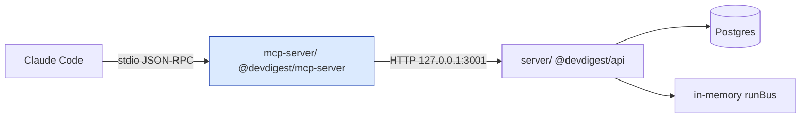

# `@devdigest/mcp-server` — DevDigest MCP tools

<!-- generated from: mcp-server/src/server.ts, mcp-server/src/config.ts, mcp-server/src/tools/*.ts, mcp-server/src/errors.ts, .mcp.json, docs/plans/l04-devdigest-mcp.md -->

Exposes DevDigest's code-review capability to Claude Code over the [Model Context
Protocol](https://modelcontextprotocol.io), transport **stdio only**. Five tools ship:
list reviewer agents, run a review on a pull request, read back its findings, read a
repo's accepted conventions, and read a PR's blast radius (changed symbols, their
callers, and downstream HTTP endpoints/cron jobs).

## What it is

`mcp-server/` is a **thin HTTP-client presentation adapter**, not a second copy of the
review engine. It opens no database connection, imports no `Container`, and
re-implements no service logic — every tool call is one or more `fetch` calls against
the already-running local API at `http://127.0.0.1:3001`. See root
[`CLAUDE.md`](../CLAUDE.md) for the rest of the stack and
[`server/docs/api-contracts.md`](../server/docs/api-contracts.md) for the routes it
consumes.



Claude Code talks to this package only over stdio JSON-RPC; this package talks to the
API only over HTTP. Nothing in this process touches Postgres or the API's in-memory
`runBus` directly.

### Why HTTP-client, not in-process

`server/src/app.ts` awaits `ReviewService.reapStaleRuns()` on boot and documents that it
*assumes a single API instance per DB*. The API's run event bus (`platform/sse.ts`,
`runBus`) is likewise a plain in-memory emitter with no cross-process fan-out. A second
process that executed reviews directly against the same Postgres database would be (a)
reaped as "stale" by the API's own boot-time reaper and (b) publish run events onto a
bus nobody else subscribes to. Concretely: **the run reaper and the in-memory `runBus`
in `server/` both assume exactly one API process talks to the database.** That is why
this package never opens its own DB connection and instead speaks HTTP to the one
running API — see the plan's "Why HTTP-client, not in-process" section for the full
rationale.

## Install & run

```bash
cd mcp-server && npm install    # npm, not pnpm — mirrors e2e/ and reviewer-core/
npm run typecheck               # tsc --noEmit
npm test                        # vitest, hermetic, stubbed HTTP — no Postgres
```

The server is launched by Claude Code, not run standalone in normal use — see
`/.mcp.json` at the repo root (committed, project-scoped). It requires the local API to
be running:

```bash
./scripts/dev.sh   # Postgres + API :3001 + web :3000, from the repo root
```

A quick manual stdio smoke test (API not required for `tools/list`):

```bash
cd mcp-server
echo '{"jsonrpc":"2.0","id":1,"method":"tools/list","params":{}}' | npx tsx src/index.ts
```

## The five tools

| Tool | Read-only? | What it does |
|---|---|---|
| `devdigest_list_agents` | yes | Lists configured reviewer agents as `(id, name, model, enabled)`. Call first to get a valid `agent_id`. |
| `devdigest_run_agent_on_pr` | **no** — the only write tool | Starts a review, waits (bounded, default 240s) for it to finish, and returns the verdict + findings in one call. |
| `devdigest_get_findings` | yes | Reads back the verdict/findings of a run started by `devdigest_run_agent_on_pr`, by `run_id`. Also how a caller collects a run that timed out. |
| `devdigest_get_conventions` | yes | Reads a repo's accepted (and, in `detailed` mode, pending) coding conventions. |
| `devdigest_get_blast_radius` | yes | Reads a PR's impact map — changed symbols, their callers, and downstream HTTP endpoints/cron jobs — from the code index. Degrades explicitly when the repo isn't indexed. |

Full per-tool contracts (input schema, response shapes, every error message verbatim)
are in [`docs/tools.md`](docs/tools.md).

## Env vars

`mcp-server/src/config.ts` is the only file in this package that reads `process.env`,
and it reads non-secret configuration only:

| Var | Default | Purpose |
|---|---|---|
| `DEVDIGEST_API_URL` | `http://127.0.0.1:3001` | API base URL |
| `DEVDIGEST_MCP_RUN_TIMEOUT_MS` | `240000` | Bounded wait budget for `devdigest_run_agent_on_pr` |
| `DEVDIGEST_MCP_POLL_INTERVAL_MS` | `2000` | Poll interval for the wait loop (backs off to 5000ms after 60s) |
| `DEVDIGEST_MCP_MAX_FINDINGS` | `20` | Truncation threshold for findings per response |
| `DEVDIGEST_MCP_DEBUG` | unset | Debug logging, written to **stderr only** |
| `DEVDIGEST_API_TOKEN` | unset | Future auth seam (`authHeaders()`); unused locally |

An empty string for any of these is treated as unset, not as an invalid value (see
`mcp-server/insights/gotchas.md`).

## Manual QA

### MCP Inspector

```bash
cd mcp-server && npm run inspect
```

Or from the repo root, without the script (the root has no `tsx` binary, so the path
must be explicit):

```bash
npx @modelcontextprotocol/inspector mcp-server/node_modules/.bin/tsx mcp-server/src/index.ts
```

With the local API up (`./scripts/dev.sh`):

1. **Tools tab** — exactly five tools, in this order: `devdigest_list_agents`,
   `devdigest_run_agent_on_pr`, `devdigest_get_findings`, `devdigest_get_conventions`,
   `devdigest_get_blast_radius`. `devdigest_list_agents` shows an empty-object input
   schema; `devdigest_run_agent_on_pr` shows four flat scalar arguments.
2. Run `devdigest_list_agents`, then `devdigest_run_agent_on_pr` against a real seeded
   PR and confirm findings come back; run `devdigest_get_findings` with the returned
   `run_id`.
3. Run `devdigest_get_blast_radius` against a real seeded PR and confirm real
   `symbols`/`callers`/`endpoints` come back (or an explicit `state: "degraded"` if the
   repo isn't indexed — never a fabricated result).
4. Run `devdigest_get_findings` with a made-up `run_id` and confirm a red `isError`
   result naming `devdigest_run_agent_on_pr`.
5. **Server info panel** — confirm the `instructions` text is present.
6. Stop the API and re-run `devdigest_list_agents`; confirm the `apiUnreachable` text
   mentions `./scripts/dev.sh`.

### Inside Claude Code

1. From the repo root, start a session, approve the project-scope `devdigest` server
   when prompted, run `/mcp`, and confirm it shows *connected* with 5 tools.
2. Ask in plain language: *"review PR &lt;n&gt; of &lt;owner/name&gt; with the Security
   agent"* and confirm the model reaches findings in one `devdigest_run_agent_on_pr`
   call (at most one `devdigest_list_agents` lookup first).
3. In a fresh session, before touching any DevDigest topic, run `/context` and confirm
   the five tool definitions are **not** loaded into the base system prompt (tool search
   resolves them on demand); confirm `.mcp.json` has no `alwaysLoad` key. Then ask a
   DevDigest-flavoured question and confirm the tools are discovered.

### Token budget

The real, serialized `tools/list` payload — round-tripped through a live
`InMemoryTransport` `Client`/`McpServer` pair, not the hand-written source strings — is
**≈9449 chars ≈ 2363 tokens**, against a **9700-char ceiling** (`mcp-server/test/tools-list-budget.test.ts`,
printed to stderr on every run). The ceiling was raised from its original 9000 when
`devdigest_get_blast_radius` was wired to real, non-flat data (nested `symbols[].callers`)
instead of its `not_implemented` stub. That leaves about 62 tokens of headroom: **a sixth
tool will not fit** without either raising the ceiling deliberately or trimming an
existing `outputSchema` first.

## A note on "hangs"

**Claude Code automatically backgrounds an MCP call that runs past about 2 minutes** —
this is expected behavior, not a bug in this package. `devdigest_run_agent_on_pr`'s wait
budget defaults to 240 seconds (`DEVDIGEST_MCP_RUN_TIMEOUT_MS`), so a slow review will
routinely cross that 2-minute threshold. When it does, the tool call is moved to a
background task: the turn continues and the result (the same finished payload this tool
always returns) arrives later as a task notification. The `run_id` + `next_step`
hand-off from `devdigest_run_agent_on_pr`'s "still running" response covers the case
where the user's session ends before that: `devdigest_get_findings(run_id)` retrieves
the result in a later call or session. Do not read either behavior as a hang.

## Out of scope for this lesson (L04)

- **HTTP / SSE / Streamable-HTTP transport** — stdio only, no port, no listener.
- **Remote deployment, OAuth, or any auth** beyond the one-line `authHeaders()` seam in
  `api-client.ts` (returns `{}` today; adds a bearer token if `DEVDIGEST_API_TOKEN` is
  set — no token storage, no refresh).
- **MCP resources and prompts** — tools only.
- **New or changed API routes, or any change to `@devdigest/shared` contracts.**
- **Write tools beyond `devdigest_run_agent_on_pr`** — no accept/dismiss finding
  actions, no conventions-extraction trigger, no repo import, no run cancellation.
- **Multi-agent fan-out** (`{all: true}` on the review route) — one tool call starts
  exactly one agent's run.
- **Client/UI changes, e2e flows, and CI wiring** for this package.

## Testing

```bash
cd mcp-server && npm test          # vitest, hermetic, stubbed fetch, no Postgres
cd mcp-server && npm run typecheck
```

No `.it.test.ts` files — that suffix is reserved for `server/`'s Postgres-backed
integration split (`server/insights/gotchas.md`); this package has no Postgres
dependency and must not adopt it. See [`../TESTING.md`](../TESTING.md) for how this
suite fits into the rest of the repo's test matrix.
