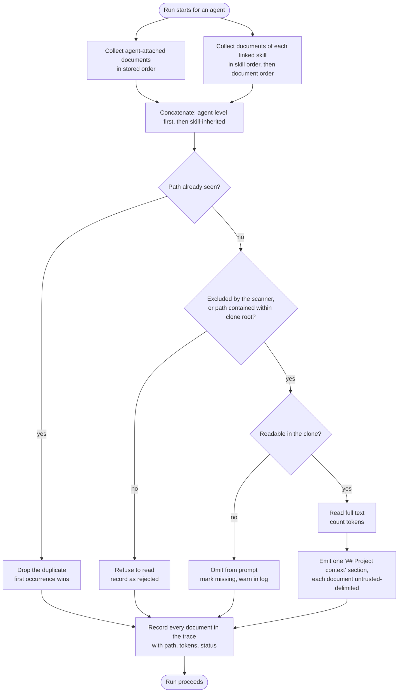
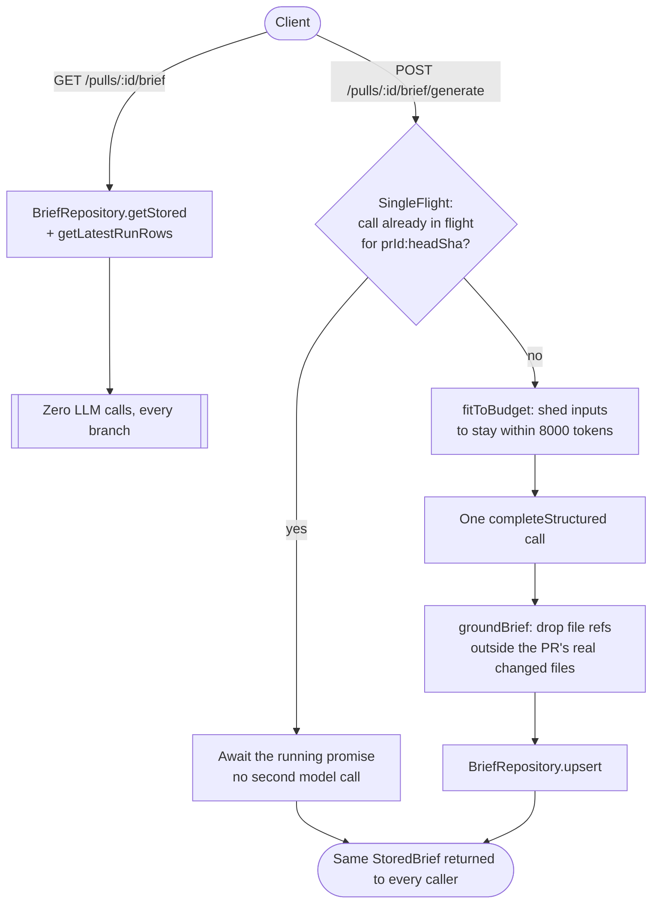

# Server Architecture

## Request Flow

```
HTTP Request
  → middleware (helmet, cors, rate-limit)
  → Zod schema validation (params / body / response)
  → module route handler (src/modules/<name>/routes.ts)
  → service (src/modules/<name>/service.ts)
  → platform/container.ts (DI)
  → adapter (port implementation)
  → external: Postgres / GitHub / LLM API / git
```

Validation rejects malformed input with `422` before the handler runs. Response schemas are also validated — a handler cannot return an undeclared shape.

## Dependency Injection

`platform/container.ts` is the single DI container. It wires all adapters at startup and exposes them to services. Services receive dependencies via constructor:

```typescript
class ReviewService {
  constructor(
    private db: Db,
    private llm: LLMProvider,
    private github: GitHubClient,
    private secrets: SecretsProvider,
    private reviewerCore: ReviewerCore,
    private runBus: RunBus,
  ) {}
}
```

In tests, `src/adapters/mocks.ts` provides drop-in stubs for every port. Pass mocks to the constructor — no monkey-patching, no module-level mocks.

## Adapter Ports

| Port | Interface | Production impl | Test impl |
|------|-----------|----------------|-----------|
| `LLMProvider` | `.complete(messages)` | OpenAI / Anthropic / OpenRouter | `MockLLMProvider` |
| `GitHubClient` | `.getPullRequest()`, `.getDiff()` | Octokit | `MockGitHubClient` |
| `GitClient` | `.clone()`, `.checkout()` | simple-git | `MockGitClient` |
| `Embedder` | `.embed(text)` | OpenAI embeddings | `MockEmbedder` |
| `SecretsProvider` | `.get(key)` | `LocalSecretsProvider` | `MockSecretsProvider` |
| `CodeIndex` | `.search(query)` | ripgrep | `MockCodeIndex` |

## SecretsProvider — Single Chokepoint

`LocalSecretsProvider` is the **only** place in the entire codebase that reads `process.env` or `~/.devdigest/secrets.json`. All other code receives secrets through the injected `SecretsProvider`. This makes secret access auditable and testable.

## SSE & RunBus

Review runs are asynchronous. `POST /pulls/:id/review` returns `{ runId }` immediately. The UI subscribes to `GET /runs/:id/events` (SSE).

```
ReviewService.run()
  → emits RunEvent objects into RunBus (platform/sse.ts)
  → RunBus fans out to all SSE connections for that runId
  → client receives progress, log lines, completion event
```

`RunBus` is in-memory. It is not persisted and not shared across processes. A server restart clears all active streams.

## Database Schema

Drizzle ORM + PostgreSQL + pgvector. Tables are pre-defined for all course lessons — many are empty stubs today.

**Active tables:** `repos`, `pulls`, `reviews`, `findings`, `agents`, `runs`, `pr_brief`, plus the four
Project Context tables added by migration `0011` (`repo_context_documents`, `repo_context_scans`,
`agent_context_documents`, `skill_context_documents` — see below).
<!-- updated from: server/src/modules/brief/repository.ts, server/src/db/schema/reviews.ts -->
`pr_brief` (see `## PR Why + Risk Brief`, below) is no longer a stub as of SPEC-02 — it is read on
every `GET /pulls/:id/brief` and written on every `POST /pulls/:id/brief/generate`.
**Future (pre-defined, empty):** `skills`, `memory_items`, `eval_cases`, `eval_runs`, `blast_radius`, `conventions`, `intents`, `smart_diffs`, `ci_runs`

Migrations live in `drizzle/`. Rules:
- Never edit an existing migration file
- Schema change → `pnpm db:generate` → `pnpm db:migrate`
- Migrations never run automatically on boot

## Project Context Module

<!-- updated from: server/src/modules/context/{scanner,path-guard,ordering,repository,service,routes}.ts, server/src/db/migrations/0011_*.sql, server/src/platform/container.ts, server/src/adapters/tokenizer/index.ts, server/src/modules/reviews/run-executor.ts -->

`src/modules/context/` (added by SPEC-01) fills the `## Project context` prompt slot that
`reviewer-core` already reserved but nothing used to feed. It is onion-layered like every other
module in `src/modules/`:

- `scanner.ts` — walks a repo clone for `.md` files under a directory named `specs`, `docs`, or
  `insights`, at **any depth** (not only the repo root). When a path nests one context-root directory
  inside another (e.g. `docs/specs/x.md`), the **outermost** match wins and its name is the recorded
  `root`. Reuses `EXCLUDED_DIRS` / `MAX_FILE_SIZE` / `MAX_INDEXED_FILES` from
  `modules/repo-intel/constants.ts` and `regexScan` from `modules/skills/scanner.ts` for threat
  classification — it never calls `llmScan`, so discovery makes no LLM request.
- `path-guard.ts` — `isSafeContextPath` (lexical rejection: absolute paths, `..` segments,
  backslashes, NUL bytes, anything not ending `.md`) plus `resolveContained` (async, `realpath`-based
  containment check that also catches a symlink planted inside the clone that resolves outside it — a
  lexical check alone cannot see that). Every attached path is validated by both gates at attach time
  and re-validated at read time, since a clone re-sync can invalidate a path that was safe when
  stored.
- `ordering.ts` — `buildEffectiveSet`, a pure function ordering an agent's effective document set:
  agent-attached documents first (stored position order), then skill-inherited documents (by
  `agent_skills.order`, then document position within that skill), deduped by path with the first
  occurrence winning.
- `repository.ts` — all Drizzle access for the four tables below; services never issue SQL directly.
- `service.ts` — orchestration only (list / rescan / readDocument / get-and-set agent context /
  get-and-set skill context / preview). Never imports an `LLMProvider` — discovery, attach, count,
  read, and inject make **zero LLM calls**, a hard constraint carried from the spec.
- `routes.ts` — the eight HTTP routes; see `server/docs/api-contracts.md`.

### Schema (migration `0011`)

Four tables, none of which store document text — only path, position, size, token count, and status
(`NFR-7`):

| Table | Purpose |
|-------|---------|
| `repo_context_documents` | One row per discovered document: path, root, size, tokens, threat level, excluded reason. PK `(repo_id, path)`. |
| `repo_context_scans` | One row per repo: scan status, file count, commit sha, duration, message. PK `repo_id`. |
| `agent_context_documents` | Documents directly attached to an agent, with position. PK `(agent_id, path)`. |
| `skill_context_documents` | Documents directly attached to a skill, with position. PK `(skill_id, path)`. |

### How the effective document set is built

The composition spans two sources (an agent's direct attachments and its linked skills' attachments)
with an ordering rule, a dedupe rule, and a per-document failure path, applied fresh on every run by
`run-executor.ts`'s `buildProjectContextSpecs`. Every document that was attached — including ones
dropped as a duplicate, rejected, or missing — ends up recorded in the run trace, so the trace is an
audit of intent, not only of what succeeded.



The dedupe step is `ordering.ts`'s `buildEffectiveSet`; the exclusion/containment/read step is
`buildProjectContextSpecs` in `run-executor.ts`, which re-validates containment at read time (not just
at attach time) and re-checks the scanner's `excluded_reason` in case a document was excluded by a
rescan after it was attached (the EC-4 fix in commit `6ac584f`).

### Container

`container.contextRepo` and `container.reposRepo` are lazy getters on `Container`
(`platform/container.ts`), following the same pattern as every other repository getter.

### Tokenizer port widened

The `Tokenizer` port (`adapters/tokenizer/index.ts`) gained `countDetailed(text)`, returning
`{ tokens, approximate }` — `approximate: true` exactly when the real `cl100k_base` encoder failed to
load and the port fell back to its `ceil(length / 4)` heuristic. `count()` is unchanged, so existing
repo-intel callers are unaffected.

### Known limitation — single repo per workspace

Attachments carry no `repo_id` (agents and skills are workspace-scoped, not repo-scoped). At attach
time, read time, and preview time on the configuration surface, `ContextService` resolves "the" repo
for a workspace by heuristic — the first repo with a clone, falling back to the first repo overall
(`repos.find(r => r.clonePath) ?? repos[0]`, `service.ts`'s `resolveRepoForWorkspace`). In a workspace
with more than one cloned repository, this can validate or preview an agent's or skill's attachments
against the wrong repo's clone. The run executor does not share this ambiguity: at run time it reads
documents from the actual repo the PR under review belongs to
(`run-executor.ts`'s `buildProjectContextSpecs`), so the heuristic affects only the configuration
surface (attach validation, token hydration, the skill preview) — never what a run actually injects.

## PR Why + Risk Brief Module

<!-- generated from: server/src/modules/brief/{service,repository,routes,single-flight,budget}.ts, server/src/db/schema/reviews.ts, server/test/brief-routes.it.test.ts -->

`src/modules/brief/` (added by SPEC-02) fills the `pr_brief` storage slot and the `risk_brief`
model-selection entry that were pre-placed as scaffolding — a brief judging a pull request's risk
level, its concrete risks, and what to review first, surfaced at the top of the Overview tab. It is
onion-layered like every other module:

- `repository.ts` — the only file in this module issuing Drizzle.
- `service.ts` — `BriefService`: `getBriefView` (read) and `generate` (the only path that spends
  money).
- `single-flight.ts` — in-process request coalescing, described below.
- `budget.ts` — shrinks the model input to fit a fixed token budget.
- `grounding.ts` — drops any file reference the model invents outside the PR's real changed files.
- `prompt.ts` / `types.ts` / `constants.ts` / `latest-run.ts` — prompt assembly, input types, and
  the "which run counts as the latest completed one" selection.
- `routes.ts` — `GET /pulls/:id/brief`, `POST /pulls/:id/brief/generate`; see
  `server/docs/api-contracts.md`.

### Storage: no migration, no schema change

`pr_brief` already existed as `{ pr_id PK, json jsonb NOT NULL }` (`server/src/db/schema/reviews.ts:57`).
This feature fills it rather than altering it: the entire envelope — head sha, generated-at,
provider, model, token counts, cost, duration, the degradation list, and the brief itself — lives in
that free-form `json` column. `.$type<>()` was deliberately not added to the schema; the mapper is
`StoredBrief.safeParse()` in `repository.ts`, run at read time. A row whose `json` fails that parse
degrades to "no brief" rather than throwing a 500 — a migration would only have bought an indexable
head sha, which is worthless against a primary-key lookup that returns at most one row.

### Read never spends, generate is gated

`GET /pulls/:id/brief` makes zero model calls in every branch, including when the stored brief is
stale — it diverges deliberately from its two nearest neighbours, `GET /pulls/:id/intent` (computes
on a cache miss) and `GET /pulls/:id/blast` (always calls the LLM): a read that spends money means
merely loading a page bills the user. Both of the feature's spend controls sit on the `POST` route
instead — a 10/min rate limit and `SingleFlight` (`single-flight.ts`), a new pattern in this
codebase. It is in-process only, backed by a `Map<string, Promise>` keyed `${prId}:${headSha}` — a
restart drops it and a second API instance would not share it, the same limitation `RunBus`
(`platform/sse.ts`) already has. It exists to coalesce concurrent generation requests for the same PR
state into one paid model call, not for convenience.



The diagram shows the two routes never sharing a code path except at the `SingleFlight` join: `GET`
only ever reads, `POST` is the only place a model call can occur, and a second `POST` for the same
PR state waits on the first rather than starting its own. The blast-summary input on the generate
path is read from `container.repoIntel.getBlastRadius` directly rather than through `BlastService`,
because `BlastService` always calls the LLM and routing through it would fire a second paid call per
brief. Diff hunk bodies never enter the model input either way — the changed-file rows carry path and
line counts only (`BriefRepository.getChangedFiles` never selects `pr_files.patch`); `fitToBudget`
sheds the changed-file list by binary-searching the largest ranked prefix that fits, so a 400-file
pull request costs about thirteen `tokenizer.count()` calls rather than four hundred.

### Bounded read path

The read path issues a fixed, constant number of queries regardless of PR size — measured at seven
for the fullest case in `server/test/brief-routes.it.test.ts`, unchanged whether the pull request has
one completed run and one changed file or twenty-five runs and forty files. `BriefService` is
constructed once at plugin registration (mirroring `modules/blast/routes.ts`, not
`modules/intent/routes.ts`'s per-request construction), because `SingleFlight` lives on the service
instance — a fresh instance per request would silently defeat request coalescing.

## Rate Limiting

`POST /pulls/:id/review` — 120 requests/min globally (tight because each call hits an LLM API).
Rate limiting is disabled in test mode (`NODE_ENV=test`).
