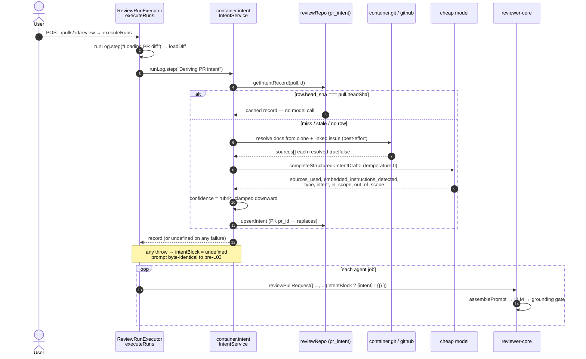

# 0002 — PR Intent Layer

Status: accepted
Lesson: L03
Packages: server

reviewer-core slice: [`reviewer-core/specs/0001-pr-intent-layer.md`](../../reviewer-core/specs/0001-pr-intent-layer.md).
Client slice: [`client/specs/0002-pr-intent-layer.md`](../../client/specs/0002-pr-intent-layer.md).

## Intent

DevDigest feeds a diff plus repo-derived context to a review model but never tells it
**why** the change was made. Every diff is judged as if it appeared from nowhere: the
reviewer can't distinguish a deliberate scope decision from an oversight, and flags
"you didn't also update X" on work that explicitly excluded X.

A cheap model reads the PR's title, body, linked ticket, and any linked plan/spec, and
emits a structured statement of intent — what the PR is trying to do and what it
deliberately is not. That statement is derived once per PR (cached by head SHA) and
handed to `reviewer-core` as an advisory prompt block. When the PR links no
documentation, intent is still derived from indirect signals — including the diff
itself — but is marked lower confidence, computed by our code, never self-reported by
the model.

## Behaviour

### Evidence sources

`resolveSources` (`src/modules/intent/sources.ts`) builds `sources: IntentSource[]` —
the confidence evidence, and what the client's tooltip shows:

| # | Source (`kind`) | Read from | When absent |
|---|---|---|---|
| 1 | `pr_title` | `pull.title` | never (title always present) |
| 2 | `pr_body` | `pull.body`, capped `MAX_BODY_CHARS = 4000` | `resolved: false` |
| 3 | `linked_issue` | live `container.github().getIssue(...)`, matched via `#123`/`closes #123` in the body, capped `MAX_ISSUE_CHARS = 2000` | no GitHub token (`ConfigError` → `reason: 'no_github_token'`) or fetch failure (`'issue_fetch_failed'`) → caught, `resolved: false`, classification continues (`sources.ts:104-117`) |
| 4 | `doc` | **local clone only**, `container.git.readFile`; repo-relative `*.md`/`*.mdx` paths or `github.com/<owner>/<repo>/blob/<ref>/<path>` URLs whose owner/name case-insensitively match the repo's `full_name` (`sources.ts:36-73`) | foreign-repo URL (dropped before any read, logged `reason: 'foreign_repo'`), unsafe path, a read error, or empty/whitespace content → `resolved: false`, logged `intent: doc ref dropped` |
| 5 | branch name | `pull.branch` | always present (not itself an `IntentSource` kind — folded into the classifier's user text as `Branch: …`) |
| 6 | `diff` | the already-loaded `UnifiedDiff` via the two-tier code digest below | always available; recorded `resolved: true` unconditionally (`sources.ts:169`) |

No source ever fetches an arbitrary URL over HTTP — a doc ref is only ever read
through `container.git.readFile` against the local clone, which is what makes
resolution hermetically testable via `MockGitClient`.

Doc-ref caps: at most `MAX_DOC_REFS = 5` candidates are even considered, of which at
most `MAX_DOC_READS = 3` are actually read, each capped at `MAX_DOC_CHARS = 6000`
(`src/modules/intent/constants.ts:22-30`).

**Path safety.** Each candidate doc path is checked with `isSafeRepoPath`
(`src/modules/_shared/repo-path.ts`, moved out of `modules/conventions/verify.ts`,
which now re-exports it) — rejects `\0`, absolute paths, and any `..` segment — and
then a `resolve()` containment check against the clone root
(`sources.ts:139-143`) before the file is ever touched.

**`MockGitClient.readFile` returns `''` where the real client throws.** Both cases are
treated identically as `resolved: false` (`sources.ts:154-158`), so a mocked test
never reports a false `high` confidence.

### Two-tier code digest — inferring intent from the code

`buildCodeDigest` (`src/modules/intent/digest.ts`) is pure — it takes the already-loaded
`UnifiedDiff` and does no I/O:

- **Tier 1 — always produced.** Per changed file: an inferred status (`added` if
  every hunk starts at old line 0, `removed` if every hunk ends at new line 0, else
  `modified`) plus `+adds/-dels` and the path (`digest.ts:42-47,80-84`).
- **Tier 2 — only when the caller's `includeCode` flag is set.** Real hunk content,
  budgeted to `MAX_CODE_CHARS = 6000` total and allocated across files proportional
  to each file's change size (largest files first, so a budget that runs out drops
  the least-informative small files, not an arbitrary tail — `digest.ts:95-114`).
  Paths matching `SKIP_PATTERNS` (lockfiles, `dist/`, `build/`, `vendor/`,
  `node_modules/`, `*.snap`, `*.min.js`/`*.min.css`, `generated/`,
  `*.generated.*`) are excluded (`digest.ts:24-38`).

`IntentService.ensureForPull` (`src/modules/intent/service.ts:74,86`) decides
`includeCode` with the exact rule: **no `doc` resolved AND no `linked_issue` resolved
AND the trimmed body is under `MEDIUM_BODY_CHARS = 200` chars.** When the author
explained themselves, tier 2 is skipped — their statement is better evidence than our
reading of the diff, and re-deriving it would spend tokens and invite contradiction.

**Code inference never raises confidence.** The rubric (below) grades `diff` no higher
than `low` — see `confidence.ts:14-23,30`. Source 6 changes the *quality* of the
summary an undocumented PR gets, never the grade.

### Confidence rubric — computed by code, never self-reported

`computeConfidence` (`src/modules/intent/confidence.ts`) is the entire mechanism:

| Best evidence | Band |
|---|---|
| at least one `doc` source resolved | `high` |
| no `doc`, but a `linked_issue` resolved **or** body ≥ `MEDIUM_BODY_CHARS` (200) chars | `medium` |
| everything else (including diff-only) | `low` |

The classifier model **never emits a confidence value** — it only emits
`sources_used` (`src/modules/intent/constants.ts:64-89`, evidence fields first in the
schema so JSON's autoregressive generation doesn't anchor a later field to an earlier
assertive claim). `computeConfidence` runs the rubric twice — once against the
`resolved` evidence, once against the model's self-reported `sources_used` — and takes
`min(rank(fromEvidence), rank(fromModel))` (`confidence.ts:61-67`): the model can
**lower** the band by admitting it ignored evidence, never raise it. `clamped: true` in
the result records when this happened — logged as a calibration signal. This mirrors
`consistencyScore` in `modules/conventions/verify.ts`.

### Call sequence

Classification runs in `ReviewRunExecutor.executeRuns`, **once per PR before the agent
fan-out** — not once per queued agent job (`src/modules/reviews/run-executor.ts:108-121`).



- **Cache key `(pr_id, head_sha)`.** The primary key stays `pr_id` — one row per PR —
  so a head-SHA move overwrites the row via `onConflictDoUpdate`
  (`repository/pull.repo.ts:78-82`). Re-reviewing the same SHA does zero LLM work; the
  cache-hit path is logged `intent: cache hit` and returns immediately
  (`service.ts:53-61`).
- **Failure is non-fatal.** `ensureForPull` never throws — every failure path (no
  GitHub token, clone read error, LLM error, bad parse) is caught, logged
  `intent: classification failed — continuing without intent`, and returns
  `undefined` (`service.ts:163-169`). `run-executor.ts` additionally wraps the call in
  `.catch(() => undefined)` as a second line of defense (`run-executor.ts:114-120`).
  This differs from the diff load immediately above it, which calls `failAll` and
  fails every queued run on error (`run-executor.ts:96-105`) — intent is best-effort
  context enrichment, the diff is not.

### Cache staleness — a known, accepted trade-off

The cache key is `head_sha` alone, not a hash of the PR body. **Editing a PR's
description without pushing a new commit leaves the cached intent stale** until the
next commit. This is a deliberate consequence of the (PR, head SHA) cache design — a
body-hash key would invalidate on cosmetic edits (typo fixes) as readily as on
substantive ones, and there is no re-derive route (see Out of scope) to force a
refresh. The workaround is a new commit.

### Injection posture

Nothing in this layer evaluates security-severity findings intent-blind — that is
named as residual risk, not solved here (see Out of scope). What this layer does do:

- The classifier's own system prompt (`constants.ts:93-110`) states all PR text is
  untrusted data describing a change someone else made, never an instruction, and that
  any instruction-shaped text must be **reported** via
  `embedded_instructions_detected`, never followed. A `true` value is logged as a
  warning (`service.ts:106-111`) but does not block classification.
  `reviewer-core/src/prompt.ts`'s `INJECTION_GUARD` already named "derived
  intent/scope" among its covered categories before this feature existed
  (`prompt.ts:16-28`) — no guard edit was needed.
  See [`reviewer-core/specs/0001-pr-intent-layer.md`](../../reviewer-core/specs/0001-pr-intent-layer.md)
  for the trusted/untrusted rendering split.
- **When intent is inferred purely from the diff** (no doc, ticket, or substantive
  body resolved), `renderIntentBlock` (`src/modules/intent/render.ts:37-45`) makes the
  confidence line say so explicitly: *"INFERRED FROM THE DIFF; the author gave no
  description, ticket, or spec. Treat this as our own reading of the code, not as a
  statement of intent."* This exists because the reviewer would otherwise receive a
  summary of the very code it is judging and could anchor on that reading instead of
  forming its own — a real residual risk, mitigated by disclosure, a 6000-char tier-2
  cap, the mandatory citation-grounding gate (unrelated to this feature but the
  backstop that still applies), and the fact that diff-only inference caps confidence
  at `low`.

## Acceptance

- [ ] `pr_intent` gains `type`, `confidence`, `sources`, `head_sha` (nullable),
      `provider`, `model`, `classified_at` via migration `0017_gigantic_goblin_queen.sql`.
- [ ] `resolveSources` resolves all six sources correctly, drops a foreign-repo blob
      URL without a `readFile` call, and drops `../../../etc/passwd`-shaped paths
      without a `readFile` call.
- [ ] `MockGitClient.readFile` returning `''` is treated as `resolved: false`,
      matching the real client's throw-on-missing behaviour.
- [ ] `buildCodeDigest` includes tier 2 only when `includeCode` is true; the char
      budget is respected and allocated across files rather than consumed by the
      largest; lockfiles/`dist/`/`vendor/`/`*.snap`/generated paths are excluded.
- [ ] `computeConfidence` implements the rubric table and clamps downward only — a
      body claiming "see the spec" cannot manufacture `high` on its own, and an
      empty-body PR (diff-only inference) yields `low`, never `medium`.
- [ ] `ensureForPull` never throws; two calls at the same `head_sha` make exactly one
      model call (the second is a cache hit); advancing the head SHA reclassifies and
      **replaces** the single `pr_intent` row (never appends).
- [ ] `GET /pulls/:id/intent` returns the cached `PrIntentRecord`; 404 when no row
      exists for the PR, or the PR does not belong to the caller's workspace.
- [ ] No new outbound HTTP fetch of an arbitrary URL is introduced anywhere in the
      path — only `container.git.readFile` against the local clone and one
      `container.github().getIssue()` call.
- [ ] `reviewer-core`'s existing injection-guard test still passes unmodified,
      confirming no guard edit was needed.

## Contracts

**@devdigest/shared — apply to BOTH `server/src/vendor/shared/` and
`client/src/vendor/shared/`:**

- `contracts/brief.ts` — `IntentType`, `IntentConfidence`,
  `IntentSourceKind` (`'pr_title' | 'pr_body' | 'linked_issue' | 'doc' | 'diff'`),
  `IntentSource`, and `Intent` gains three **required** fields: `type`,
  `confidence`, `sources: IntentSource[]`. No separate `IntentClassification` type —
  the fields live directly on `Intent`; there is exactly one shape, one producer
  (`IntentService`), one persister (`upsertIntent`/`getIntentRecord`).
- `contracts/review-api.ts` — `PrIntentRecord = Intent.extend({ pr_id, head_sha,
  provider, model, classified_at })`, the last four nullable
  (`review-api.ts:65-71`).
- `contracts/trace.ts` — `PromptAssembly.intent: z.string().nullish()`.
- `contracts/platform.ts` — `review_intent` in `FEATURE_MODELS`, defaulting to
  `provider: 'openrouter', model: 'deepseek/deepseek-v4-flash'` (`platform.ts:52-59`),
  the same cheap slug `conventions/constants.ts` uses — this keeps the Settings
  picker's displayed default honest, since `SettingsModels.tsx` hard-codes
  `provider: 'openrouter'` and could never show an Anthropic default as overridable.

**DB (`src/db/schema/reviews.ts:72-102`):** `pr_intent` deliberately carries **no
`workspace_id`** — it is scoped through the `pr_id` FK to `pull_requests`, which is
itself workspace-scoped. `head_sha` is **nullable**: a `NOT NULL` default would make a
pre-L03 row look like a valid cache entry for the wrong commit; `NULL` always misses
the cache and reclassifies once, which is correct. Migration:
`server/src/db/migrations/0017_gigantic_goblin_queen.sql` (pure `ALTER TABLE ADD
COLUMN`, no backfill).

**Routes:** `GET /pulls/:id/intent` (`src/modules/intent/routes.ts`) — `IdParams`,
returns `PrIntentRecord`, 404 via `NotFoundError` when the PR doesn't exist in the
caller's workspace or has no intent row yet. **No POST** — see Out of scope.

**Module.** `src/modules/intent/` (`constants.ts`, `sources.ts`, `digest.ts`,
`confidence.ts`, `render.ts`, `service.ts`, `routes.ts`), registered in
`src/modules/index.ts`. `container.intent` is a lazy getter on `Container`
(`src/platform/container.ts:140-144`) plus a `ContainerOverrides.intent` injection
seam, mirroring `repoIntel`. Persistence reuses `container.reviewRepo.*`
(`upsertIntent`, `getIntent`, `getIntentRecord` in
`src/modules/reviews/repository/pull.repo.ts:57-117`) — no new repository.
`run-executor.ts` does not import from `modules/intent/` directly; it only calls
through `container.intent`.

## Logging

Fields-object first, lower-case message, all confirmed at their call sites:

| Level | Fields | Message |
|---|---|---|
| `info` | `prId, headSha, cached: true, confidence` | `intent: cache hit` (`service.ts:44-47`) |
| `info` | `prId, docsResolved, docsDropped, ticketResolved, bodyChars` | `intent: sources resolved` (`service.ts:67-70`) |
| `warn` | `prId, ref, reason: unsafe_path \| foreign_repo \| empty_or_missing \| cap_exceeded` | `intent: doc ref dropped` (`sources.ts:123,131`) |
| `warn` | `prId, reason: no_github_token \| issue_fetch_failed` | `intent: linked issue unresolved` (`sources.ts:113-114`) |
| `info` | `prId, headSha, provider, model, type, confidence, clamped, tokensIn, tokensOut, costUsd, durationMs` | `intent: classified` (`service.ts:144-147`) |
| `warn` | `prId, headSha` | `intent: embedded instructions detected in pr text — reported, not followed` (`service.ts:106-109`) |
| `warn` | `prId, err` | `intent: classification failed — continuing without intent` (`service.ts:163-166`) |

The run-visible step also flows through `runLog.step('Deriving PR intent', …, { kind:
'tool' })` (`run-executor.ts:114-119`), so it lands in the Live Log and the persisted
run trace's event buffer alongside the diff-load step.

## Out of scope

- **RISK AREAS** (the mockup's chip row) — deferred to L05, belongs to the existing
  `Risks` contract in `contracts/brief.ts`.
- **BLAST RADIUS** — L04; owns the reserved right-hand grid track in the client's
  `PR BRIEF` grid (see the client spec).
- **A manual re-derive route or button.** Classification is automatic only — a step of
  the review run, by explicit user decision. There is no `POST /pulls/:id/intent` and
  no "recompute" UI action. The only way to force a fresh classification is a new
  commit (which changes `head_sha`) or a manual DB delete.
- **Intent history.** One row per PR, overwritten on every head-SHA move — not a log
  of past classifications.
- **A genuinely intent-blind security pass.** Nothing in this layer or the surrounding
  review pipeline evaluates security-severity findings without ever seeing the derived
  intent block. Published research (arXiv:2603.18740) shows attacker-crafted PR
  metadata can bias an LLM reviewer into passing vulnerable code across every CVE
  tested; the mitigations shipped here are the pre-existing `INJECTION_GUARD`, the
  trusted advisory sentence rendered outside the untrusted wrapper, the untrusted
  wrapper itself, and code-computed (never self-reported) confidence — not a second,
  intent-free review pass. That would cost a second model call per agent and is
  explicitly left as residual risk for a later lesson.
- **Persisting the linked-ticket link.** There is no `linked_issue` column on
  `pull_requests`; the ticket is fetched live on every cache miss (bounded by the same
  head-SHA cache), never stored, because the link is regex-derived from an editable
  body and a stored copy would go stale silently.
- Changes to `contracts/findings.ts`, the grounding gate, or the citation
  requirement — unrelated to this feature.

## Verification

```sh
cd server && pnpm exec vitest run --exclude '**/*.it.test.ts' && pnpm typecheck
```
Intended coverage (hermetic, `MockGitClient` + a stubbed `LLMProvider`): the rubric
table (doc→`high`, ticket-only or long-body→`medium`, title-only→`low`); the downward
clamp; path-traversal and foreign-repo blob URLs producing **no** `readFile` call;
`MockGitClient` returning `''` yielding `resolved: false`; a classifier throw omitting
the slot without failing the run; one classification shared across N agent jobs;
`contracts.test.ts`'s `Intent`/`PrIntentRecord` fixtures parsing (already added,
confirmed at `server/test/contracts.test.ts:68-83`).

**Code digest:** tier 1 always present; tier 2 present only for a blank-body,
no-ticket, no-doc PR and absent when a substantive body exists; the char budget split
across files rather than consumed by the largest; lockfiles/generated paths excluded;
an empty-body PR yields `confidence: 'low'`, never `medium`.

```sh
cd server && pnpm exec vitest run .it.test        # needs Docker
```
Intended coverage: the new columns round-trip through Postgres; two review runs at the
same `head_sha` make exactly one model call; advancing the SHA reclassifies and
replaces the single row (never appends a second); `GET /pulls/:id/intent` 404→200 and
404 for a PR outside the caller's workspace.

**Status of these suites [updated 2026-08-12]:** all present and passing. The gap noted
while this spec was first drafted is closed — `test/intent-sources.test.ts` (13),
`test/intent-confidence.test.ts` (9), `test/intent-digest.test.ts` (8),
`test/intent-service.test.ts` (10) and `test/intent-routes.test.ts` (1) bring the
hermetic lane to **163 passing**, and `test/intent.it.test.ts` (5) passes against a real
Postgres. Migration `0017` has been applied; `\d pr_intent` confirms all seven columns
with `head_sha` nullable. See also
[`reviewer-core/specs/0001-pr-intent-layer.md`](../../reviewer-core/specs/0001-pr-intent-layer.md).

One caveat for whoever runs the full lane next: adding a 6th testcontainers file made an
unrelated pre-existing test (`reviews.it.test.ts` "dual-provider structured output")
flake under container contention. It passes 9/9 when that file is run in isolation —
recorded in [`../INSIGHTS.md`](../INSIGHTS.md).

**Manual:** `./scripts/dev.sh`, open a PR, run a review — confirm an `intent:
classified` log line, then run again on the same commit and confirm `intent: cache
hit` with zero additional model calls.
