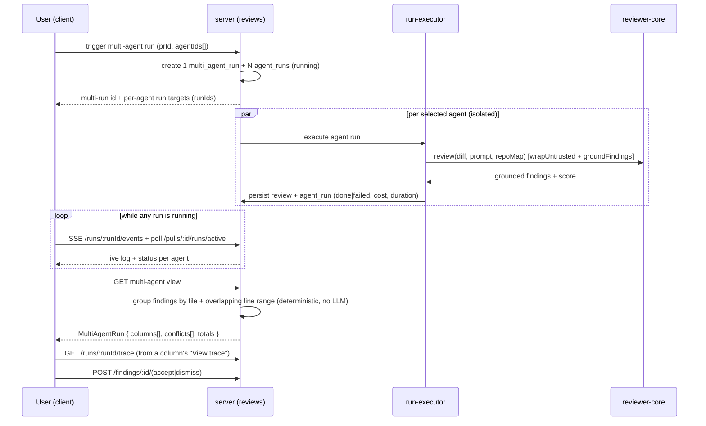

# Spec: Multi-Agent Review (Worktree A)   |   Spec ID: SPEC-2026-07-08-multi-agent-review   |   Status: draft
Supersedes: none

## Problem & why

A real PR is heterogeneous — it mixes security, performance and domain concerns at
once. Today a reviewer runs **one** agent (or blindly "all") and has to pick a focus up
front; running several specialised agents in parallel closes the PR from every angle in
one pass. But raw fan-out creates three problems this feature must solve:

1. **Duplicate noise.** Three agents independently flag the same obvious bug; without
   cross-agent grouping the user reads three identical findings and stops trusting the
   tool. We need a "same place in the code" grouping so duplicates collapse and genuine
   *disagreements* become visible.
2. **No live feedback.** Running several agents without a live window is minutes of
   anxious spinner-watching. We need per-agent live status (who finished, who is
   thinking, who failed) and a link to each run's trace.
3. **No cost/time foresight.** There is no pre-run estimate in the product today. Users
   want to know "≈ 8.2s · $0.20 · parallel fan-out" *before* committing to a run.

Attribution of "which agent found what" is preserved in the data as raw material for a
future Per-Agent Stats feature (out of scope here).

## Existing surface — Build vs Reuse inventory

Requirement from the request: mark each capability BUILD (new) or REUSE (exists). Grounded
against the current code. (References describe what exists so the planner knows the reuse
targets; they are **not** a prescription of where new code must live.)

| Capability | Verdict | Grounding |
|---|---|---|
| Trigger a review that fans out to several agents | **REUSE (partial)** | `POST /pulls/:id/review` (`server/src/modules/reviews/routes.ts`) already resolves 1 agent or `all:true` into N `agent_runs`. Body `RunRequest` = `{agentId?, all?}` — **no arbitrary subset**, so accepting a chosen *set* is BUILD. |
| Per-agent execution with failure isolation | **REUSE + BUILD** | `run-executor.ts` catches per-agent errors and continues, but runs agents SEQUENTIALLY (`for…of await`). **Decision: worktree A makes the fan-out parallel** (`Promise.allSettled`, failure-isolated) so `total_time = max` holds and the "parallel fan-out" label is real. `run-executor` lives in `server/src/modules/reviews/` — inside worktree A's allowed surface (only `ci/` and `agent-runner/` are off-limits). |
| Per-run persistence (status/duration/tokens/cost/score/blockers/error) | **REUSE** | `agent_runs` table (`server/src/db/schema/runs.ts`): `status ∈ {running,done,failed,cancelled}`, `durationMs`, `tokensIn/Out`, `costUsd`, `findingsCount`, `score`, `blockers`, `error`. |
| SSE live event stream + replay buffer | **REUSE** | `GET /runs/:id/events` (per-run, in-memory `RunBus`, `server/src/platform/sse.ts`). `RunEvent = {runId, seq, kind∈{info,tool,result,error}, msg, t, data?}`. No dedicated started/finished/cost event kinds; lifecycle is derived. |
| Run trace drawer + live log primitive | **REUSE** | The **same** `RunTraceDrawer` used on the PR page's "Agent runs" section (`client/…/pulls/[number]/_components/RunTraceDrawer`), opened via the `?trace=<runId>` URL search param (`page.tsx` reads `search.get("trace")`). Props: `{ runId, running, findings, agentName }`. Tabs: **Trace** (Configuration / Stats / Prompt assembly [system·skills·memory·specs·diff with tokens] / Raw / Output / Copy) and **Live-log**. Backed by `useRunTrace(runId)` + `GET /runs/:id/trace` (`RunTrace`) and the SSE live stream + replay buffer. It is currently colocated under the PR route, so reuse from the new page implies it becomes a shared component (a structural move, not a rewrite). |
| Live-status source of truth | **REUSE** | `GET /pulls/:id/runs/active` (polled ~4s) + `GET /pulls/:id/runs` (history, `RunSummary`). |
| Findings storage + Accept/Dismiss | **REUSE** | `findings` table (confidence, severity, category, start/end line, rationale, suggestion, accepted_at/dismissed_at); `POST /findings/:id/(accept|dismiss)`; `FindingCard`. |
| `multi_agent_runs` grouping (service + link + routes) | **BUILD** | Table `multi_agent_runs` is a **stub** (`id, workspaceId, prId, ranAt` only); zero reads/writes; no FK from `agent_runs`. |
| Multi-agent read view (columns + conflicts + totals) | **BUILD** (contracts REUSE) | Zod contracts `MultiAgentRun`, `AgentColumn`, `Conflict`, `ConflictTake` already exist in `vendor/shared/contracts/observability.ts` (server **and** client copies). **No route/service implements them.** **Decision: served by new `POST /pulls/:id/multi-agent-run` + `GET /pulls/:id/multi-agent`.** |
| Cross-agent finding-match rule ("same place") | **BUILD (server)** | **Not found in reviewer-core or server.** reviewer-core only has the diff-grounding gate (finding vs diff, not finding vs finding). The requirement's premise that this rule is "done in reviewer-core" is **false**. **Decision: worktree A builds the match rule + conflict grouping on the server** over persisted findings using a **deterministic** test — same file AND overlapping line ranges only, no essence/semantic/embedding comparison; the client only renders the computed groups. |
| Pre-run time/cost estimate | **BUILD (no new endpoint)** | Raw material exists (`agent_runs.costUsd`/`durationMs`) + a proven SUM/GROUP-BY aggregation pattern. **Decision: no separate estimate route** — the existing agents-list response (used by the picker / Configure run) is extended with per-agent `est_duration_ms`/`est_cost_usd`/`has_history`; the client computes the sum/max summary. |
| Agent picker (PR dropdown) | **BUILD** | Replaces `RunReviewDropdown` (`…/_components/RunReviewDropdown`), currently mounted in `PrDetailHeader`. |
| Multi-Agent Review page + Configure run + nav item | **BUILD** | No such route or GLOBAL nav item exists (`vendor/ui/nav.ts` has only WORKSPACE + SKILLS LAB). |
| Columns / Tabs result views | **BUILD** | No component exists. |
| Learn / Reply / Turn into eval case / Compose actions | **BUILD (UI placeholder only, deferred)** | `FindingActionKind` includes `learn`/`reply` and `useFindingAction` forwards `reply`, but only `accept`/`dismiss` have server routes. Turn-into-eval / Compose have contracts but no client UI. **Decision: only Accept/Dismiss are functional in worktree A; Learn / Reply to author / Turn into eval case render as visible non-functional placeholders reserved for future work (ДЗ Memory / evals L06).** |

## Goals / Non-goals

- **Goal:** a fast agent picker on the PR page that lets the user run a chosen *set* of
  agents (not just one or all).
- **Goal:** a standalone Multi-Agent Review page with a Configure-run step (pick PR +
  agents + pre-run estimate) and a results screen with two toggleable views (Columns,
  Tabs + detail).
- **Goal:** group each fan-out into one persistent multi-agent run that links its per-agent
  runs, and expose it as a single result resource (columns + conflicts + totals).
- **Goal:** a "Where agents disagree" block that groups findings by shared code location
  across agents, shows each agent's verdict (including "did not flag"), and a
  "Show only conflicts" toggle.
- **Goal:** live per-agent status in the Columns headers and a "View trace" link from each
  agent, reusing the existing SSE + trace surface.
- **Goal:** a pre-run estimate of total time and cost derived from past runs.
- **Non-goal:** the review engine internals — `ci/` and `agent-runner/` are **out of
  scope** and must not be touched.
- **Non-goal:** Per-Agent Stats / Agent Performance page (`GET /agents/:id/stats`) — the
  attribution data is preserved as raw material, but the stats surface is future work.
- **Non-goal:** the Compose Review drawer (curating findings before publishing a review) —
  it is a separate feature.
- **Non-goal:** fully implementing Learn / Turn into eval case / Reply-to-author behaviour
  (ДЗ Memory hook and evals L06 bridge) — only Accept/Dismiss are functional here; the rest
  are visible placeholders (AC-19).
- **Non-goal:** changing the reviewer-core grounding gate or untrusted-input handling.

## User stories

- US1: As a reviewer on a PR page, I want a quick picker to choose which agents run, so
  that I can fan out to exactly the specialists this PR needs.
- US2: As a reviewer, I want a Configure-run screen to pick a PR and agents with a cost/time
  estimate, so that I can launch a multi-agent review deliberately from one place.
- US3: As a reviewer, I want the selected agents grouped into one multi-agent run, so that I
  can compare their results as a single unit and revisit it later.
- US4: As a reviewer, I want a Columns view with live per-agent status and a trace link, so
  that I can see who finished, who is thinking, and who failed in real time.
- US5: As a reviewer, I want a Tabs + detail view where I can expand a finding (confidence,
  rationale, suggested fix) and act on it, so that I can triage per agent. Columns and Tabs are
  two layouts over the **same** building blocks (finding cards, per-agent summary, and the
  "Where agents disagree" block) — only the arrangement and the toggle differ.
- US6: As a reviewer, I want a "Where agents disagree" block that collapses duplicates and
  surfaces genuine divergence, so that I stop reading the same finding three times and can
  focus on conflicts.
- US7: As a reviewer, I want a pre-run estimate of total time and cost, so that I know the
  cost before committing to a fan-out.

## Acceptance criteria (EARS)

**Picker on the PR page (US1)**
- AC-1: WHEN a user opens the run control on the PR page, the system **shall** present a
  "Pick agents to run" dropdown listing every enabled agent with a checkbox and a per-agent
  time estimate, replacing the previous single/all dropdown.
  _(observable: dropdown shows checkboxes + per-agent estimate; the old one-or-all menu is gone)_
- AC-2: WHILE at least one agent is checked, the system **shall** enable a
  "Run multi-agent review (N)" action whose N equals the count of checked agents, and
  **shall** disable it when zero are checked.
  _(observable: button label tracks N; disabled at 0)_
- AC-3: WHEN the user confirms the picker, the system **shall** start a multi-agent run over
  exactly the checked agents and surface the live result view.
  _(observable: the run is created with precisely the selected agent set)_

**Configure run page (US2)**
- AC-4: The system **shall** provide a Multi-Agent Review page reachable from a GLOBAL
  navigation item, with a Configure-run step to select a pull request and agents.
  _(observable: nav item present; route renders Configure run)_
- AC-5: WHILE no pull request is selected on Configure run, the system **shall** disable the
  agent-selection step and the run action and show an empty-state prompt to pick a PR first.
  _(observable: step 2 + run button disabled until a PR is chosen)_
- AC-6: WHEN a pull request is selected, the system **shall** list selectable agent cards,
  each showing the agent name, a short teaser, and a per-agent time·cost estimate.
  _(observable: agent cards populated with teaser + estimate)_

**Pre-run estimate (US7)**
- AC-7: WHEN one or more agents are selected (picker or Configure run), the system **shall**
  display a summary estimate before the run, computed **on the client** from the per-agent
  estimate fields already present in the agents-list response, where estimated total cost =
  the sum of the selected agents' cost estimates and estimated total time = the maximum of the
  selected agents' time estimates.
  _(observable: summary reads "≈ Xs · $Y · parallel fan-out"; time = max, cost = sum; no extra request is made)_
- AC-8: The agents-list response used by the picker / Configure run **shall** carry, per agent,
  a time and cost estimate derived from that agent's own past completed (`done`) runs (e.g.
  average `durationMs` and average `costUsd`) — there is **no separate estimate endpoint**.
  _(observable: each agent in the list response has est_duration_ms/est_cost_usd/has_history from its prior agent_runs)_
- AC-9: IF a selected agent has no past completed runs, THEN its estimate fields **shall** be
  null with `has_history:false`, the UI **shall** render "—" / "no history" for it, and the
  client summary **shall** simply skip it when summing cost / taking the max time.
  _(observable: agent without history shows "—"; it does not contribute to the summary total)_

**Multi-agent run grouping (US3)**
- AC-10: WHEN a multi-agent review is triggered from either entry point, the system **shall**
  create exactly one persistent multi-agent run that groups the N per-agent runs it fans out
  on that PR.
  _(observable: one multi_agent_run record links the N agent_runs of the fan-out)_
- AC-11: The system **shall** run each selected agent in its own isolated context so that a
  failure in one agent's run does not abort the others.
  _(observable: forcing one agent to fail leaves the others reaching `done`)_
- AC-12: The system **shall** expose a multi-agent run as a single result resource containing
  one column per agent (status, score, duration, cost, findings) plus the cross-agent
  conflict groups and run totals.
  _(observable: reading the run returns a MultiAgentRun with columns + conflicts + totals)_

**Columns view + live status + trace (US4)**
- AC-13: WHILE a multi-agent run is in progress, the Columns view **shall** show, in each
  agent column header, a live status (running / done / failed) and that agent's time and cost
  once known; the same live status **shall** drive the `running` state passed to that agent's
  trace drawer, so a header showing "running" opens the drawer on its Live-log tab.
  _(observable: a column header transitions running→done live; a running column's "View trace" opens on Live-log)_
- AC-14: WHEN a user clicks "View trace" next to an agent — in **either** the Columns view
  (column footer) or the Tabs view (agent summary card) — the system **shall** open the
  **same existing `RunTraceDrawer`** used on the PR page's "Agent runs" section, targeted at
  that agent's `agent_run` id, via the existing `?trace=<runId>` URL search-param mechanism.
  _(observable: clicking "View trace" for an agent sets `?trace=<that agent_run id>` and mounts the shared RunTraceDrawer)_
- AC-14a: WHILE the drawer is open for an agent, the system **shall** expose the drawer's
  existing sections unchanged for that agent's run — Trace (Configuration, Stats, Prompt
  Assembly with system/skills/memory/specs/diff token attribution, Raw, Output, Copy) and the
  Live-log tab (live SSE stream during the run, replay buffer on connect, persisted log after
  completion). Worktree A only wires the correct `runId` + link; it does not rebuild the drawer.
  _(observable: the drawer opened from Multi-Agent Review is the same component/tabs as on the PR page, scoped to the agent's runId)_
- AC-15: IF an agent's run fails, THEN the system **shall** render that column in a failed
  state showing the failure reason, without blocking the other columns.
  _(observable: a failed agent's column shows its error; sibling columns still render)_

**Tabs + detail view + finding actions (US5)**
- AC-16: The system **shall** offer a Columns/Tabs toggle over the **same** multi-agent run,
  where Tabs shows one tab per agent with a score badge and an agent summary card, and **shall**
  build both views from the same shared building blocks — the finding card, the per-agent
  summary/header, and the "Where agents disagree" block are one implementation each, reused by
  both layouts; only the arrangement and the toggle differ (no duplicated per-mode variants).
  _(observable: toggling views does not re-run and reads the same run resource; the finding card, per-agent summary and disagree block are a single shared component used in both modes)_
- AC-17: WHEN a user expands a finding in the Tabs detail, the system **shall** show its
  confidence, rationale, and suggested fix, plus the finding action buttons.
  _(observable: expanded card shows confidence + rationale + suggested fix + actions)_
- AC-18: WHEN a user chooses Accept or Dismiss on a finding, the system **shall** persist the
  resulting state.
  _(observable: accept/dismiss sets accepted_at/dismissed_at and survives reload)_
- AC-19: WHERE the Learn, Reply to author, and Turn into eval case actions are shown, the
  system **shall** render them as clearly non-functional placeholders reserved for future work
  in this worktree (ДЗ Memory / evals L06); they perform no persisted action.
  _(observable: buttons visible but marked/disabled; clicking performs no persisted action)_

**Where agents disagree (US6)**
- AC-20: The system **shall** present a "Where agents disagree" section, shared by both
  Columns and Tabs views, that groups findings pointing at the same code location across
  agents.
  _(observable: the same section renders under both views; findings are grouped by location)_
- AC-21: The system **shall** treat two findings as the same location when they are in the
  same file AND their line ranges overlap — a purely deterministic test, with no essence /
  semantic / embedding comparison. Findings in different files or with non-overlapping ranges
  **shall** remain separate.
  _(observable: same-file overlapping-range findings group; different file or disjoint ranges do not; no LLM/embedding call is made)_
- AC-22: For each conflict group, the system **shall** list every agent that ran in the
  multi-run, showing each agent's verdict at that location OR "did not flag" when that agent
  produced no finding matched into the group.
  _(observable: a 4-agent run shows 4 rows per group; agents with no matched finding read "did not flag")_
- AC-23: WHERE the user enables "Show only conflicts", the system **shall** display only
  groups in which agents diverge (at least one flagged and at least one did-not-flag, or
  divergent severities) and hide unanimous groups.
  _(observable: toggling hides groups where every agent agrees)_

**Invariants (Untrusted / grounding)**
- AC-24: The system **shall** keep the reviewer-core grounding gate and untrusted-input
  wrapping unchanged for every agent run in a multi-agent run — no finding bypasses
  grounding, and each diff / PR body remains fenced before reaching a prompt.
  _(observable: only grounded findings persist; the injection guard + fencing are intact)_

## Edge cases

- All selected agents fail → the multi-agent run still renders with every column in a failed
  state; run totals reflect the failures. → AC-11, AC-15
- Agent selected has no past runs → "no history" fallback estimate. → AC-9
- Zero agents selected → run action disabled. → AC-2
- PR is merged/closed at trigger time → the picker warns before running (carrying the
  existing `warnMerged` behaviour into the new picker). → accepted: inherit the single-review precondition (OQ-6)
- Identical finding from every agent at one location → grouped and, when unanimous, hidden by
  "Show only conflicts". → AC-20, AC-23
- Findings at overlapping-but-not-identical line ranges → matched by range overlap alone.
  → AC-21
- Two genuinely DIFFERENT findings that happen to sit on the same overlapping lines → may be
  merged into one group. → accepted: deliberate simplicity tradeoff (deterministic, no essence
  check); rare in practice, and both findings still show under the group's per-agent takes.
- Two agents flag the same location with different severities → shown as a conflict. → AC-23
- Live SSE lost / server restarts (RunBus is in-memory, not persisted) → live status falls
  back to the polled active-runs / run-history source of truth; the drawer falls back to the
  persisted trace after completion. → accepted: degrade to polling (AC-13 satisfied via poll)
- Client component unmounts mid-run → known gotcha: the SSE subscription must stay mounted
  for the run's duration or live events are lost. → accepted: keep subscription mounted
- Two multi-agent runs triggered on the same PR → each is its own record; the view shows the
  one being opened. → AC-10
- An agent runs but returns zero findings → it appears in every conflict group as "did not
  flag". → AC-22
- Selection made in the picker/Configure run, then user navigates away → selection is not
  persisted; reopening restores the default set. → accepted: no persistence (OQ-4)

## Non-functional

- **Performance:** the agents-list response (now carrying the per-agent estimate fields) p95
  < 500 ms — the estimate is a DB aggregate over past runs, no LLM, and no extra round-trip;
  the multi-agent result view initial load < 1 s excluding LLM execution time.
- **Live status latency:** a per-agent status change is reflected in the UI within the
  existing polling window (≤ ~4 s) or sooner via SSE.
- **Rate limiting:** the multi-agent trigger keeps a tight per-route limit (the existing
  review trigger is 10 requests / minute); a single trigger may fan out to N agent runs.
- **Security / untrusted inputs:** unchanged reviewer-core guarantees (see AC-24 and Untrusted
  inputs).
- **Accessibility:** the new page meets WCAG 2.1 AA — the Columns/Tabs segment control, the
  agent checkboxes/cards, the tabs, and the "Show only conflicts" toggle are keyboard
  operable and labelled.
- **i18n:** all user-facing strings go through `next-intl` (`useTranslations()`); no hardcoded
  English in JSX.

## Cross-module interactions

Modules: **client** (picker, Configure-run page, Columns/Tabs views, "Where agents
disagree"), **server** (multi-agent run trigger + grouping + read view + conflict
computation + estimate), **reviewer-core** (per-agent review + grounding — unchanged,
consumed via the server executor). `ci/` and `agent-runner/` are untouched.

Data crossing boundaries and failure contract:
- client → server: trigger a multi-agent run for `(prId, agentIds[])`; poll active runs;
  subscribe per-agent SSE; fetch the multi-agent result view; act on findings.
- server → reviewer-core: one review invocation per agent run; each is independently
  grounded. A per-agent failure is isolated (column marked failed), never aborting siblings.
- Conflicts are **computed from persisted findings, not stored** (per the existing contract
  annotation), using the **deterministic** same-file + overlapping-range test (no LLM /
  embedding step); "did not flag" is derived by the computation from the roster of agents that
  ran vs which findings matched each group.

## Contracts

Shapes only; several already exist in `vendor/shared/contracts/` and are reused verbatim.

**Trigger a multi-agent run** — `POST /pulls/:id/multi-agent-run` _(BUILD)_
- Request: `{ agentIds: string[] }` scoped to the PR (the current `RunRequest` `{agentId?,all?}`
  gains a subset field; the picker passes the chosen set). Both entry points — the PR-page
  picker and Configure run — call this same endpoint and create exactly one `multi_agent_run`.
- Response: identifier of the created multi-agent run + per-agent run targets
  (`{ run_id, agent_id, agent_name }[]`), so the client can subscribe to each per-run SSE
  stream immediately.

**Read a multi-agent run** — `GET /pulls/:id/multi-agent` _(BUILD; contracts REUSE — `observability.ts`)_
- `MultiAgentRun` = `{ id, pr_id, pr_number?, ran_at, agent_count, total_duration_ms,
  total_cost_usd, columns: AgentColumn[], conflicts: Conflict[] }`.
- `AgentColumn` = `{ run_id, agent_id, agent_name, provider, model,
  status: 'done'|'failed'|'running', verdict, score, summary, duration_ms, cost_usd,
  findings: AgentColumnFinding[] }`.
- `Conflict` = `{ file, line, title, takes: ConflictTake[] }`;
  `ConflictTake` = `{ agent_id, persona, verdict: Severity | 'ignored', note }` — where
  `'ignored'` is the "did not flag" state surfaced in the UI.

**Pre-run estimate** _(BUILD — no new endpoint; extends the agents-list response)_
- There is **no dedicated estimate route**. The agents-list response the picker / Configure
  run already fetch is extended so each agent carries `est_duration_ms: number | null`,
  `est_cost_usd: number | null`, `has_history: boolean`, derived server-side by aggregating
  that agent's past `done` `agent_runs`.
- The summary (`total time ≈ max`, `total cost ≈ sum`) is computed **on the client** from the
  selected agents' fields. Agents with `has_history:false` (null estimates) are skipped in the
  summary and shown as "—" / "no history" (AC-9). No new request is issued when selection
  changes.

**Persistence** _(BUILD)_
- `multi_agent_runs` gains the ability to group its per-agent runs on a PR (today the table
  is a 4-column stub with no link from `agent_runs`). The grouping is the durable identity of
  a multi-agent run; conflicts are computed on read, not stored.

**SSE / live status** _(REUSE)_
- Per-run `RunEvent = { runId, seq, kind: 'info'|'tool'|'result'|'error', msg, t, data? }`
  over `GET /runs/:id/events` (replay-first). There is no multi-run aggregate stream and no
  dedicated started/finished/cost event kind; the Columns headers derive status from the
  per-run streams plus the polled active-runs / run-history source of truth.

**Run trace ("View trace")** _(REUSE)_
- `GET /runs/:id/trace` → `RunTrace` (config, stats, `prompt_assembly` with per-slot token
  attribution, `tool_calls`, `raw_output`, `log`) rendered by the shared `RunTraceDrawer`
  (`useRunTrace(runId)`), opened via the `?trace=<runId>` URL search param. Worktree A passes
  each agent's `agent_run` id; it adds no new trace shape or endpoint.

**Findings + actions** _(REUSE + partial BUILD)_
- `FindingRecord` (adds `review_id`, `accepted_at`, `dismissed_at` to `Finding`) with
  `confidence ∈ [0,1]`, `severity ∈ {CRITICAL,WARNING,SUGGESTION}`, `start_line`/`end_line`,
  `rationale`, `suggestion?`. Accept/Dismiss persist; Learn/Reply/Turn-into-eval are visible
  placeholders (D-4 / AC-19).

## Untrusted inputs

Yes. Each agent run consumes the PR diff and PR body, which are third-party / attacker-
influenceable text. These are already handled inside reviewer-core and **must remain
unchanged**: `wrapUntrusted()` fences the diff and PR body before they reach any prompt, the
`INJECTION_GUARD` is appended unconditionally, and `groundFindings()` drops any finding that
does not cite a real diff hunk. This feature adds no new prompt path and must not bypass these
gates (AC-24). The teaser/summary strings shown in the picker and columns originate from
model output about untrusted content — they are rendered as data (no HTML/script execution)
and never re-fed as instructions.

## Decisions (resolved with the coordinator)

The four blocking questions were resolved; they are now fixed in the ACs, inventory and
contracts above.

- D-1 (was OQ-1) — **Cross-agent match rule + conflict grouping is built on the server** over
  persisted findings using a deterministic test (same file + overlapping line ranges only,
  no essence/semantic comparison); the client
  only renders the computed groups. → AC-20, AC-21, AC-22.
- D-2 (was OQ-2) — **The fan-out is made parallel** (`Promise.allSettled`, failure-isolated) in
  `run-executor` (inside `server/src/modules/reviews/`, allowed); estimate time = max, cost =
  sum; the "parallel fan-out" label stays. → AC-7, AC-11.
- D-3 (was OQ-2b) — **New endpoints** `POST /pulls/:id/multi-agent-run` + `GET /pulls/:id/multi-agent`
  (contracts already in `observability.ts`); both entry points create one `multi_agent_run`. →
  AC-10, AC-12, Contracts.
- D-4 (was OQ-3) — **Only Accept/Dismiss are functional**; Learn / Reply to author / Turn into
  eval case are visible placeholders (ДЗ Memory / evals L06). → AC-18, AC-19.

## Open questions

Smaller points, **resolved with a default — override if needed**:

- OQ-4 (selection persistence) — *Resolved with default:* the agent selection does **not**
  persist between sessions; each Configure run / picker opens with a sensible default set (all
  enabled agents pre-checked). Note: the client already has a `dd-*` `localStorage` convention
  (`repoContext.tsx`, `theme.tsx`) — that is the mechanism to reach for if per-PR/per-workspace
  persistence is wanted later. No server user-prefs store exists.
- OQ-5 (agent teaser source) — *Resolved with default:* the teaser is the agent's stored
  `agents.description` field (confirmed to exist, `notNull().default('')`). When empty, the
  teaser is simply omitted. (It is **not** the last run's summary, which would be absent before
  the first run.)
- OQ-6 (merged/closed PR) — *Resolved with default:* the multi-agent run is allowed on any PR
  state where the existing single review is allowed — the same precondition as `POST
  /pulls/:id/review` is inherited; no stricter block is added.
- OQ-7 ("Configure agents…" link) — *Resolved with default:* it navigates to the existing
  `/agents` management page.
