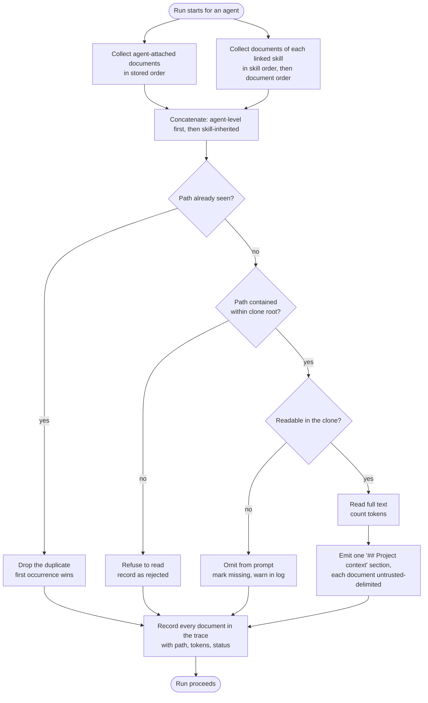

# Spec: Project Context
Spec ID: SPEC-01
Status: approved
Supersedes: none

## Problem and user

The person who configures DevDigest's review agents is the same person who wrote the project's
specs, architecture docs, and incident write-ups. Today none of that reaches the reviewer.

A review run assembles its prompt from the agent's system prompt, its linked skill bodies, curated
memory, the repo skeleton, the callers digest, the derived intent, and the diff. Project
documentation is not among them. The prompt assembler already has a slot for it —
`reviewer-core/src/prompt.ts:121` emits a `## Project context` section from `parts.specs`, wrapping
each entry as untrusted content — but nothing ever fills that slot: the server passes no specs, and
`server/src/modules/reviews/run-executor.ts:415` writes `specs_read: []` on every run. The run trace
contract already reserves `PromptAssembly.specs` and `RunTrace.specs_read`, and the run drawer
already renders both; both are permanently empty.

The cost is that a reviewer cannot enforce a rule the team has already written down. If a PRD says
"all public endpoints MUST be rate-limited per client IP", the reviewer has no way to know it, so the
violation ships. The configurator's only workaround is to paste documentation into the agent's system
prompt by hand, which drifts from the repository the moment the document changes and mixes trusted
instructions with repository-derived text that should never be trusted as instructions.

There is also a half-built surface pointing at this gap: `SpecFile` and `IndexStatus` exist in the
shared contracts under a `// ---- Project Context ----` header, the client has `useContextFiles` /
`useReindexContext` hooks calling `GET|POST /repos/:id/context[/reindex]`, and a `context` message
catalogue exists — but the server routes those hooks call do not exist, and nothing renders the
catalogue. None of it is reachable by a user.

## Goals / Non-goals

**Goals**
- The configurator can see every markdown document the repository contains, in one place.
- The configurator can manually attach an ordered subset of those documents to a review agent, and to
  a skill, so that every agent using that skill inherits them.
- The configurator can see, before running anything, how many tokens the attached set will add.
- A review run reads the attached documents from the repository and injects their full text into the
  prompt as untrusted data.
- Anyone auditing a run can see which documents were read, how large each was, and the exact text
  that was injected.

**Non-goals**
- **Automatic, PR-content-driven document selection.** Selection is manual in this slice; an
  automatic selector is deferred to a separate feature.
- **Editing, uploading, creating, or deleting documents from this surface.** The user delegated this
  call to us conditional on difficulty, and the difficulty is real: the repository clone is a
  read-only mirror that is hard-reset to the upstream branch on every sync
  (`server/src/adapters/git/simple-git.ts:79`), so any edit written into it is silently destroyed on
  the next sync; there is no write path into a clone anywhere in `server/src`. Supporting editing
  would require a clone-write path plus a commit/push or Contents-API path plus a conflict story
  against that hard reset — a materially larger and riskier feature. The document view is read-only.
- **Chunking, embedding, or a vector index of documents.** Discovery is a plain filesystem scan.
- **A "coverage" metric.** Replaced by a plain count of how many agents use each document.
- **User-configurable scan scope.** The scan walks the entire repository clone by default, minus the
  fixed exclusion set in NFR-2; there is no user-facing way to narrow it to selected directories, add
  custom scan roots, or edit the exclusion list in this slice (see Q-2, reopened and overturned
  2026-08-28). The path-derived category shown per document is likewise not user-editable.
- **Checking out the pull request's head commit.** Documents are read from the existing
  default-branch clone (see Q-5).
- **A new version snapshot when attachments change.** The user explicitly chose the simplest
  persistence (see Q-4).

## User stories

- US-1: As a review configurator, I want to browse every markdown document in my repository, so that
  I know what project knowledge exists to attach.
- US-2: As a review configurator, I want to attach an ordered set of documents to an agent, so that
  its reviews are judged against my project's written rules.
- US-3: As a review configurator, I want to attach documents to a skill, so that every agent using
  that skill inherits them without my repeating the work.
- US-4: As a review configurator, I want to see the token cost of the set I am attaching while I
  choose it, so that I understand how much each prompt will grow.
- US-5: As a reviewer, I want the attached documents' full text present in the review prompt as
  untrusted data, so that the agent can cite my project's actual rules without obeying them as
  instructions.
- US-6: As someone auditing a run, I want to see which documents were read, their size, and the exact
  injected text, so that I can verify a document actually influenced the review.

## Acceptance criteria (EARS)

- AC-1 (US-1): WHEN the user opens the Project Context page for a repository that has a local clone,
  the system shall list every `.md` file found anywhere in the repository clone that is not excluded
  under NFR-2, showing each document's repository-relative path and a category derived
  from its path, distinguishing at least `docs`, `specs`, `insights`, and `readme`, with every other
  document falling into a residual category (the exact category values are an implementation
  decision).
  Verify: integration — `*.it.test.ts` against a fixture clone containing markdown under `docs/`,
  `specs/`, `insights/`, at the repository root, elsewhere in the tree with no special-cased ancestor,
  and beneath `node_modules/`, `.git/`, and a dot-directory (e.g. `.claude/`); assert only the
  non-excluded documents are returned, each with the expected category.

- AC-2 (US-1): WHEN the user selects a document from the list, the system shall render that
  document's markdown content read-only, and shall offer no control that modifies the document.
  Verify: e2e — deterministic flow against the seeded repo; assert rendered content is present and no
  edit/upload/delete control exists.

- AC-3 (US-1): WHEN the user requests a re-scan, the system shall re-read the repository clone and
  return a document list reflecting files added or removed since the previous scan.
  Verify: integration — scan a fixture clone, add and delete a markdown file, re-scan, assert the
  list changed accordingly.

- AC-4 (US-1): The system shall display, for each discovered document, the number of agents that
  currently use it, counting both direct attachment and inheritance through a skill.
  Verify: integration — seed one document attached directly to one agent and via a skill linked to
  two others; assert the reported count is 3.

- AC-5 (US-2): WHEN the user attaches or detaches a document on an agent's Context tab, the system
  shall persist the document's repository-relative path and its position in the agent's ordered set,
  and shall not persist the document's text.
  Verify: integration — attach two documents, assert the persisted record contains paths and
  positions and contains no document body.

- AC-6 (US-2): WHEN the user changes the position of an attached document, the system shall persist
  the new ordering and return the documents in that order on subsequent reads.
  Verify: integration — attach three documents, reorder, re-fetch, assert the new order.

- AC-7 (US-3): WHEN the user attaches a document on a skill's Context tab, the system shall persist
  it against that skill independently of any agent.
  Verify: integration — attach to a skill with no linked agents, re-fetch the skill's attachments.

- AC-8 (US-3): WHILE a skill with attached documents is linked to an agent, the system shall include
  that skill's documents in the agent's effective document set without the user attaching them to the
  agent.
  Verify: integration — link a skill with one attached document to an agent with none; assert the
  agent's effective set contains that document.

- AC-9 (US-3): The skill Context tab shall display a preview of the serialisation actually used at
  run time, showing the `## Project context` heading and the untrusted-delimited document text.
  Verify: e2e — assert the preview contains the `## Project context` heading and delimited body text,
  and does not present the attachment as a bare list of paths.

- AC-10 (US-4): WHILE the user is changing which documents are attached, the system shall display the
  token count of each attached document and the token total of the set, updating both without a page
  reload.
  Verify: unit — client component test (vitest + jsdom); toggle a document, assert per-document and
  total counts update.

- AC-11 (US-5): WHEN a review run starts for an agent whose effective document set is non-empty, the
  system shall read each document from the repository clone and place its full text into a single
  `## Project context` section of the prompt, with each document individually delimited as untrusted
  content.
  Verify: integration — run the executor with a stubbed LLM provider, assert the assembled prompt
  contains the heading and each document's full body inside untrusted delimiters. The delimiting and
  heading are already produced by `reviewer-core/src/prompt.ts`; this AC covers the server supplying
  the documents.

- AC-12 (US-5): The system shall order the injected documents with the agent's directly attached
  documents first in their stored order, followed by skill-inherited documents in skill order and
  then document order.
  Verify: unit — pure ordering function over a fixture set of agent-level and skill-level
  attachments.

- AC-13 (US-5): IF the same document path appears both as a direct attachment and through one or more
  skills, THEN the system shall include it exactly once, at the position of its first occurrence in
  the order defined by AC-12.
  Verify: unit — same fixture, assert one occurrence at the agent-level position.

- AC-14 (US-5): IF an attached document cannot be read from the clone at run time, THEN the system
  shall omit that document from the prompt, record it as missing in the run trace, emit a warning
  line into the run log, and complete the run normally.
  Verify: integration — attach a path, delete the file, run; assert the run completes, the trace marks
  the document missing, and the log contains the warning.

- AC-15 (US-5): The system shall make no language-model request in order to discover, attach, count,
  read, or inject project context documents.
  Verify: integration — run the full attach-and-review path with an LLM provider stub that counts
  calls; assert the count equals the review's own calls and no more.

- AC-16 (US-5): IF an attached document path resolves outside the repository clone root, THEN the
  system shall reject it when it is attached and shall refuse to read it at run time.
  Verify: unit — path-containment function rejects absolute paths, `..` traversal, and symlink escape;
  plus integration asserting the attach request is refused.

- AC-17 (US-6): WHEN a run completes, the run trace shall list every document in the run's effective
  set with its repository-relative path, its token size, and whether it was read or missing.
  Verify: integration — assert the persisted trace's document list matches the attached set with
  per-document sizes and statuses.

- AC-18 (US-6): The run trace shall present a segment labelled "Project context — attached specs
  (untrusted)" that expands to show the full injected text.
  Verify: e2e — open the run drawer, expand the segment, assert the injected document text is visible.
  The drawer already renders the `specs` prompt-assembly block; this AC covers the label and the
  segment being populated.

## Edge cases

- EC-1 (AC-1): The repository has no local clone yet → the page states that the repository is not yet
  cloned, lists no documents, and offers no attachment.
  Verify: e2e — seeded repo with no clone path; assert the explanatory state renders.
- EC-2 (AC-1): The clone contains no `.md` file that survives the NFR-2 exclusions → the page shows an
  empty state saying no markdown documents were found in the repository; there is no longer a fixed
  set of scanned directories to name.
  Verify: integration + e2e — fixture clone whose only `.md` files are excluded under NFR-2 (e.g.
  `node_modules/README.md`, `.git/...`, a dot-directory such as `.claude/NOTES.md`, or a root-level
  `CLAUDE.md`).
- EC-3 (AC-1): A markdown file anywhere in the scanned tree is a symbolic link → it is not listed and
  not attachable.
  Verify: unit — the walk over a fixture tree containing a symlinked `.md`.
- EC-4 (AC-1): A document is too large for the reader to load → it is excluded from the list and from
  injection, and the exclusion is reported rather than silent. No new size limit is introduced; the
  reader's existing per-file limit applies.
  Verify: integration — fixture file above the reader's limit.
- EC-5 (AC-10): The exact token encoder is unavailable → a character-based estimate is shown instead,
  labelled as approximate, and no error surfaces.
  Verify: unit — token counter stub that fails; assert an estimate is returned and marked approximate.
- EC-6 (AC-11): A document's text contains the untrusted closing delimiter → the delimiter is escaped
  so the document cannot terminate its own untrusted block early.
  Verify: unit — `reviewer-core` prompt test with a document body containing the closing delimiter.
  Already satisfied by the escaping in `wrapUntrusted`.
- EC-7 (AC-14): An attached document was renamed or moved on the default branch after being attached
  → treated as missing per AC-14, and the agent's Context tab marks it "missing in repo".
  Verify: integration for the run path; e2e for the badge.
- EC-8 (AC-17): The effective document set is empty → no `## Project context` section is emitted at
  all, and the trace shows an empty document list rather than an error.
  Verify: integration — run with no attachments; assert the prompt has no such heading.
- EC-9 (AC-13): The same document is inherited from two different skills and not attached directly →
  it appears once, at the position of the earlier skill.
  Verify: unit — ordering/dedupe fixture.
- EC-10 (AC-1): The repository-wide scan returns several thousand matching documents — materially
  more likely now that scanning is no longer limited to three subtrees → the list remains usable
  through the existing render cap and filter input; no more than the capped number of rows renders at
  once, and the filter narrows results without a full-page freeze.
  Verify: unit — client component test asserting the rendered row count never exceeds the existing
  render cap for a stub of ≥2,000 documents; manual — load a clone with ≥2,000 matching documents and
  confirm the page stays interactive while filtering.
- EC-11 (AC-1, AC-5): A document attached to an agent or skill before this change (discovered under
  the old fixed-root scan) → remains attached and resolvable afterward. `agent_context_documents` and
  `skill_context_documents` store only path and position, no root/category column, so widening the
  scan and the category set does not touch those rows at all; the document's repository-relative path
  is still discovered under the whole-repository scan (the old roots `specs/`, `docs/`, `insights/`
  are not among the excluded directories), and it still resolves to a readable file at run time
  (AC-11).
  Verify: integration — seed an agent attachment for a document under `docs/`, apply the widened
  scanner and widened `SpecFile.root` contract, re-fetch the agent's effective document set, and
  confirm the same document is still present and still reads successfully at run time.

## Non-functional requirements

- NFR-1 (AC-3, global): Latency — a re-scan that takes longer than 300 ms shall show progress
  feedback, and the document list for a repository of ≤5,000 matching `.md` files (after the NFR-2
  exclusions) shall be returned within 5 s at p95, including each document's per-agent usage count
  (AC-4). Because the walk now traverses the entire repository tree rather than three known subtrees,
  this bound is the primary defense against an unbounded scan; NFR-2's exclusion list is what keeps
  the walked tree small enough to make the bound achievable in practice.
  Verify: integration — timed scan over a fixture clone with a full-repository directory structure
  (not confined to `docs/`/`specs/`/`insights/` subtrees) at or near 5,000 matching files, including
  usage-count computation; e2e for the progress affordance.
- NFR-2 (AC-1): Scale — discovery shall remain bounded on a large repository: the walk shall exclude
  the existing dependency/build directory set (`node_modules`, `dist`, `build`, `coverage`, `.next`,
  `out`, `vendor`, `.git`), every directory whose name begins with a dot (e.g. `.claude`, `.github`),
  and, at any depth, any file named `CLAUDE.md` or `AGENTS.md`, rather than descending into or listing
  them. The dot-directory exclusion exists because, once the scan is no longer limited to `specs/`,
  `docs/`, `insights/`, agent-tooling directories dominate: on the repository used to validate this
  change, 125 of 169 markdown files live under `.claude/` alone, and without excluding dot-directories
  the list would be flooded with agent-tooling documents rather than project documentation. The
  filename exclusion exists for the same reason but a directory-shaped rule cannot express it: this
  repository carries five `CLAUDE.md` files — one at the repository root and one in each of four
  package directories — none of them beneath a dot-directory or the dependency/build set, so only a
  by-name rule catches them. These files describe how to work on the repository rather than what the
  software under review must do; without the exclusion, a reviewer grounding a finding in one of them
  would be citing its own operating instructions back at itself as if they were a project requirement.
  Verify: unit — walk over a fixture tree containing `node_modules`, `dist`, `.claude`, `.github`, a
  root-level `CLAUDE.md`, and a `CLAUDE.md` nested inside a package directory (e.g.
  `server/CLAUDE.md`); assert none are descended into or returned, including both `CLAUDE.md`
  fixtures.
- NFR-3 (AC-14, AC-10): Degradation — an unreadable document, an unavailable token encoder, or an
  absent clone shall each degrade to a stated partial result; none shall fail a review run.
  Verify: integration — each degradation path asserted to complete.
- NFR-4 (AC-5, AC-6): Accessibility — attaching, detaching, and reordering shall each be operable
  using the keyboard alone, and the resulting change of order shall be announced to assistive
  technology.
  Verify: manual — with the pointer unused, tab to a document row, toggle it, move it up and down,
  and confirm a screen reader announces the new position.
- NFR-5 (global): i18n — every user-visible string introduced by this feature shall be a `next-intl`
  message key, and no string shall be hardcoded in markup.
  Verify: unit — client test asserting rendered labels resolve through the message catalogue.
- NFR-6 (AC-17): Observability — the run trace shall record the commit sha of the clone the documents
  were read from, in addition to the per-document path, size, and status.
  Verify: integration — assert the sha is present in the persisted trace.
- NFR-7 (AC-5, AC-16): Security and privacy — document text shall never be persisted outside the
  repository clone; only paths and positions are stored. Every stored path shall be validated for
  containment within the clone root both when it is attached and when it is read.
  Verify: integration — inspect persisted rows for absence of document bodies; unit for containment.
- NFR-8 (AC-17): Compatibility — widening the run trace's document list from bare paths to
  path-plus-size-plus-status is a breaking change to a shared contract consumed by both packages; the
  run drawer and the server contract test shall be updated in the same change so no consumer reads
  the old shape.
  Verify: unit — `server/test/contracts.test.ts` and the run-drawer test both parse the new shape.
- NFR-9 (AC-1, global): Compatibility — widening `SpecFile.root` from the closed three-value enum
  (`'specs' | 'docs' | 'insights'`, required) to a category enum that also covers `readme` and a
  residual value is a breaking change to a shared contract vendored in two copies
  (`server/src/vendor/shared/contracts/platform.ts` and
  `client/src/vendor/shared/contracts/platform.ts`); both copies shall be widened together in the same
  change so neither package parses a category value the other does not know. The `root` column on
  `repo_context_documents` is a plain `text` column (Drizzle's `enum` option there is a
  TypeScript-only narrowing, not a database constraint), so no schema migration is required for
  existing rows — every previously stored value (`specs`/`docs`/`insights`) already satisfies the
  widened enum.
  Verify: unit — a contract test asserting both vendored copies of `SpecFile.root` accept an identical
  category set; integration — a fixture repo with pre-existing `repo_context_documents` rows written
  under the old three values re-scans and re-serves successfully under the widened contract.
- Not applicable: none — every category in the standard menu (latency, scale, degradation,
  accessibility, i18n, observability, security and privacy, compatibility) applies to this feature and
  is bounded above.

## Inputs and provenance

- Markdown document list for a repository — [deterministic: server, filesystem walk of the entire
  repository clone minus the NFR-2 exclusions] — the set of documents the user can choose from, with
  path and a path-derived category.
- Attached document paths and positions, per agent and per skill — [deterministic: server, persisted
  configuration] — which documents to inject and in what order.
- Document text at run time — [deterministic: server, filesystem read of the repository clone] — the
  content injected into the prompt.
- Per-document and total token counts — [deterministic: server, existing token counter] — the size
  the user is shown before running and the size recorded in the trace.
- Injection-risk classification of a document's text — [deterministic: server, existing regular
  expression scan] — the threat badge shown next to a document. The existing model-based second layer
  is deliberately not used, so the no-extra-model-call constraint holds.
- The `## Project context` prompt section and its untrusted delimiting — [reused: existing prompt
  assembly] — already emitted from the assembler's specs slot; this feature supplies its content.
- The prompt-assembly record and run trace that surface the injected text — [reused: existing run
  trace] — already persisted per run and already rendered in the run drawer.
- Clone commit sha — [deterministic: server, git] — makes the read reproducible in the trace.

**New model calls: zero.** Every input above is either reused from an artifact that already exists or
computed deterministically. This is a hard constraint from the user, not an optimisation.

### Authoring sources

- Chat screenshots (5), transcribed by the main session —
  `specs/SPEC-01-project-context/design/project-context-design-brief.md` — the four screens (Project
  Context page, agent Context tab, skill Context tab, run drawer prompt assembly), the written
  requirements list, and the user's verbatim asks. The screenshot files were unavailable while the
  spec was drafted, so the spec was written from that transcription. **The user re-supplied all five
  images on 2026-08-28 and the main session verified the transcription against them screen by screen:
  it is accurate, and no requirement in this spec changed as a result.**
- Design screenshots, checked in — `specs/SPEC-01-project-context/design/01-project-context-page.png`,
  `02-agent-context-tab.png`, `03-skill-context-tab.png`, `04-run-trace-prompt-assembly.png`,
  `05-written-requirements.png` — the primary design source; the brief above is the written reading
  of them.
- Step 0 interview answers (2026-08-28) — recorded at the end of the same brief — the scope,
  root-set, read-source, ordering, and no-cap decisions.
- Amendment brief (main session, 2026-08-28) — the user tested the shipped feature against a real
  repository and found the fixed-root scan surfaced 20 documents versus 56 from a reference
  implementation; this overturned Q-2 and drove the whole-repository scan change recorded throughout
  this revision (AC-1, EC-2, EC-3, EC-10, EC-11, NFR-1, NFR-2, NFR-9, and the Non-goals and Q-2
  rewrites).
- `specs/README.md` — template, placement rule, and registry.
- `reviewer-core/docs/pipeline.md`, `server/docs/architecture.md`, `client/docs/ui-architecture.md`,
  `client/specs/pages.md`, `e2e/specs/coverage.md`, `server/specs/review-flow.md` — current
  documented behaviour.
- Source read directly to establish what exists today: `reviewer-core/src/prompt.ts`,
  `reviewer-core/src/review/run.ts`, `server/src/modules/reviews/run-executor.ts`,
  `server/src/vendor/shared/contracts/trace.ts`, `server/src/vendor/shared/contracts/platform.ts`,
  `server/src/db/schema/agents.ts`, `server/src/db/schema/skills.ts`,
  `server/src/modules/skills/scanner.ts`, `server/src/adapters/git/simple-git.ts`,
  `server/src/adapters/tokenizer/index.ts`, `server/src/modules/repo-intel/pipeline/walk.ts`,
  and the run trace drawer components.

## Untrusted inputs

- **Attached document text** — repository-controlled, and the whole point of the feature is to put it
  in a prompt. Each document is individually delimited as untrusted content, the system prompt's
  injection guard instructs the model to treat delimited content as data only, and any occurrence of
  the closing delimiter inside a document is escaped so a document cannot break out of its own block
  (EC-6). Additionally each document's text is classified by the existing regular-expression
  injection scan and a threat badge is shown to the user before they attach it. A document is never
  treated as instructions, and a document claiming to relax or descope the review never does so.
- **Attached document path** — user-selected from a server-produced list, persisted, and later
  resolved against the clone directory. Validated for containment within the clone root on attach and
  re-validated on read; absolute paths, `..` traversal, and symlinked escapes are rejected (AC-16,
  EC-3, NFR-7). Without this, a stored path would be joined to the clone root and read, exposing
  arbitrary host files into a prompt.
- **Document paths and filenames rendered in the UI** — repository-controlled strings displayed in
  lists, badges, and the trace. Rendered as text through the framework's escaping; never interpolated
  as markup.
- **Rendered markdown preview** — repository-controlled markup. Rendered without executing embedded
  HTML or script, and links with non-HTTP(S) schemes are not made active.
- **The repository clone itself** — an untrusted repository can contain a document crafted to attack
  the reviewer. Note the reader uses the default-branch mirror, so a pull request author cannot alter
  these documents without a merge; a repository owner can. The delimiting and guard above are what
  make this safe, not the branch choice.
- **Model output** — unchanged by this feature; findings continue to pass the existing grounding gate
  before being persisted.

## How the effective document set is built

The composition rule spans two sources (agent and skills) with an ordering rule, a dedupe rule, and a
per-document failure path, which is hard to follow in prose. The flow below is the run-time path for a
single run; it produces the ordered list that AC-11 injects and AC-17 records.

Every document that was attached appears in the trace, including the ones that were dropped, rejected,
or missing — that is what makes the trace an audit of intent rather than only of what succeeded.

## Open questions

- Q-1: **Closed (user, 2026-08-28) — plain filesystem scan.** The re-scan reports a plain
  filesystem scan status; the staged `IndexStatus` contract is reused in reduced form and its
  embedding-oriented states are left unused. Removing the unused states is deliberately not part of
  this slice.
- Q-2: **Reopened and overturned (user, 2026-08-28) — scan the whole repository.** Originally closed
  the same day as "roots stay fixed" (original text, preserved for the audit trail: *"The scan root
  set is fixed at `specs/`, `docs/`, and `insights/`. Making the roots user-configurable, as the
  original written requirement suggested, is deferred; it is already recorded as a non-goal."*). The
  user then tested the shipped feature against a real repository: the fixed-root scan surfaced 20
  documents, where a reference implementation the user compared against surfaced 56. The user
  overturned the fixed-root decision the same day: the scan now walks the entire repository clone,
  subject to NFR-2's exclusion rule. `SpecFile.root` becomes a category derived from the document's path rather than a record of which of
  three fixed roots it was found under, and `readme` is one of the category values (AC-1, NFR-9). This
  closes the gap toward the original written requirement's request for full-repository discovery,
  which the first close had deferred.
- Q-3: **Closed (user, 2026-08-28) — accepted.** There is no cap on the attached set, so a run's
  prompt size and cost are unbounded by design; the prominently displayed token total is the only
  guard, and everything attached is injected without truncation.
- Q-4: Because attachment changes do not create a configuration version snapshot, the document set
  used by a past run is recoverable only from that run's own trace. Is that sufficient
  reproducibility? — assumption: it is; the trace records path, size, status, and clone sha per run.
  Two facts verified in the codebase on 2026-08-28 make this narrower than it first appears: linking
  skills to an agent already does not bump the version either (the version-bumping field set in
  `server/src/modules/agents/helpers.ts:28` excludes skill links), so leaving attachments out of
  versioning matches existing product behaviour rather than diverging from it; and `agent_versions`
  is currently written but never read anywhere in `server/src`, so no rollback or version-history
  feature depends on it today. The residual risk is confined to a future feature that compares agent
  metrics across versions, where an attachment change would shift behaviour without a version
  boundary to attribute it to. If that feature arrives, the fix is to bring skill links and attached
  documents into versioning together.
- Q-5: Documents are read from the default-branch clone, so a document added or amended *within* the
  pull request under review is not visible to that review. Is that acceptable beyond this slice? —
  assumption: it is acceptable for this slice; introducing a pull-request-head checkout is out of
  scope.

## Traceability

| US | AC | EC / NFR | Verify level |
|----|----|----------|--------------|
| US-1 | AC-1, AC-2, AC-3, AC-4 | EC-1, EC-2, EC-3, EC-4, EC-10, EC-11, NFR-1, NFR-2, NFR-9 | integration, e2e, unit, manual |
| US-2 | AC-5, AC-6 | EC-11, NFR-4, NFR-7 | integration, manual |
| US-3 | AC-7, AC-8, AC-9 | — | integration, e2e |
| US-4 | AC-10 | EC-5, NFR-3, NFR-5 | unit |
| US-5 | AC-11, AC-12, AC-13, AC-14, AC-15, AC-16 | EC-6, EC-7, EC-9, NFR-3, NFR-7 | integration, unit |
| US-6 | AC-17, AC-18 | EC-8, NFR-6, NFR-8 | integration, e2e, unit |
