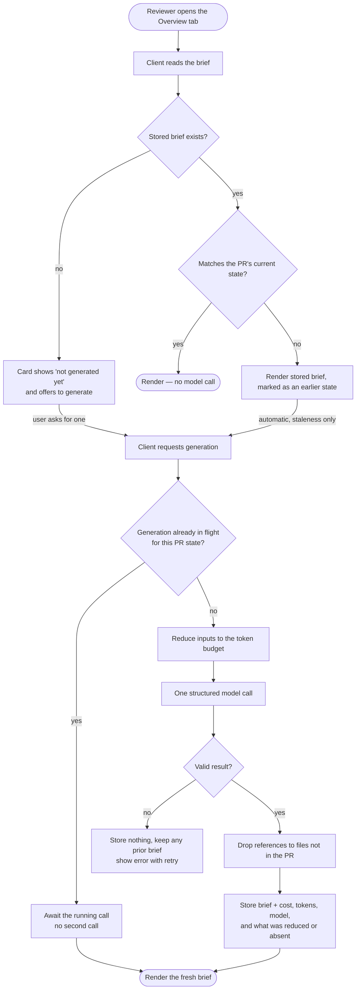

# Spec: PR Why + Risk Brief
Spec ID: SPEC-02
Status: approved
Supersedes: none

## Problem and user

A reviewer opening a pull request in DevDigest lands on the Overview tab and has to work out, from the
diff alone, what the change is for and where the danger is. The tab today shows the PR's derived
intent and its blast radius — what the PR says it is doing, and what it structurally touches — but
nothing that connects those to a judgement: *is this risky, and what should I read first?* There is no
presentation of risk anywhere on the pull request today — not a level, not a list, not a single flagged
file.

The cost is that reviewers read pull requests in file order, which is arrival order, not risk order.
The most dangerous line in a PR is frequently in a small, boring-looking file — a committed
credential, a token forwarded to a caller-controlled URL — while the reviewer's attention is spent on
the largest diff. A reviewer who does not already know the codebase has no way to prioritise, and a
reviewer who does know it still has to reconstruct the reasoning every time.

There is also review output the reviewer cannot see from here. When an agent has already run against
the PR, its verdict, finding counts, score, and the cost of producing them live on a different tab.
The reviewer must leave the Overview to learn whether the PR has been judged at all.

A placeholder brief contract and a storage slot for it were pre-placed in the project as scaffolding
for this feature, together with a model-selection entry named for it and an unused message catalogue.
None of it is reachable by a user, none of it is read or written by any code, and its shape does not
match the feature described here. It is scaffolding awaiting this spec, not a prior design with
intent to honour.

## Goals / Non-goals

**Goals**
- A reviewer can read, at the top of the Overview tab, what the PR changes and why, in prose.
- A reviewer can see the concrete risks in the PR, each anchored to a real file in it, alongside the
  PR's stated intent.
- A reviewer can see an ordered "read these first" list and jump straight to each referenced location.
- The brief reflects the PR's current state, and follows the PR when new commits arrive.
- The brief costs one metered model call per PR state, and whoever pays can see what it cost.
- The reviewer sees the latest agent run's judgement in the same card, without changing tabs.

The feature has **three presentation surfaces**:

| Surface | Carries |
|---|---|
| The brief card at the top of the Overview tab | "what", "why", the risk level, and — when one exists — the latest agent run's judgement |
| A risks section shown with the PR's intent | the grounded risks |
| The review-focus card | the grounded, activatable "read these first" list |

**The brief card builds up progressively rather than appearing all at once.** It is present on the
Overview tab throughout, and its content grows as each ingredient arrives:

| State | The card shows |
|---|---|
| No brief yet | that none has been generated, and offers to generate one |
| Generation under way, no earlier brief | that generation is in progress, with placeholders where content will land |
| Generation under way, earlier brief exists (stale) | the earlier brief and its run-derived elements at reduced emphasis, behind an explicit "being updated" indication, with no regeneration control offered |
| Generation failed, no earlier brief | a plain-language cause and a control to try again |
| Generation failed, earlier brief exists | the earlier brief at reduced emphasis behind a "couldn't update — showing the previous brief" indication, with a control to try again |
| Brief available, no completed agent run | "what", "why", and the risk level |
| Brief available, completed agent run exists | the above, plus the run's verdict, finding and blocker counts, score, cost, and token volume |

Run data is **additive**: its absence removes those elements and nothing else. No state of this
feature is an absent card or an empty shell, and **the card's structural layout is identical in every
state** — only the content within it changes, so the card never reflows as it moves between them
(AC-20).

**Non-goals**
- **Sending diff content to the model.** The brief is derived from metadata, statistics, and
  already-derived artifacts. Hunk bodies are never part of the model input. This is a hard constraint,
  not a budget optimisation.
- **Replacing the review.** The brief orients a human reviewer; it does not produce findings, does not
  gate a merge, and does not write to the pull request on GitHub.
- **Re-deriving intent or blast radius.** Both already exist as their own features; this feature reads
  their results and never recomputes them.
- **Automatic generation without a user present.** Generation is triggered by a client acting for a
  user viewing the PR. There is no background job that briefs every open PR.
- **A brief per agent, or per review run.** One brief per PR state, independent of which agents exist.
- **Editing or dismissing brief content.** The brief is regenerated, never hand-corrected.
- **Authentication or per-user permissions.** This product has no authentication; see
  `## Untrusted inputs`.

## User stories

- US-1: As a reviewer, I want a plain-language statement of what this PR changes and why, so that I
  can start reviewing without reverse-engineering the author's intent from the diff.
- US-2: As a reviewer, I want the PR's concrete risks spelled out beside its stated intent, each one
  pointing at a real file in this PR, so that I can judge severity against the code rather than trust
  an unsupported adjective — and so that I get them whether or not an agent has reviewed the PR yet.
- US-3: As a reviewer, I want an ordered list of what to read first, with each entry taking me
  straight to that location, so that my attention goes to the riskiest code rather than the largest
  file.
- US-4: As a reviewer, I want the brief to correspond to the PR as it is now, so that I never make a
  merge decision from a description of an older revision.
- US-5: As the person paying for model usage, I want each brief to cost one call and to see what that
  call cost, so that a generated brief is never a silent expense.
- US-6: As a reviewer, I want the latest agent run's judgement and its cost added to the same card once
  a review has run, so that I can see whether this PR has been reviewed without leaving the Overview
  tab — and I want the card to still tell me something useful before any review has run.

## Acceptance criteria (EARS)

- AC-1 (US-1): WHEN the user opens the Overview tab for a pull request that has a stored brief matching
  the PR's current state, the system shall render the brief's "what" and "why" prose without making a
  model call.
  Verify: e2e — deterministic flow against a seeded brief for the seeded PR; assert the prose renders
  and no model call occurs.

- AC-2 (US-1): WHEN brief generation is requested for a pull request, the system shall produce the
  brief using exactly one structured model call whose validated result carries a "what", a "why", a
  risk level, a list of risks, and a list of review-focus entries.
  Verify: integration — request generation with a call-counting stubbed provider; assert exactly one
  call and that the stored result satisfies the brief contract.

- AC-3 (US-1): The system shall exclude pull-request diff hunk bodies from the model input, passing
  only pull-request metadata, diff statistics, the derived intent, the blast summary, the linked
  issue, and relevant project-context documents.
  Verify: unit — assemble the model input over a fixture PR whose diff contains a distinctive added
  code line; assert that line is absent from the input and the changed-file statistics are present.

- AC-4 (US-2): The system shall constrain every brief to exactly one risk level drawn from a fixed
  ordered set, and shall require each risk to carry a title, an explanation, and at least one file
  reference.
  Verify: unit — brief contract test asserting the risk level is constrained to the fixed set and that
  a risk with no file reference is rejected.

- AC-5 (US-2): IF a risk's file reference or a review-focus entry names a file that is not among the
  pull request's changed files, THEN the system shall drop that reference or entry before the brief is
  stored.
  Verify: unit — grounding function over a model result containing one real and one invented path;
  assert only the real one survives.

- AC-6 (US-3): The system shall present the review-focus entries as an ordered list in which each
  entry shows a file location and a one-line reason, and each entry can be activated to open that file
  at that location.
  Verify: unit — client component test asserting ordered entries, each with a reason and an activatable
  target carrying the file location.

- AC-7 (US-4): WHEN the pull request's current state differs from the state the stored brief was
  generated for, the system shall report the stored brief as stale, and the client shall request
  regeneration on the user's behalf.
  Verify: integration — store a brief, advance the PR's state, read it back, assert the stale
  indication; unit — client test asserting a stale read triggers exactly one regeneration request.

- AC-8 (US-4): WHILE a generation for a given pull-request state is in flight, the system shall not
  begin a second model call for that same state, and shall resolve concurrent requests with the result
  of the call already running.
  Verify: integration — issue several simultaneous generation requests for one PR state against a
  call-counting stubbed provider; assert one call and identical results returned to every caller.

- AC-9 (US-5): The system shall not make a model call when the brief is only being read.
  Verify: integration — perform reads against a call-counting stubbed provider; assert zero calls,
  including when the stored brief is stale.

- AC-10 (US-5): The system shall record, and display alongside the brief, the model used and the cost
  and token counts of the call that produced it.
  Verify: integration — generate with a stubbed provider reporting known usage; assert the values are
  stored; unit — client test asserting they render.

- AC-11 (US-5): WHILE a generation is in flight, the system shall offer no actionable way to start
  another one — presenting the regeneration control as disabled, or not presenting it at all.
  Verify: unit — client component test for each in-flight presentation; assert no activatable
  regeneration control is reachable in either.

- AC-12 (US-6): WHEN the pull request has at least one completed agent run, the system shall add that
  run's finding and blocker counts, its score, its cost, and its token counts to the brief card, and
  shall take the card's headline and colour treatment from that run's verdict in place of the risk
  level.
  Verify: unit — client component test over a fixture run; assert each run-derived element renders and
  the headline reflects the verdict rather than the risk level.

- AC-13 (US-6): IF the pull request has no completed agent run, THEN the system shall still present the
  brief card, taking its headline and colour treatment from the brief's risk level, shall state that no
  review has run yet, and shall omit the finding and blocker counts, the score, and the cost and token
  row.
  Verify: unit — client component test with a stored brief and no completed run; assert the card renders
  with a risk-level headline, states that no review has run, and that none of the run-derived values is
  present, including as a placeholder.

- AC-14 (US-5): The system shall keep the model input for a brief within 8000 tokens; IF the available
  inputs would exceed that budget, THEN the system shall reduce them to fit, still produce a brief, and
  state to the user which inputs were reduced or omitted.
  Verify: integration — generate for a fixture PR whose inputs exceed the budget; assert the measured
  input is within budget, a brief is produced, and the reduction is reported in the result.

- AC-15 (US-1): IF the derived intent or the blast summary is unavailable for a pull request, THEN the
  system shall generate the brief from the remaining inputs and state which inputs were absent.
  Verify: integration — generate with intent absent, then with the blast summary absent; assert a brief
  is produced each time and names the missing input.

- AC-16 (US-4): IF the model call fails, or its result fails validation against the brief contract,
  THEN the system shall store no brief, leave any previously stored brief unchanged, and present a
  plain-language statement of why generation failed together with a control to try again — stating
  that no earlier brief exists when there is none, and otherwise keeping that earlier brief readable
  at reduced emphasis and saying it is being shown instead.
  Verify: integration — stub a failing call and an invalid result; assert nothing is stored and the
  prior brief survives; unit — client test for both branches, asserting the failure statement and retry
  control appear in each, and that the earlier brief is still readable in the second.

- AC-17 (US-2): WHILE a brief is stored for the pull request, the system shall present that brief's
  risks as a section shown together with the pull request's stated intent, each risk showing its title
  and its grounded file references, regardless of whether any agent run exists.
  Verify: unit — client component test rendering the intent surface from a stored brief with no
  completed agent run; assert each risk's title and file references are present.

- AC-18 (US-1): WHILE a brief generation is under way for the pull request, the system shall present the
  brief card in an explicit in-progress state — either as placeholders where the brief's content will
  land when no earlier brief exists, or as the earlier brief at reduced emphasis carrying an explicit
  indication that it is being replaced — and never as an absent card, an empty container, or
  superseded content with no such indication.
  Verify: unit — client component test with a generation in flight, once with no earlier brief and once
  with one; assert each renders and communicates that generation is under way.

- AC-19 (US-6): The system shall treat the arrival of a completed agent run as a change of the brief
  card's headline and colour treatment, from describing the PR's risk to describing the review's
  verdict, without regenerating the brief.
  Verify: unit — client component test rendering the same stored brief with and without a completed
  run; assert the headline and colour differ between the two and the brief's own content is identical.

- AC-20 (US-1): The system shall preserve the brief card's anatomy — a leading status region, a main
  content region, and a trailing region — in every state, varying only what those regions contain and
  holding each region's footprint even when it has nothing to show, so that the main content's measure
  does not change as the card moves between states.
  Verify: unit — client component test rendering the card in each state; assert all three regions are
  present in every one, that no state adds or drops a region, and that the main content region occupies
  the same width in every state, including those where the trailing region is empty.

- AC-21 (US-2): The system shall present each risk level using the severity treatment the product
  already uses for findings of equivalent seriousness, so that a risk level and a finding severity of
  the same weight read alike rather than introducing a second visual vocabulary.
  Verify: unit — client component test asserting each risk level resolves to the same severity
  treatment as its equivalent finding severity.

- AC-22 (US-5): The system shall render every token volume this feature displays using the product's
  established convention for presenting token counts, rather than introducing a second form.
  Verify: unit — client component test asserting the rendered token volume matches the product's
  existing convention wherever this feature shows one.

- AC-23 (US-1): IF no brief has been generated for the pull request, THEN the system shall present the
  brief card with its usual anatomy, carrying a neutral informational status treatment, a headline
  stating that no brief has been generated, one line of explanatory text, and a control offering to
  generate one, with that control placed in the main content region and the trailing region left
  present but empty per AC-20. The control sits inline for the same reason recovery does in the failed
  states: the primary action belongs in the main region, and one action gets one affordance.
  Verify: unit — client component test with no stored brief and no generation in flight; assert the
  card renders with all three regions, an informational rather than risk or verdict treatment, the
  headline and explanatory line, exactly one control offering generation, and that control inside the
  main content region.

## Edge cases

- EC-1 (AC-5): Every review-focus entry the model returned was dropped for naming files outside the PR
  → the review-focus surface renders the product's standard empty-state treatment, saying there is
  nothing to read first and explaining that no file was singled out ahead of the rest of the diff; it
  is neither an error nor a bare empty card.
  Verify: unit — client test with an empty review-focus list asserting the standard empty-state
  treatment and its explanatory line render.
- EC-2 (AC-7, AC-6, AC-18): The brief is stale and regeneration has not yet completed → the previously
  stored brief remains readable at reduced emphasis — including its run-derived headline and score —
  and its review-focus entries remain activatable, behind a full-emphasis indication that new commits
  arrived and the brief is being updated. A superseded brief is dimmed, never hidden, because a
  superseded brief still beats nothing.
  Verify: unit — client test asserting the earlier brief and its run-derived elements render at reduced
  emphasis alongside a full-emphasis updating indication, rather than being hidden or replaced by a
  placeholder.
- EC-3 (AC-2): The pull request has no changed files → the system produces a brief whose "what" and
  "why" derive from the title, description, and linked issue, with an empty risk and review-focus list.
  Verify: integration — generate for a fixture PR with zero changed files.
- EC-4 (AC-15): No linked issue exists, or the issue cannot be retrieved because no GitHub credential
  is configured or the service is unreachable → generation proceeds without it and records its absence.
  Verify: integration — generate with issue retrieval unavailable; assert success and the recorded
  absence.
- EC-5 (AC-12, AC-13): The pull request's only agent run failed and carries no verdict, score, or cost
  → there is no completed run, so the card falls back to its risk-level headline per AC-13; a failed
  run never produces a zero score or a zero cost, and never overrides the risk-level headline with an
  empty verdict.
  Verify: unit — client test with a failed-run fixture asserting the risk-level headline renders and no
  run-derived element appears.
- EC-6 (AC-6): The model returns two review-focus entries for the same file location → they are
  reduced to one before storage.
  Verify: unit — deduplication over a fixture result.
- EC-7 (AC-4): A risk explanation is far longer than the card's layout allows → it is truncated in the
  card with the full text reachable, and never silently cut off mid-sentence with no affordance.
  Verify: unit — client test with an over-long explanation.
- EC-8 (AC-7): The pull request is merged or closed → the brief remains readable and regeneration
  remains available; a merged PR is not treated as an error.
  Verify: integration — read and regenerate for a merged fixture PR.
- EC-9 (AC-8): Two reviewers open the same PR with a stale brief at the same moment → the single-flight
  guard means one model call, and both see the same regenerated brief.
  Verify: integration — the AC-8 concurrency test, driven through the stale-read path.
- EC-10 (AC-16): The model returns well-formed output whose risk level is outside the fixed set → this
  is a validation failure and is handled by AC-16; no brief with an unknown risk level is ever stored.
  Verify: unit — contract test rejecting an out-of-set risk level.
- EC-11 (AC-3): A pull request's description or linked issue contains text shaped like an instruction
  to the model → it is carried as delimited untrusted data and does not alter the brief's task.
  Verify: unit — assemble the input with an injection-shaped description; assert it is delimited.
- EC-12 (AC-13, AC-17): A brief exists but no agent run has ever completed → all three surfaces render
  from the brief alone: the card shows "what", "why", and the risk level, and the risks and
  review-focus surfaces render in full. Nothing the brief paid for is left unsurfaced.
  Verify: unit — client test asserting the card renders the brief's "what", "why", and risk level, and
  that the risks section and review-focus card both render, with no completed run present.

## Non-functional requirements

- NFR-1 (AC-1, AC-2, AC-18): Latency — a read of a stored brief shall complete within 500 ms at p95; a
  generation that has not completed within 300 ms shall show the in-progress state of AC-18 from that
  point until it resolves.
  Verify: integration — timed read against a stored brief; unit — client test asserting the progress
  affordance appears for a generation that has not yet resolved.
- NFR-2 (AC-14, global): Scale — the feature shall behave within its stated bounds for a pull request
  of at least 400 changed files, with the 8000-token input budget of AC-14 as the binding constraint
  rather than the size of the pull request.
  Verify: integration — generate for a fixture PR of at least 400 changed files; assert the budget
  holds and a brief is produced.
- NFR-3 (AC-15, AC-16, global): Degradation — an absent intent, an absent blast summary, an
  unreachable issue source, an over-budget input set, or an unavailable model shall each degrade to a
  stated partial result or a stated error; none shall render an empty card with no explanation.
  Verify: integration — each degradation path asserted to produce either a brief naming what was
  missing or an error naming the failure.
- NFR-4 (AC-6, AC-11, AC-12, AC-16, AC-17, AC-18): Accessibility — the regeneration control shall carry
  a text name rather than relying on its icon alone; the completion of a generation shall be announced
  to assistive technology, and a generation failure shall be announced without the user having to move
  focus to discover it; every review-focus entry and every expandable risk row shall be reachable and
  operable by keyboard alone; the risk level shall be conveyed by more than colour; the score
  presentation shall have a text equivalent rather than conveying its value by shape and colour only;
  and every animated affordance introduced by this feature — the in-progress indicators and the
  content placeholders — shall stop animating when the user has asked for reduced motion.
  Verify: manual — with the pointer unused, tab to the regeneration control and confirm its announced
  name, trigger a regeneration and confirm completion is announced, force a failure and confirm it is
  announced without moving focus, tab through every review-focus entry and every risk row and operate
  one of each, and confirm the risk level and the score are each announced as a value; unit — client
  test asserting no animation is applied under a reduced-motion preference.
- NFR-5 (global): i18n — every user-visible string introduced by this feature shall resolve through the
  message catalogue, and none shall be hardcoded in markup.
  Verify: unit — client test asserting rendered labels resolve through the catalogue.
- NFR-6 (AC-10, AC-14, AC-15): Observability — each generation shall record the model used, its input
  and output token counts, its cost, its duration, and which inputs were absent or reduced, so that a
  brief's cost and completeness can be audited after the fact.
  Verify: integration — assert every recorded field is present after a generation that both omitted an
  input and reduced another.
- NFR-7 (AC-3, global): Security and privacy — diff hunk bodies shall never leave the system in a model
  request; every repository-derived or model-derived string shall be treated per `## Untrusted inputs`;
  and no credential shall appear in any log line emitted by this feature.
  Verify: unit — assert the assembled input excludes hunk bodies and wraps repository-derived text;
  integration — assert no credential value appears in the generation's log output.
- NFR-8 (global): Compatibility — the brief contract described here replaces the scaffolded placeholder
  contract of the same name. That contract is vendored in both packages, so both copies shall change
  together in the same change, and no consumer shall be left parsing the placeholder shape.
  Verify: unit — a contract test asserting both vendored copies accept an identical brief shape and
  that the repository's contract-synchronisation check passes.
- Not applicable: none — every category in the standard menu applies to this feature and is bounded
  above.

## How generation, staleness, and single-flight fit together

Three rules interact and are hard to follow in prose: reads never spend money (AC-9), a moved head
must produce a fresh brief (AC-7), and a PR state must never be briefed twice concurrently (AC-8).
Together they mean staleness is *detected* by the server on a read but *acted on* by the client, and
that the single-flight guard — not the client — is what makes two simultaneous viewers cost one call.

The read path is free in every branch: the only arrows that reach a model call originate from a
generation request, and a stale brief is rendered before regeneration is requested rather than being
withheld while the user waits. **Only staleness regenerates automatically** — a pull request that has
never been briefed waits for the user to ask, so merely opening an unbriefed PR never spends money. Every "render" node above distributes the brief across the
three surfaces of `## Goals / Non-goals`. The presence of a completed agent run is orthogonal to this
whole flow: it changes only which elements the brief card carries and what drives its headline
(AC-12, AC-13, AC-19), never whether the card appears and never whether a model call happens.

## Inputs and provenance

- Derived intent for the pull request — [reused: L03 intent] — what the PR says it is doing, and its
  in-scope and out-of-scope areas, which anchor the brief's "why".
- Blast summary for the pull request — [reused: L04 blast radius] — the changed symbols, callers, and
  impacted endpoints that make a risk concrete rather than speculative.
- Pull-request metadata — title, description, author, branch, state — [deterministic: server] — the
  author's own account of the change.
- Diff statistics and the changed-file list — [deterministic: server] — the size and surface of the
  change, and the ground truth against which every file reference in the result is checked (AC-5).
- Linked issue title and body — [deterministic: server, retrieved from GitHub, best-effort] — the
  problem the PR claims to solve.
- Relevant project-context documents — [reused: SPEC-01 project context attachments] — the team's own
  written rules, so a risk can be stated against a documented requirement.
- Latest agent run's verdict, finding and blocker counts, score, cost, and token counts —
  [reused: existing agent run record] — the run-derived elements of the card (AC-12). Read live at
  render time, never copied into the stored brief.
- The brief's "what", "why", risk level, risks, and review focus — [new: 1 LLM call] — a judgement
  about risk and reading order. It cannot be reused, because nothing in the product produces it today:
  intent states what the PR claims to do, the blast summary states what it structurally touches, and
  neither ranks danger or reading order. It cannot be computed deterministically, because prioritising
  "a live credential in a config file" over "a large mechanical refactor" is exactly the judgement a
  static rule cannot make. One call, cached per PR state, is the minimum that delivers the outcome.
- The brief's own model, cost, and token counts — [deterministic: server, provider usage report] —
  makes the metered call visible to whoever pays for it (AC-10).

### Authoring sources

- Design image — `specs/SPEC-02-pr-why-risk-brief/design/01-loaded-overview.png` — **the design source
  of record**, committed alongside this spec and read directly while authoring it. It shows the loaded
  state: the brief card's anatomy (verdict headline, findings and blockers chip, information icon,
  prose body, regenerate control, score ring, cost and token row), the RISK AREAS block of three
  collapsible rows each carrying a title and a file location, and the REVIEW FOCUS card with its count
  badge and four file locations with one-line reasons.
- Design transcription — `specs/SPEC-02-pr-why-risk-brief/design/design-notes.md` — a written reading
  of that image, verified against it point by point. It also covers a second scroll position and is
  the searchable form of the same source. It describes **only** the loaded state.
- Design artboards for the non-loaded states — `specs/SPEC-02-pr-why-risk-brief/design/states/`,
  indexed by its own `README.md` — **user-approved**, committed in-repo, and read directly while
  authoring this spec. They are the design source for the six states the loaded-state image does not
  show: generating, no completed agent run, stale, generation failed without a prior brief, generation
  failed with a prior brief kept, and empty review focus. They are **design artboards rather than
  shipped UI**, so they show intended behaviour; their tokens and card anatomy are lifted from the
  product's own stylesheet and existing primitives, so what they show is within what the product can
  already render. A hosted view of the same canvas exists at
  `https://claude.ai/code/artifact/9790aa19-0393-416f-bbd8-13efd3e3821d` as a convenience pointer; the
  committed files are the source of record.
- **Correction applied to that transcription, and fixed at its source.** It originally attributed the
  RISK AREAS block to the existing intent card and marked it "for layout context only". That was
  wrong: no risk presentation exists in the product today, and the block is part of *this* feature —
  it is where this brief's risks are shown (AC-17). The image confirms the block's position inside the
  intent card, and the transcription now carries the correction inline rather than this spec
  silently overriding it.
- The user's written requirements, given verbatim in the authoring conversation — the feature name,
  the route shape, the one-structured-call rule, the no-diff-hunks rule, the 8000-token cap, the
  grounding rule, the caching and regeneration rules, and the origin of the score, cost, and token
  figures.
- Step 0 interview answers — the four blocking decisions: reclaiming the placeholder brief contract;
  the run verdict driving the headline with a risk-level fallback when no run exists; auto-regeneration
  on staleness with a single-flight guard; and reads that never spend money.
- `specs/README.md` — template, placement rule, and registry.
- `reviewer-core/docs/pipeline.md`, `server/docs/api-contracts.md`, `server/docs/architecture.md`,
  `client/docs/ui-architecture.md`, `client/specs/pages.md`, `e2e/specs/coverage.md` — current
  documented behaviour.
- Scoped `server/` and `client/` insights — the existing conventions for derived per-PR artifacts,
  query invalidation, and null-valued run costs.

## Untrusted inputs

- **Pull-request title and description** — written by whoever opened the PR, which on a public
  repository is anyone. They flow into the model input and are rendered in the card. Carried as
  delimited untrusted data so the model treats them as material to analyse rather than instructions to
  follow (EC-11), and rendered as text rather than as markup.
- **Linked issue title and body** — same origin and same treatment. Additionally, the issue is fetched
  from a reference found in the PR description, so the *choice of which issue to fetch* is itself
  attacker-influenced; retrieval is best-effort and its failure never fails generation (EC-4).
- **File paths from the pull request** — repository-controlled strings that become both model input
  and the target of an activatable link in the card. Every path in the model's result is checked
  against the PR's actual changed-file list before storage (AC-5), so a path the model invented or an
  attacker suggested cannot become a link. Paths are rendered as text and are encoded when composing a
  link target, never interpolated raw into a URL or into markup.
- **Branch, repository, and author names** — repository-controlled and displayed. Rendered as text.
- **Project-context document text** — repository-controlled and deliberately placed in the prompt;
  carried delimited as untrusted data, consistent with SPEC-01.
- **The model's own output** — the "what", "why", risk explanations, and review-focus reasons are
  attacker-influenceable, because an attacker who controls the PR description controls part of the
  model's input. The output is validated against the brief contract before storage (AC-16), its file
  references are grounded (AC-5), its risk level is constrained to a fixed set (EC-10), and its prose
  is rendered as text, never as markup and never as a link target. Model-authored text is presented as
  generated content, not as a system statement of fact.
- **No authentication exists in this product.** Requests are scoped to a workspace but no user
  identity is established and no permission is checked, so this spec claims no access control it does
  not have. Generation is a metered, money-spending operation reachable by anyone who can reach the
  API; rate limiting consistent with the product's other model-backed operations, and the
  single-flight guard of AC-8, are the only controls on repeated spend. Q-3 records the residual risk.

## Open questions

- Q-1: Should regeneration require an explicit confirmation, given that each one spends money? —
  assumption this spec currently runs on: it should not; the cost of a single brief is small, the
  control is disabled while a generation is in flight (AC-11), and the cost is shown after the fact
  (AC-10). If briefs prove expensive, a confirmation is the cheapest correction.
- Q-2: The design places an information icon beside the risk headline whose behaviour is not defined
  by any source — assumption: it is out of scope for this spec and is not specified as a requirement;
  no acceptance criterion depends on it.
- Q-3: Because there is no authentication, generation is reachable by anyone who can reach the API,
  and auto-regeneration on staleness means a reviewer merely *viewing* a PR can cause spend without an
  explicit click — assumption: acceptable for a locally-run product, bounded by rate limiting and the
  AC-8 single-flight guard. This is consistent with the product's existing model-backed operations,
  which are likewise unauthenticated and rate-limited rather than permission-checked. It would not be
  acceptable for a hosted, multi-tenant deployment.
- Q-4: Activating a review-focus entry opens the referenced file in the hosting provider rather than
  in the product's own changed-files view — assumption: this matches how file references behave
  elsewhere in the product today and is the expected behaviour here. A "read these first" list that
  navigated within the product might serve the user story better, and is the obvious follow-up if
  reviewers report losing their place.
- Q-5: A brief is regenerated when the PR's state changes, but not when a *new agent run completes*
  against an unchanged PR state. The run-derived elements of the card update, because they are read
  live, while the brief's prose does not — assumption: correct, because the brief describes the change
  rather than the review of it, and regenerating on every run would multiply cost with no new
  information about the code.
- Q-6: **Closed (2026-08-29).** Both halves of its premise are gone, and no caveat survives. The loaded
  state was verified directly against the design image now committed alongside this spec. The states
  that had no design source — generating, no completed agent run, stale, generation failed with and
  without a prior brief, and empty review focus — now have approved artboards, also committed in-repo
  and also read directly. The requirements it flagged (AC-13, AC-16, AC-18, AC-19, EC-1, EC-2, EC-5,
  EC-12) were reconciled against those artboards and amended where they had drifted. Every design
  source this spec rests on is first-party and in the repository.
- Q-7: **Closed (2026-08-29) — dissolved by the progressive-card rule.** It asked whether it was
  acceptable that "what" and "why" were generated but unsurfaced on a PR with no agent run. The card
  now always renders and carries them (AC-13, EC-12), so nothing the brief pays for is hidden and the
  question no longer has a subject.
- Q-8: **Closed (user, 2026-08-29) — the existing lowercase convention wins.** The question was which
  form should govern the card's token volume, given that the design image shows an uppercase unit
  suffix and the product already presents token counts with a lowercase one. The user chose the
  existing convention: it is already applied consistently everywhere token volumes appear, so matching
  it costs nothing, whereas adopting the design's form would mean changing every one of those surfaces
  for a purely cosmetic gain. The design is treated as approximate on this single point; the
  transcription in `design/design-notes.md` records that its uppercase rendering is superseded.
  Promoted into AC-22.
- Q-9: **Closed (2026-08-29) — designed, and the assumption held.** A generation that fails while a
  stored brief exists now has its own approved artboard, and it resolves exactly as this question
  assumed: the earlier brief stays readable at reduced emphasis, its score stays with it at the same
  reduced emphasis, and a critical-toned indication reading that the brief could not be updated and the
  previous one is being shown replaces the stale state's updating indication, with a retry control
  beneath the prose. Folded into AC-16, which now carries both designed branches. **No state in this
  feature is without an approved design.**
- Q-10: **Closed (2026-08-29) — designed, and the derivation held.** It recorded that the no-brief-yet
  state of AC-23 was derived from the failed-without-prior-brief artboard rather than designed. That
  state now has its own approved artboard, read directly and matching AC-23 as written: the standard
  card anatomy, a neutral informational status treatment, a headline stating no brief exists, one
  explanatory line, a single primary control offering generation placed in the main content region, and
  the trailing region present but empty and holding its footprint. AC-23 needed no amendment. The
  question existed only because `implementation-planner` found the state named in this spec's prose and
  diagram with no acceptance criterion behind it — a gap the spec review gate could not see, because it
  checks acceptance criteria against each other and never against the spec's own prose.

## Traceability

| US | AC | EC / NFR | Verify level |
|----|----|----------|--------------|
| US-1 | AC-1, AC-2, AC-3, AC-15, AC-18, AC-20, AC-23 | EC-3, EC-11, NFR-1, NFR-3, NFR-7 | e2e, integration, unit |
| US-2 | AC-4, AC-5, AC-17, AC-21 | EC-1, EC-7, EC-10, NFR-8 | unit |
| US-3 | AC-6 | EC-2, EC-6, NFR-4, NFR-5 | unit, manual |
| US-4 | AC-7, AC-8, AC-16 | EC-2, EC-8, EC-9, NFR-3 | integration, unit |
| US-5 | AC-9, AC-10, AC-11, AC-14, AC-22 | NFR-1, NFR-2, NFR-6 | integration, unit |
| US-6 | AC-12, AC-13, AC-19 | EC-5, EC-12, NFR-4 | unit, manual |
